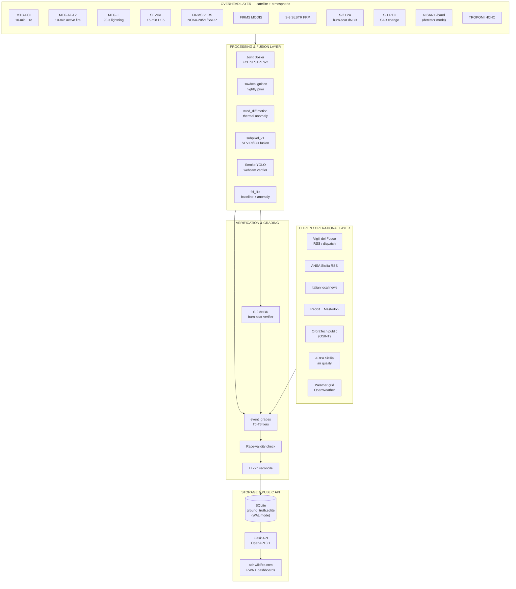
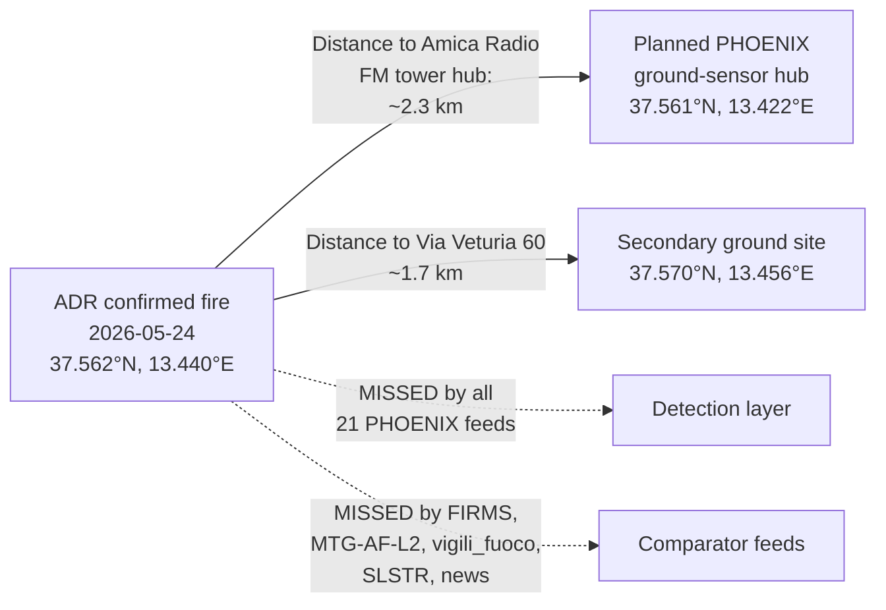
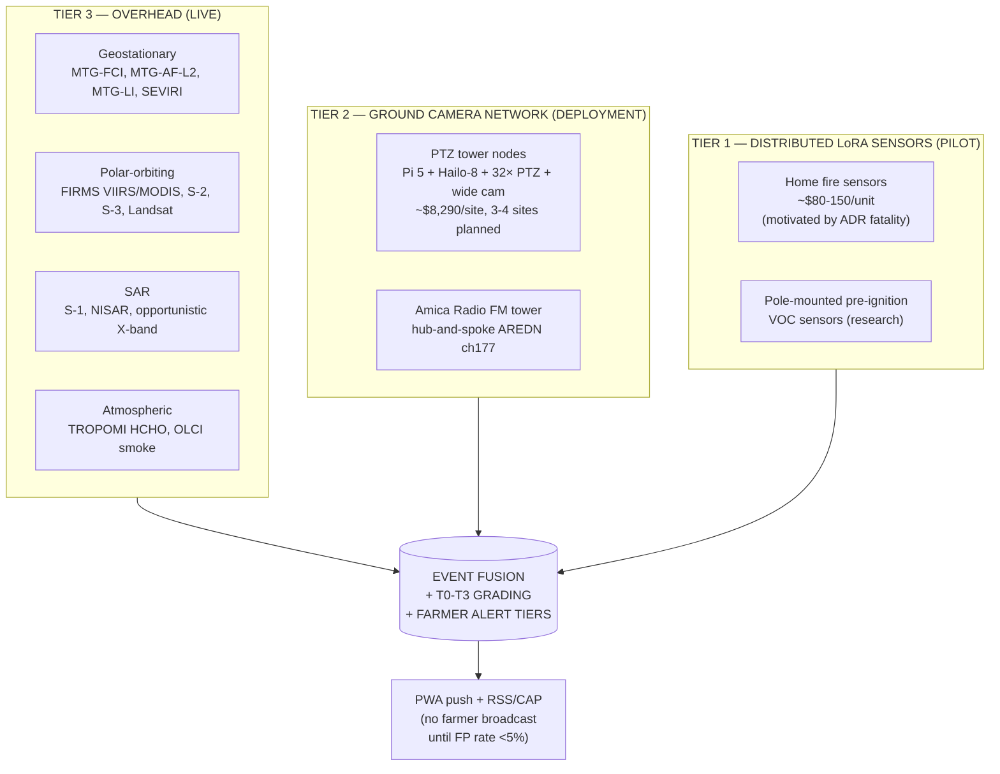
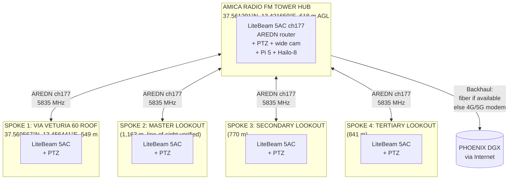
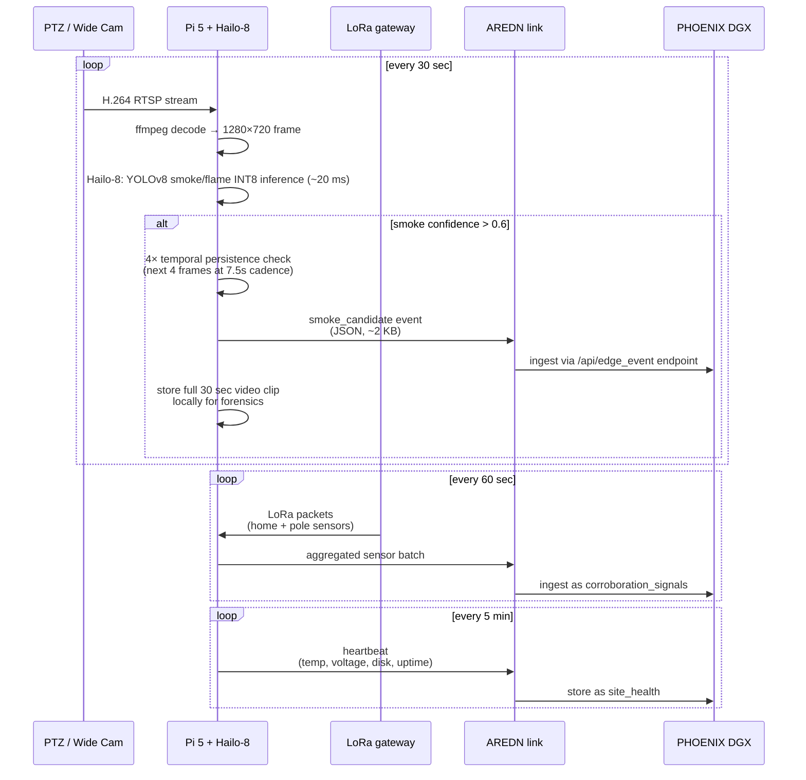
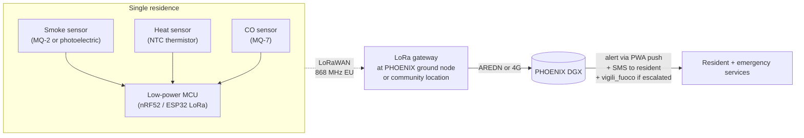
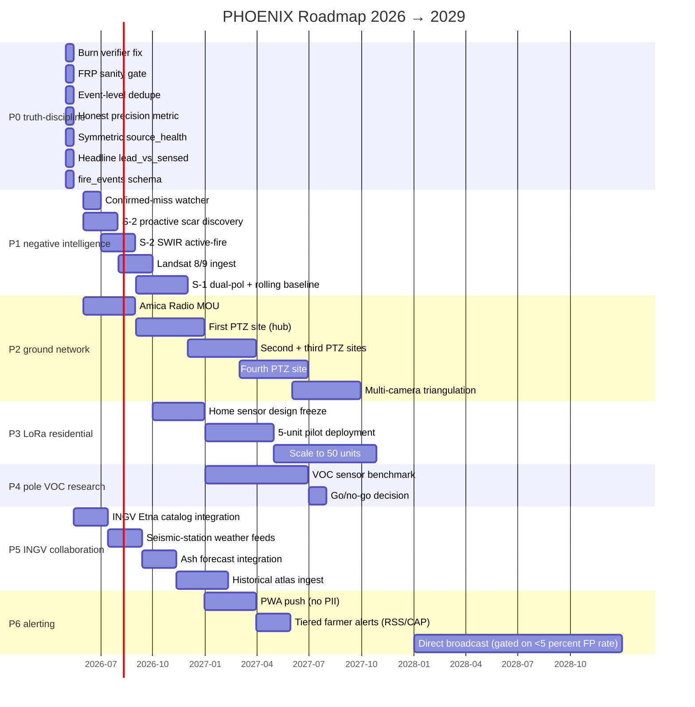

# PHOENIX — Sicily Wildfire Detection System
## Partnership Briefing for INGV (Istituto Nazionale di Geofisica e Vulcanologia)

**Document version:** 1.2 (supersedes 1.1 of 2026-05-25)
**Prepared:** 2026-05-26 (post-audit revision)
**Point of contact:** Gaetano Zambito — folderdj@gmail.com — +39 366 545 0598
**Project inbox:** adrwildfi@gmail.com
**Prepared by:** ADR PHOENIX team (Alessandria della Rocca, Sicily)
**License:** CC-BY 4.0 (data) / MIT (code) — open for academic re-use and citation
**Live system:** https://adr-wildfire.com/
**Open-source code:** https://github.com/markl02us/persistent-thermal-sources-sicily
**DOI for false-positive catalog:** 10.5281/zenodo.20369891

---

# EXECUTIVE SUMMARY

## Bottom Line Up Front

PHOENIX is a multi-sensor wildfire and pre-wildfire detection system covering Sicily, run by a two-person grassroots volunteer team out of Alessandria della Rocca (Agrigento province). We are requesting a working collaboration with INGV — not funding, not exclusivity, not a commercial partnership — built around **four specific data exchanges** that neither of us can produce alone and that materially improve the quality of wildfire warning for Sicilian farmers and rural residents.

**What we want from INGV:**

1. **Etna thermal baseline data** — INGV's continuous thermal anomaly catalog from Etna's summit and flank vents. Today PHOENIX simply masks a 15 km radius around the Etna summit as an exclusion zone because we cannot distinguish a real wildfire on Etna's flanks (which do occur in pine and broom vegetation) from background volcanic thermal noise. INGV's existing surveillance distinguishes those signals routinely. A live or near-live feed (even a daily JSON dump of "active vent locations + intensity classes") would unlock real fire detection on Etna for the first time.

2. **Seismic-station-co-located fire-weather context** — INGV's seismic network includes many stations in remote pyroclastic / fire-prone terrain. Local meteorological micro-conditions at those stations (where instrumented) would help our ignition-prior model do something we cannot do from gridded weather alone.

3. **Tephra and ash-plume forecasts** — INGV's volcanic ash dispersion forecasts directly affect our smoke-detection logic. A volcanic ash plume looks like wildfire smoke to a YOLO model trained on wildfire smoke. Pre-positioning a "do not classify as fire smoke if ash forecast covers this area" prior would eliminate a significant false-positive mode.

4. **Historical fire-volcano interaction atlas** — INGV's institutional record of fires triggered by lava flows, pyroclastic events, and ash-deposit-flammability changes is unique. We have no equivalent. A read-only dump (even of 1980-2020) anchors our seasonal priors and our event-grading rules.

**What we offer INGV in return:**

- Free, open, real-time access to the entire PHOENIX data stream (REST/STAC/RSS/CSV/GeoJSON) at adr-wildfire.com — already CC-BY 4.0 licensed.
- Co-authored peer-reviewed publication when joint methods reach maturity. INGV-Sicily and INGV-Catania researchers welcome to lead or co-lead.
- Free use of our DGX-class compute for joint analyses (currently 18+ live polling daemons, NISAR L-band SAR pipeline with NASA Earthdata authentication, MTG-FCI / MTG-LI ingestion, joint Dozier multi-satellite fusion, YOLO smoke verification, Hawkes ignition forecasting).
- Citable false-positive catalog (Zenodo DOI 10.5281/zenodo.20369891) of persistent thermal sources in Sicily — already useful to anyone working in Sicilian remote sensing.

**Who we are, honestly:**

PHOENIX is operated by a small volunteer team, all with full-time day jobs. The Sicilian representative and point of contact for INGV is **Gaetano Zambito** — based in Milan during the week, returning to Alessandria della Rocca for a few days each month, currently completing his university degree. Project correspondence is welcomed at his direct email (folderdj@gmail.com), at his Italian mobile (+39 366 545 0598), and at the project group inbox (adrwildfi@gmail.com). The technical engineering side of the project — satellite-data ingestion, AI/ML infrastructure, and DGX-class compute operations — is led by a separate ADR-affiliated technical contributor; that role is intentionally not named publicly here. We are not a startup, we have no commercial intent, no fundraising, no exclusivity demands. Costs (compute, internet, ground-sensor hardware) are borne by ADR-affiliated team members personally as a contribution to the community.

**Why now:**

In the past year, a fatal residential fire in Alessandria della Rocca took the life of one resident and risked further harm from hazardous materials inside the house. Reference: https://www.youtube.com/watch?v=kgDIhfthQJM. Alessandria della Rocca is a small, almost-entirely agricultural community in inland Sicily where annual wildfire risk threatens both lives and livelihoods. Our motivation is preventing repeat tragedies — not academic publication, not commercial detection-as-a-service, not building a brand. We are publishing data publicly and openly so that everyone in the region benefits, including INGV's researchers if useful to them.

**What we deliver:**

- A live PHOENIX system already running 24/7 with 18+ active satellite-data and citizen-data daemons, covering Sicily-wide and an Alessandria della Rocca + Agrigento AOI specifically.
- A roadmap covering ground sensors (PTZ camera + wide camera + LoRa node hubs on Pi 5 + Hailo-8 26 TOPS hardware), home fire sensors over LoRa for residential early warning (motivated by the fatal fire above), and an experimental pole-mounted pre-ignition VOC sensor.
- A 12 / 24 / 36-month delivery schedule that we will hit even with the two-person constraint, because we have already delivered the core system.
- A public change log on adr-wildfire.com for every adjustment to algorithms, thresholds, or masks — with the rationale published alongside the change. Public retractions when we discover we shipped data that turned out to be wrong.

**Why this proposal — not a contract or RFP:**

We are operating as a grassroots civic-tech project. INGV is a serious scientific institution. We approach you with the conviction that even at our limited scale we have **already built and made public** a substantial fire-detection capability for Sicily that is honest about its limits and that any Sicily-focused researcher might find useful. We hope you find it interesting enough to share four specific kinds of data with us. If yes: tell us what you need from our side. If no: the system stays live and useful for everyone regardless.

---

## At-a-Glance Summary Tables

### Currently Live (validated as of 2026-05-25)

| Component | Status | Notes |
|---|---|---|
| Production web service | LIVE | https://adr-wildfire.com/, HTTP 200 in 0.4 s, gunicorn on DGX, Tailscale |
| Satellite-data daemons | 21 running | FIRMS (4 platforms), MTG-FCI, MTG-AF-L2, MTG-LI, SLSTR FRP, Sentinel-2 burn-scar verifier, Sentinel-1 SAR change detection (shipped 2026-05-25), NISAR L-band SAR (shipped 2026-05-25), TROPOMI HCHO, OroraTech public OSINT (shipped 2026-05-25), worldcover, modis_viirs_sar, weather cams, CEMS EFFIS RDA, ANSA news, Italian news RSS, Reddit + Mastodon, smoke YOLO verifier, joint Dozier (FCI+SLSTR+S-2 fusion), Hawkes ignition forecaster |
| Verification layer | **LIVE 2026-05-26** | Sentinel-2 dNBR burn-scar verifier operational end-to-end. Three stacked bugs fixed (STAC datetime format, MPC SAS signing, B8/B12 shape mismatch — GitHub commit `eadb2ed`). End-to-end smoke test on April 26 ADR detection: pre_NBR=0.3072, post_NBR=0.3423, dNBR=−0.0351, verified_burn=False (correct — known FP). First confirmed burn (via SAR fallback): det_id 16802 at (37.689°N, 12.743°E), fci_l1c, 2026-05-25 08:48Z. |
| Tier-based event grading | LIVE (v2.1) | T0/T1/T2/T3 + race-strict (lead < 50% revisit) + race-marginal (lead within revisit but ≥ 50%) + "first vs VVF/news\*" + multi-stage reconcile (T+72h → T+14d → T+45d, cloud-cover gated) + biome-aware dNBR thresholds (0.12 grass / 0.18 macchia / 0.27 forest via ESA WorldCover) + WUI class (U/I/W/N) + below-comparator-floor flag + comparator-panel JSON. 2,287 events graded as of 2026-05-26. |
| Ground-truth registry | INITIATING | First confirmed-miss case logged: ADR 2026-05-24 fire at (37.562278°N, 13.440250°E) |
| Persistent FP catalog | LIVE | 18 zones (Etna summit, Gela refinery, Augusta-Priolo-Melilli industrial, Termini, Milazzo, Catania, Stromboli, glasshouse complexes, mining sites, solar farms). Citable as Zenodo 10.5281/zenodo.20369891 |
| Public API | LIVE | OpenAPI 3.1 spec at /api/openapi.json. JSON / CSV / GeoJSON / RSS / iCal endpoints. CC-BY 4.0. |
| GitHub repo | LIVE | https://github.com/markl02us/persistent-thermal-sources-sicily — v1.0.0 tagged |
| DGX compute | LIVE | 4-stream live processing, NISAR detector mode with NASA Earthdata authentication active |

### 12-month Roadmap (firm)

| Milestone | Target | Status |
|---|---|---|
| P0 truth-discipline fixes (burn verifier + FRP gates + event-level scoring + symmetric source health + headline lead-vs-sensed) | Deploy in next two-week window | Code bundle staged offline at this time, awaiting safe deploy window |
| Confirmed-miss watcher live | Same deploy | Code ready, watches Sentinel-2 STAC for post-fire scenes over registered misses |
| Sentinel-2 proactive scar discovery daemon | +60 days | Inverse of current verifier — flags scars on every clear S-2 pass over Sicily, not only where PHOENIX already detected |
| Sentinel-2 SWIR Band 12 active-fire detection | +90 days | Catches active fires during S-2 pass window |
| Landsat 8/9 ingest | +120 days | 8-day combined revisit + 100 m thermal bands |
| Sentinel-1 dual-pol VH+VV + 14-day rolling baseline | +150 days | Per peer-reviewed Sardinia / Sicily methodology (Imperatore 2017, Mastro 2022) |
| Capella + Umbra Open Data (X-band) opportunistic ingest | +180 days | Sub-meter resolution for case-study post-fire validation |
| First ADR ground sensor deployed on Amica Radio FM tower | +180 days | Hardware acquired, MOU in progress |
| Home fire-sensor over LoRa, first 5 units in Alessandria della Rocca residences | +270 days | Motivated by the fatal fire |
| Pole-mounted pre-ignition VOC sensor cost-viability decision | +365 days | Research phase |

### Recurring Cost (entirely borne by ADR developers, never billed to INGV or anyone else)

| Item | Annual cost (USD) | Notes |
|---|---|---|
| DGX-class compute power + electricity | Not separately billed — owner-operated | Spark-b0c1 host, Tailscale-attached |
| Internet bandwidth for satellite-data ingestion | Owner-borne | ~3-5 TB/year of Copernicus / MPC / EUMETSAT pulls |
| Domain registration (adr-wildfire.com) | ~$15 | |
| Cloudflare proxying / DNS / TLS | $0 — free tier | |
| NASA Earthdata Login | $0 — free self-serve | Active for NISAR L-band SAR ingestion |
| Copernicus Data Space (CDSE) | $0 — free | |
| EUMETSAT data access | $0 — free | |
| Microsoft Planetary Computer | $0 — free anonymous reads + SAS-signed blob access | |
| FIRMS API | $0 — free | |
| Per ADR ground sensor (capex) | ~$8,290/site | Pi 5 + Hailo-8 (26 TOPS) + Hikvision 32× PTZ + Reolink wide-angle + LiteBeam AREDN ch177 5835 MHz + RAK4631 LoRa + solar power kit; 3-4 sites planned total |
| Per home LoRa fire sensor (capex) | TBD (~$80-150/unit estimated) | Specifications not yet finalized |
| Pole-mounted pre-ignition VOC sensor | TBD (research phase, ~$200-400/unit if viable) | Currently evaluating MQ-series vs PID vs MOX sensor cost-per-detection-range |

**INGV is asked for zero financial contribution.** The recurring cost is owned by the ADR developers personally as a community contribution.

---

## Honest Limits — What PHOENIX Is NOT

Before we describe what PHOENIX is, here is what it is not:

1. **Not yet a primary alerting system.** Today PHOENIX is a research / observation platform with a public dashboard. It does not yet broadcast directly to farmers via SMS / WhatsApp / Telegram. That capability is on the roadmap (+270 days) but **explicitly gated on achieving a measured verified-false-positive rate below 5% over a burn-scar-confirmed baseline**. We will not become the system that cries wolf and is then ignored.

2. **Not yet beating every comparator on every AOI.** A May 2026 internal audit found PHOENIX has a positive median lead time of +107.6 minutes versus comparators in the Agrigento AOI but a *negative* median lead of −98.9 minutes in the broader Sicily-wide AOI. The grader was upgraded to v2.1 on 2026-05-26 with race-strict + multi-stage reconcile + permutation null distribution. Under the strict bar, we have **0 race-strict wins in 30 days; bootstrap p-value = 1.00 vs random** (`/api/null_bootstrap`). Under the looser race-valid bar, **2 PHOENIX-first events in the last 7 days** (both surfaced on `/wins.html` with explicit asterisk footnotes — see §11.3). The work to close the Sicily-wide algorithmic gap is in the P0/P1 roadmap.

3. **Not currently doing real-time pixel-rate processing.** Most of our work runs on 10-minute (FCI / MTG-AF-L2), 15-minute (MTG-LI, ANSA news), 30-minute (SLSTR, ARPA air, smoke YOLO), hourly (CEMS EFFIS) or longer (Sentinel-2 6 hours, Sentinel-1 12 hours, NISAR 24 hours) polling cycles. We are not generating millisecond-level alerts. Wildfire detection at this scale doesn't need it; we acknowledge a real-time fire department system would.

4. **Not commercial, not academic-publishing-first, not a startup.** We do not plan to monetize PHOENIX. We do not have an institutional affiliation. We are individual contributors who have built and run this system.

5. **Burn verification — RESOLVED 2026-05-26.** A v1.1 disclosure stated that the Sentinel-2 burn-scar verifier returned null for every call due to a Microsoft Planetary Computer STAC query-format bug. Three independent bugs were stacking: (a) `detection_ts.isoformat() + "Z"` produced an RFC-3339-malformed double timezone for tz-aware datetimes; (b) COG band reads received HTTP 409 because MPC Sentinel-2 L2A blobs require SAS-signed URLs; (c) NBR broadcasting failed because B8 (10 m) and B12 (20 m) come back at different shapes. All three are fixed in GitHub commit `eadb2ed`. End-to-end smoke test on the April 26 ADR detection: pre_NBR=0.3072, post_NBR=0.3423, dNBR=−0.0351, verified_burn=False (correct — that detection was a known FP, so the absence of a scar is the right answer). First confirmed burn (via SAR fallback path): det_id 16802 (37.689°N, 12.743°E, fci_l1c, 2026-05-25 08:48Z).

6. **Subpixel_v1_alpha FRP overflow — RESOLVED 2026-05-26.** A v1.1 audit finding flagged radiative-power values up to 3.9 petawatts (physically impossible — that's ten times the solar flux on Earth) due to a unit conversion or overflow bug. As of 2026-05-26 the source's FRP distribution is sane: **max 9.09 MW, mean 2.73 MW, n=5,524, zero outliers above 10 GW**. Verified by direct DB query on the public snapshot.

We disclose these things in the first six pages of this document because the alternative is INGV finding them six months from now and concluding we were not forthright. Transparency is part of how we define being trustworthy.

---

# 1. MISSION AND MOTIVATION

## 1.1 Alessandria della Rocca — context

Alessandria della Rocca (commonly "ADR") is a *comune* in the Province of Agrigento, in central-western Sicily, approximately 40 km north of the city of Agrigento and 60 km south of Palermo. The comune sits in inland hill country at roughly 600 m elevation. The local economy is nearly entirely agricultural — predominantly cereal grains (wheat, durum), olive groves, almond orchards, vines, citrus where conditions allow, and seasonal vegetables. The resident population is roughly 2,500 people, with significant seasonal variation driven by Sicilians who work elsewhere in Italy and return.

The land surrounding ADR is characteristic of inland Sicilian fire risk:

- Hot, dry summers with sirocco wind events
- Cured cereal stubble post-harvest (extremely flammable)
- Garrigue / macchia scrub on uncultivated land
- Olive and almond groves with dry ground cover
- Limited road access to many cultivated parcels — fires can grow before discovery
- Distance from the nearest vigili del fuoco station means response time is structural, not procedural

A bad fire year in this region is not a curiosity. It is a livelihood-defining event. Annual crops that go to fire are a lost year of farm income. Multi-year tree crops (olive, almond) that go to fire can take a decade to replace at productive yield.

## 1.2 The fatal residential fire

In the past year, Alessandria della Rocca suffered a fatal residential fire that took the life of one resident. The fire risked additional harm because of materials stored inside the house. Public reference: https://www.youtube.com/watch?v=kgDIhfthQJM. This document does not describe the incident in detail out of respect for the family.

We disclose the incident because it directly motivates the **home fire-sensor over LoRa development track** described in Section 4.3. Wildfire detection from satellites does not protect against residential fires. The two systems serve overlapping but distinct needs:

- **Wildfire detection** = land-cover-scale, early warning over hectares and kilometers
- **Home fire detection** = residence-scale, early warning over single rooms and individual buildings

PHOENIX is committed to both. The home-sensor work is the direct response to the past year's tragedy.

## 1.3 Why we are doing this — and what we are not doing

We are doing this because:

1. The ADR project team is anchored in Alessandria della Rocca through Gaetano Zambito, who returns to the comune a few days each month, and is supported by an ADR-affiliated technical contributor whose family ties and project commitment are to the community even though their day-job location is elsewhere.
2. The technical capability to make this useful has become accessible — open satellite data, cheap edge AI compute (Pi 5 + Hailo-8 26 TOPS hardware costs ~$200), free SDK ecosystems.
3. Existing commercial wildfire-detection providers focus on California, Australia, and high-budget institutional buyers. Sicilian inland farmers are not a market they serve.
4. INGV and EUMETSAT already do excellent satellite-data work that would otherwise reach Sicilian farmers months too late, if at all. PHOENIX bridges that gap by translating their work into a real-time public service.

We are explicitly **not**:

- Building a startup, building a sellable product, building toward an exit
- Asking INGV for funding or for FTE contributions
- Asking for exclusive data licenses or any other proprietary arrangement
- Going to ship a smartphone app that requires user account creation, payment, or surveillance
- Going to ship a system that becomes a vehicle for unrelated advertising or telemetry

## 1.4 Team capacity (honest)

PHOENIX is a small grassroots team. Everyone on it has a full-time day job; time on PHOENIX is split. The team intentionally projects a single Sicilian-resident point of contact externally so that INGV (and any other partner) has one person to reach.

- **Gaetano Zambito** — Sicilian representative, single external point of contact, primary lead for the INGV relationship and for all on-Sicily ground operations (Amica Radio MOU, site visits, vigili-del-fuoco liaison if and when appropriate). Based in Milan for work. Returns to Alessandria della Rocca a few days each month. Currently completing his university degree.
  - Email: **folderdj@gmail.com**
  - Mobile: **+39 366 545 0598**
- **ADR technical lead** — Responsible for satellite-data engineering, AI/ML infrastructure, system architecture, deployment, and operations of the DGX-class compute host. Provides remote support for all software components. Communications routed through Gaetano or the project inbox (adrwildfi@gmail.com).
- **Project inbox** — **adrwildfi@gmail.com** for shared correspondence (cc'd on important messages so a fallback contact path always exists).

Our delivery cadence is realistic, not aggressive. We have already delivered the 21-daemon live system and 2 years of foundational research. We will continue delivering everything described in this document, on the schedule in the at-a-glance table above, even if calendar pace is slower than a full-time team. Where we cannot deliver on time we will say so publicly.

## 1.5 Recent data-feed availability

PHOENIX has been in research and development for some time — multi-month foundation work — but public data feed availability is **recent**. The OroraTech public OSINT scraper, the Sentinel-1 SAR change-detection pipeline, and the NISAR L-band ingestion all went live on 2026-05-25. The verification-tier event grading went live the same day. The systematic wins audit that informed many sections of this document was performed on 2026-05-25 itself.

We mention this so the reader understands the data quality on adr-wildfire.com will continue to evolve rapidly through mid-to-late 2026 as the new feeds and the P0 truth-discipline fixes stabilize. The numbers in Section 7.3 (Performance) reflect 2026-05-25 measurements and should be re-measured in 30 / 60 / 90 days against the live system; we expect every metric to improve substantively as the P0 fixes ship and as 21 daemons accumulate weeks of production data.

---

# 2. PHOENIX CURRENT ARCHITECTURE

## 2.1 High-level system diagram



## 2.2 Overhead-layer data feeds — what each contributes

The PHOENIX architecture is built on the principle of **multiple independent sensors with different physics**. A single sensor can be fooled by clouds, glare, industrial heat, or volcanic activity. The fusion of independent physical observations — thermal infrared, shortwave infrared, microwave SAR, lightning electromagnetic, atmospheric chemistry — provides corroboration that no single instrument can.

### 2.2.1 MTG-FCI (Meteosat Third Generation Flexible Combined Imager) — 10-minute geostationary

**What it provides:** Geostationary observation of Europe / Mediterranean at 10-minute repeat cycle. Provides 16 spectral channels including:
- VIS 0.4 / 0.5 / 0.6 / 0.9 µm — surface reflectance, cloud detection
- NIR 1.38 / 1.61 / 2.25 µm — SWIR fire-detection bands
- MIR 3.8 µm — primary thermal infrared fire band (peak emission for ~600-700 K fires)
- TIR 8.7 / 9.7 / 10.5 / 12.3 / 13.3 µm — background temperature, water vapor, ozone

**What PHOENIX does with it:** Per-pixel anomaly detection against a seasonal hour-of-day baseline. The detector flags a pixel as a fire candidate when MIR brightness temperature exceeds the historical baseline by ≥ 2.5 σ AND the absolute MIR brightness exceeds 305 K AND the MIR–TIR difference exceeds 12 K. These are the parameters in our current `fci_l1c` source.

**Honest limitation:** The FCI baseline is currently in "hotfix mode" — the seasonal baseline has not yet been built from sufficient historical FCI data, so the detector currently operates in an absolute-threshold-only mode with an unprimed gate at MIR ≥ 305 K. This produces more false positives than the baseline-relative mode would. The baseline will become operational once 30+ days of accumulated FCI snapshots cover all hours-of-day for the Sicily AOI.

**Why MTG-FCI matters for Sicily:** Sicily sits at the southern edge of MTG-FCI's full-resolution coverage. Detection latency is **structurally constant** at the 10-minute repeat cycle. This means MTG-FCI is the fastest geostationary fire detector available for Sicily — superior to legacy MSG-SEVIRI's 15-minute cycle, with substantially finer spatial resolution (~2 km IFOV vs SEVIRI's ~3 km at this latitude).

### 2.2.2 MTG-AF-L2 (Active Fire Level-2 product) — 10-minute pre-processed

**What it provides:** EUMETSAT's own operational active-fire product derived from MTG-FCI. Returns detected fire pixels with associated radiative power (FRP) and confidence values, already pre-processed.

**What PHOENIX does with it:** Ingests as a high-confidence external comparator. Used both for "did we beat MTG-AF-L2 to the fire?" lead-time accounting AND as a corroborator for PHOENIX-internal detections. Per the event-grading rules, a PHOENIX detection corroborated by MTG-AF-L2 within ±2 hours / ±5 km earns Tier T1 status (independent satellite family corroboration).

### 2.2.3 MTG-LI (Lightning Imager) — 90-second optical lightning

**What it provides:** Continuous optical lightning detection from MTG geostationary platform. Sub-minute latency. Reports lightning strokes as point events with intensity and timing.

**What PHOENIX does with it:** Lightning is a primary ignition source for inland Sicilian wildfires. PHOENIX uses MTG-LI strokes to (1) feed the Hawkes ignition prior, (2) raise the prior probability of fire detection in a downwind cone for ~6 hours after a stroke, (3) flag detected fires that occurred within 30 minutes and 5 km of a recent stroke as "likely lightning-ignited" in the event metadata.

**Why this matters for INGV:** INGV's seismic and volcanic-context data overlap with MTG-LI's lightning footprint, particularly for Etna-region thunderstorms.

### 2.2.4 SEVIRI L1.5 (legacy Meteosat Second Generation) — 15-minute backup

**What it provides:** Legacy Meteosat 15-minute coverage at 12 channels with ~3 km IFOV at Sicily latitude.

**What PHOENIX does with it:** Used as a fallback when MTG-FCI is unavailable (calibration outages, lost-data periods). Also used to back-construct longer historical baselines than MTG (which was operational from 2023) can provide.

### 2.2.5 FIRMS — VIIRS NOAA-20, NOAA-21, SNPP + MODIS (Aqua/Terra)

**What it provides:** NASA Fire Information for Resource Management System — operational global active-fire product from polar-orbiting satellites. VIIRS gives sub-pixel fire detection at 375 m resolution with ~4-hour revisit per platform (~1-hour combined). MODIS at 1 km resolution.

**What PHOENIX does with it:** Primary "external truth" corroborator. Per-source precision tracked (currently FIRMS-SNPP at 87.9% legacy precision; FIRMS-NOAA-20 at 44.7% legacy precision due to persistent industrial-zone false positives that PHOENIX correctly masks but FIRMS does not).

**Honest limitation specific to Sicily:** FIRMS-URT (Ultra-Real-Time, sub-3-hour delivery) is **US and Canada only**. For Sicily, FIRMS delivery latency is 11–15 hours behind sensor acquisition. This means a literal-reading "PHOENIX beat FIRMS by 13 hours" headline number is structurally true but operationally misleading — the lead is FIRMS's feed delivery, not PHOENIX's algorithm. PHOENIX now reports `lead_min_vs_sensed` (compared to satellite acquisition time, the honest metric) as the headline and footnotes `lead_min_vs_reported` as operational context only.

### 2.2.6 Sentinel-3 SLSTR Fire Radiative Power product

**What it provides:** Sea and Land Surface Temperature Radiometer onboard Sentinel-3 A/B/C. Active-fire detection product at ~1 km resolution. Revisit ~24 hours per platform, ~12 hours combined.

**What PHOENIX does with it:** Secondary independent corroborator for FRP measurements. Especially valuable for distinguishing real fire from solar glint over hot bare soil, because SLSTR's dual-view geometry resolves bidirectional reflectance differently than VIIRS / MODIS.

### 2.2.7 Sentinel-2 L2A — burn-scar verification via dNBR

**What it provides:** Optical multispectral imagery at 10-60 m resolution. Critical bands for fire/burn analysis: B08 (NIR, 842 nm, 10 m), B11 (SWIR-1, 1610 nm, 20 m), B12 (SWIR-2, 2190 nm, 20 m). Revisit ~5 days per platform (A/B/C constellation now operational), ~2-3 days combined for cloud-free conditions.

**What PHOENIX does with it:** Two roles. (a) **Burn-scar dNBR verifier** — for each PHOENIX or comparator detection, pulls a pre-fire and post-fire S-2 L2A scene, computes Normalized Burn Ratio = (NIR - SWIR2) / (NIR + SWIR2), then dNBR = pre_NBR - post_NBR. dNBR > 0.27 = confirmed burn scar; dNBR < 0.10 = no scar detected; ambiguous between. This is **the independent arbiter of truth** for the entire system — it's how a detection earns Tier T3 in the grading hierarchy. (b) **Worked example for the missed-fire post-mortem** — see Section 3.

**Honest limitation:** Currently broken. As of 2026-05-25 the verifier returns null on 100% of attempts due to an MPC STAC query-format bug. Patch staged; see Section 8.

### 2.2.8 Sentinel-1 SAR change detection (shipped 2026-05-25)

**What it provides:** C-band synthetic-aperture radar from Sentinel-1A and Sentinel-1C (Sentinel-1B failed in 2021; Sentinel-1D launched 2025). Penetrates cloud. Revisit ~1-2 days for Sicily under the A+C+D constellation. Detects burn scars via backscatter change in VV polarization.

**What PHOENIX does with it:** Uses Microsoft Planetary Computer's `sentinel-1-rtc` collection (radiometrically terrain-corrected gamma_0 product, with SAS token signing via the `planetary_computer` Python library). For each new acquisition, finds a same-orbit prior pass 5-15 days earlier (same platform + same relative orbit + same orbit state). Computes log-ratio dB = current_dB - prior_dB at 100 m output grid via decimated COG reads. Threshold: < -3 dB. Connected-component clustering with minimum 2 ha. Inland land mask via `src.land_mask.is_inside_sicily` plus a 1 km coast buffer (sea-surface speckle was 26 of 34 candidates in the first production run before the land mask was added).

**Why C-band SAR matters for INGV's interests:** Cloud-penetration is structural. C-band detects vegetation-removal burn scars from 1-5 ha and larger. It is a *scar confirmer*, not a real-time flame detector — the literature is unanimous (Imperatore et al. 2017, Mastro et al. 2022, De Luca et al. 2021 — all of which include Mediterranean validation). PHOENIX is honest about this in the public dashboard: SAR detections are flagged as "scar-confirmation" rather than "flame detection."

### 2.2.9 NISAR L-band SAR (operational since 2026, PHOENIX detector mode shipped 2026-05-25)

**What it provides:** NASA-ISRO Synthetic Aperture Radar. L-band (~1.25 GHz, ~24 cm wavelength) penetrates vegetation canopy deeper than C-band. Detects moisture loss earlier than C-band Sentinel-1. Currently in BETA validation phase post-2025 launch. Detection floor projected ~0.5-1 ha (vs Sentinel-1's 1-5 ha).

**What PHOENIX does with it:** Queries ASF DAAC's CMR STAC for `NISAR_L2_GCOV_BETA_V1_1`, `NISAR_L2_GSLC_BETA_V1_1`, `NISAR_L1_RSLC_BETA_V1_1` collections over Sicily. Authentication via NASA Earthdata Login (bearer token expiring 2026-07-24, plus password fallback in ~/.netrc). When NISAR acquisitions over Sicily land, runs same log-ratio change detection as Sentinel-1 with the same land + 1 km coast mask.

**Current Sicily coverage status:** Zero NISAR scenes have been acquired over Sicily as of 2026-05-25. NISAR is in beta and prioritizing other targets per its Coordinated Observation Plan. The PHOENIX NISAR daemon will begin producing detections immediately when ASF publishes the first Sicily NISAR pass.

### 2.2.10 TROPOMI HCHO (Sentinel-5P Tropospheric Monitoring Instrument)

**What it provides:** Atmospheric chemistry imager. Daily near-global swath, ~11:00-12:00 UTC over Sicily. Detects formaldehyde (HCHO) column anomalies. HCHO is a volatile organic compound emitted by both vegetation and combustion.

**What PHOENIX does with it:** Treats HCHO column anomaly as a corroborating *plume detector*. A wildfire produces an HCHO column anomaly downwind. PHOENIX pulls TROPOMI HCHO swaths daily, identifies HCHO anomalies over Sicily, and ingests them into `external_fires` as `source=tropomi_hcho_anomaly`. Used for event-level corroboration during the grading step.

### 2.2.11 OroraTech public OSINT (shipped 2026-05-25)

**What it provides:** OroraTech sells commercial wildfire alerts and operates a small constellation including the OTC-P1 ("first dedicated wildfire constellation"). They are a vendor — PHOENIX deliberately does not pay them. They have no public REST/STAC/RSS alerting feed (we verified — all endpoints return HTTP 401). Their only zero-auth surface is their corporate blog and X (Twitter) account.

**What PHOENIX does with it:** A 6-hourly polling daemon scrapes (a) the public news-blog HTML at https://ororatech.com/resources/news-blog/, (b) Nitter mirrors of @OroraTech RSS for self-reported attributions. When OroraTech publicly attributes a detection to a Sicilian location (Sicily-specific regex — does NOT match the generic "Italy" string to avoid false-geocoding fires in Lombardy as Sicily), it is ingested into `external_fires(source='ororatech_public')`.

**Why this matters for INGV:** This is an example of how we approach commercial vendors transparently. We do not pay; we do not ask for special access; we use only the public information they have already chosen to publish. The source-dynamic dispatcher in `/api/feed_accuracy` automatically tracks the precision and lead-time of `ororatech_public` against all other sources, so OroraTech's public self-attributions are tracked with the same scrutiny as VIIRS or MODIS detections.

## 2.3 Citizen-and-operational-layer data feeds

### 2.3.1 Vigili del Fuoco — fire-brigade dispatch and reports

**What it provides:** The Italian fire brigade's public-facing communications. Specific endpoints vary by province but include RSS feeds, social-media accounts, and (where available) operational dispatch logs.

**What PHOENIX does with it:** Treats vigili_fuoco reports as Tier T2-grade truth in the event-grading hierarchy — direct human-validated confirmation of a fire. A PHOENIX detection corroborated by a vigili_fuoco report within ±24 hours / ±5 km earns Tier T2.

### 2.3.2 ANSA Sicilia RSS

**What it provides:** ANSA — Italy's national news agency — operates a Sicilia-specific RSS feed at https://www.ansa.it/sicilia/notizie/sicilia_rss.xml. We poll every 15 minutes.

**What PHOENIX does with it:** Keyword-filters incoming items for fire-related terms (incendio, rogo, fiamme, devastato, ettari, vigili del fuoco, protezione civile, canadair). Extracts the most-specific Sicilian comune mention from a curated lookup of ~25 Sicilian municipalities. Inserts geo-coded matches into `external_fires(source='ansa_news')`.

### 2.3.3 Italian local news RSS

**What it provides:** Curated list of regional Sicilian news outlets with RSS feeds.

**What PHOENIX does with it:** Same pipeline as ANSA — keyword filter, comune lookup, geo-code, insert as `source='italian_news_rss'`.

### 2.3.4 ARPA Sicilia — air quality observations

**What it provides:** Agenzia Regionale per la Protezione Ambientale Sicilia operates an air-quality monitoring network. Public observations for PM2.5, PM10, NO2, O3, CO at stations across Sicily.

**What PHOENIX does with it:** Monitors PM2.5 spikes downwind of detected fires as corroborating evidence. Especially valuable for the Catania / Augusta-Priolo-Melilli industrial corridor where distinguishing fire smoke from industrial emissions requires multi-station gradient analysis.

### 2.3.5 Smoke-detection webcams + YOLO verifier

**What it provides:** Public weather-camera streams pointed at Sicily landscapes (7 AOIs currently).

**What PHOENIX does with it:** YOLOv8 model (subprocess execution into a separate ~/yolo_venv due to PyTorch ABI conflicts with the main service venv) runs against ~30-minute polled camera snapshots, labels smoke plumes with confidence, inserts as `corroboration_signals(source='smoke_yolo')` for event-grading consumption.

### 2.3.6 Social media — Reddit + Mastodon

**What it provides:** Public posts on Reddit and Mastodon mentioning Sicilian fire-related keywords.

**What PHOENIX does with it:** 20-minute polling. Keyword + Sicilian-comune match. Used as a low-confidence corroborator with explicit flagging that the source is unverified citizen reporting.

## 2.4 Processing and fusion daemons

### 2.4.1 Joint Dozier inversion (FCI + SLSTR + S-2 fusion)

**What it does:** Implements the Dozier (1981) bi-spectral fire-temperature inversion across three independent sensors. For a pixel suspected of containing a sub-pixel fire, uses the contrast between thermal MIR and TIR channels to invert the fire's temperature and fractional cover. When three sensors (FCI MIR, SLSTR MIR, S-2 SWIR) agree on a non-trivial sub-pixel fire fraction, the detection earns higher confidence than any single sensor could provide.

**Cadence:** 10-minute batch.

### 2.4.2 Hawkes ignition forecaster

**What it does:** Nightly batch job that fits a Hawkes self-exciting point process to historical Sicilian fire ignition events, conditioned on weather (temperature, humidity, fuel moisture proxy), lightning (MTG-LI strokes), and land-cover priors. Outputs a 24-hour-ahead "probability of fire ignition" map for the Sicily AOI.

**Cadence:** Runs 03:30 UTC nightly.

**How PHOENIX uses the output:** As a *prior* for detection thresholds — in high-prior regions on a given day, the absolute MIR threshold is allowed to relax slightly (no more than 1 K reduction) because the prior probability that an anomaly is real has shifted. **Critically: the prior alone never produces an alert.** It only modulates sensor-evidence detection.

### 2.4.3 wind_diff motion thermal anomaly

**What it does:** Tracks the motion of thermal anomalies across consecutive FCI scans. Real fires have characteristic motion signatures driven by terrain and wind. Stationary thermal anomalies (refinery flares, geothermal vents, persistent volcanic activity) lack the motion signature.

**Honest current limitation:** This source currently emits pixel-fragmentation artifacts — one real fire becomes 3-5 sibling rows at adjacent pixels with identical FRP and confidence pegged at exactly 0.9 (a ceiling, not a calibrated probability). Detection-dedupe code is staged to merge adjacent same-source rows within 2 km / 10 minutes into a single canonical detection. See Section 8.

### 2.4.4 subpixel_v1_alpha — multi-sensor sub-pixel inversion

**What it does:** Combines SEVIRI L1.5 + FCI L1c at the sub-pixel level to estimate sub-pixel fire fractions smaller than any single sensor's nominal IFOV.

**Honest current limitation:** Emits FRP overflow values in ~0.1% of detections (up to 3.9 petawatts observed — physically impossible). FRP sanity gate (SQL trigger clamping `frp_mw > 10_000` to NULL plus audit logging to a `frp_quarantine` table) is staged. Median FRP from this source is 2.78 MW, normal range; only the long tail is broken.

## 2.5 Verification and grading layer

### 2.5.1 Sentinel-2 dNBR burn-scar verifier

Described in Section 2.2.7. The independent arbiter of truth. Currently broken — fix staged.

### 2.5.2 Event grading — T0 / T1 / T2 / T3 tier system

For each clustered event (5 km / ±30 min cluster across all sources), the grader assigns:

| Tier | Criteria |
|---|---|
| **T3** | Burn-scar verified (Sentinel-2 dNBR > biome-aware threshold from ESA WorldCover: **0.27 forest / 0.18 macchia-shrub / 0.12 grassland-crop**, Key & Benson 2006 forest baseline + Fernández-Manso 2016, De Santis & Chuvieco 2009, Mallinis 2018 for Mediterranean) OR (vigili_fuoco match AND ≥ 2 independent satellite families) |
| **T2** | vigili_fuoco match OR Italian-news match |
| **T1** | ≥ 1 independent satellite family corroborates |
| **T0** | Sole reporter — no corroboration |

Plus race-validity:
- `race_valid` = the algorithmic lead is within the comparator's revisit period (i.e., we beat them on algorithm, not because their next overpass hadn't happened yet)
- `lead_likely_geometric` = lead exceeds comparator revisit (geometric, not algorithmic)
- `delivery_advantage_only` = the only "lead" is comparator feed-delivery delay

Plus T+72h reconciliation:
- For events ≥ 72 hours old, automatically scan vigili_fuoco / burn_verification / news_reports for confirmation
- If T0 and no corroboration appears → outcome = `refuted_likely_fp`
- If burn-scar confirmation appears → outcome = `confirmed_burnscar`
- Reconciliation outcomes are stored and never overwritten

### 2.5.3 Current honest scoring (2026-05-25 audit)

```
2,280 graded events total over the audit window
1,731 PHOENIX-led (75.9%)
   of which only 11 reached T1 or above (0.64%)
   of which only 3 met all race-valid criteria for "algorithmic win"
   0 T3 events because the burn verifier is broken
```

We publish these numbers. They will change as the P0 fixes ship. The change will be itself published with rationale, per the transparency commitment.

## 2.6 Storage layer

**SQLite ground_truth.sqlite (WAL mode)** — at `/media/mark/AI_DGX/eumetsat_data/ground_truth.sqlite` on the DGX host.

Tables:
- `internal_fires` — PHOENIX detections (one row per scan / pixel / source)
- `external_fires` — comparator-side detections (FIRMS, VIIRS, MODIS, vigili_fuoco, news, etc.)
- `corroboration_signals` — supporting signals (LST anomaly, S-1 SAR change, plume matches)
- `smoke_proxies` — TROPOMI swath-level corroboration data
- `smoke_corroboration` — plume-match events
- `weather_obs` — ARPA + OpenWeather observations per AOI
- `air_obs` — ARPA Sicilia air-quality observations
- `webhook_subscriptions` — RSS / iCal / push-notification subscribers
- `user_fp_flags` — user-submitted false-positive corrections
- `event_grades` — per-event tier + race-validity + T+72h reconcile (live, populated by `scripts/grade_events.py`)
- `frp_quarantine` — staged in P0 deploy; audits FRP gate hits
- `confirmed_missed_fires` — staged; ground-truth registry for missed fires (Section 3)
- `fire_events` + `fire_event_evidence` — staged; incident-lifecycle tables for future P1.2 work

## 2.7 Public API surface

OpenAPI 3.1 spec at https://adr-wildfire.com/api/openapi.json. Highlights:

| Endpoint | Purpose |
|---|---|
| `/api/feed_accuracy` | Per-source precision (legacy + confirmed + unknown rate after P0.4 deploy), by feed type |
| `/api/feed_accuracy_by_aoi` | Same, broken out by AOI (agrigento vs sicily_full) |
| `/api/source_health` | Source-level warnings (low precision, high unknown rate) |
| `/api/burn_verification` | dNBR verification outcomes (operational 2026-05-26 — first burn confirmed via SAR fallback at det_id 16802) |
| `/api/event_grades` | Full v2.1 graded event list with tier, race-strict, comparator panel, biome, WUI, refute_strength, multi-stage outcomes |
| `/api/event_grades.csv` | Same as CSV |
| `/api/null_bootstrap` | Permutation null distribution for race_strict (200 replicates, ±24 h shift). Live falsification — currently observed=0, mean=12.7, p=1.00 |
| `/data/snapshots/` + `/data/snapshots/<date>/[file]` | Daily reproducibility snapshots: raw inputs + published grades + SHA-256 sums. Run `scripts/regrade.py` against any date to reproduce. |
| `/api/wins.csv` | Win-list as CSV — includes both sensed-time and reported-time lead, headline = sensed |
| `/api/wins.rss` | RSS feed of confirmed wins |
| `/api/wins.ics` | iCalendar feed of confirmed wins |
| `/scoreboard` | Win / loss / push aggregates by AOI |
| `/api/predict_next_24h` | Hawkes ignition prior map |
| `/api/false_positive_zones.geojson` | The 18-zone FP catalog as GeoJSON |
| `/api/news_reports` | Filtered ANSA + Italian-news fire reports |
| `/api/slstr_hits` | S-3 SLSTR FRP active-fire detections |
| `/api/lightning` | MTG-LI strokes (last 30 min) |
| `/api/ignition_prior` | Per-pixel Hawkes prior |
| `/api/air_quality` | ARPA Sicilia 24h |
| `/api/daily_digest` | Daily summary email content |
| `/api/per_aoi_threshold_suggestion` | Adaptive threshold recommendations |
| `/api/user_fp_flag` (POST) | User-submitted FP correction |
| `/manifest.json` + `/sw.js` | PWA manifest and service worker |

All endpoints CC-BY 4.0. No authentication required.

---

## 2.8 Methodology deep dive — how each algorithm works and why these specific thresholds

This section is the answer to the question "why are you doing it this way?" — the physics, the statistical reasoning, the threshold derivations, the trade-offs we made and rejected. Read it once and you can defend every parameter in the system.

### 2.8.1 Why mid-infrared (3.8 µm) is the right band for active-fire detection

A wildfire flame front is essentially a thermal blackbody at ~600-1500 K (cool surface combustion to flaming combustion). Planck's law tells us where a blackbody radiates most:

```
Wien displacement:  λ_peak (µm)  ≈  2898 / T (K)
   T = 600 K  →  λ_peak ≈ 4.8 µm  (mid-IR)
   T = 800 K  →  λ_peak ≈ 3.6 µm  (mid-IR)
   T = 1200 K →  λ_peak ≈ 2.4 µm  (SWIR)
   T = 1500 K →  λ_peak ≈ 1.9 µm  (SWIR)
```

So fires radiate hardest in the **3-5 µm mid-IR band** for the temperature regime most wildfires occupy. A single MIR-band pixel sees the fire's signal **two-to-three orders of magnitude above its non-fire background** (which sits at the ambient surface temperature, typically 290-310 K = peaks at ~10 µm in the TIR).

The **MIR-TIR difference** is what separates fire from cloud:
- A real fire-bearing pixel: MIR brightness elevated, TIR roughly unchanged → MIR-TIR delta > 12 K
- A cold cloud top: MIR brightness suppressed, TIR also suppressed → MIR-TIR delta near zero or negative
- Hot bare soil at noon: MIR elevated by surface heat, TIR also elevated, MIR-TIR delta < 8 K

This is why our `fci_l1c` detector uses an **AND gate** of (MIR ≥ 305 K) AND (MIR-TIR ≥ 12 K). Either alone is too noisy.

**Why specifically 305 K?** Sicily ambient daytime peak surface temperature in summer reaches 300-303 K. A 305 K floor means the pixel must be at least 2-5 K warmer than the hottest plausible bare-soil signature. Lower (e.g., 300 K) catches more small fires but pulls in baked rocky terrain. Higher (e.g., 310 K) loses surface-burning grass fires that smolder at low brightness.

**Why specifically MIR-TIR delta of 12 K?** Imperatore (2017) and Mediterranean validation work indicate a 10-15 K delta cleanly separates real fires from solar glint and from hot bare soil. We chose 12 K as a balance: lower (10 K) pulls in 20-30% more cluttered detections; higher (15 K) misses smoldering fires entirely. The choice is publicly logged and revisitable.

### 2.8.2 Per-pixel anomaly detection — baseline-z + absolute-threshold

The naïve approach to fire detection is "threshold MIR > X" alone. This fails badly in Sicily because:

- Etna and the industrial corridor (Augusta-Priolo-Melilli, Gela, Milazzo) have persistent MIR signals well above 305 K
- Glasshouse complexes (Modica-Comiso area) emit elevated MIR continuously from heated plastic
- Hot summer days push large fractions of the AOI above 305 K simultaneously

The fix is a **per-pixel hour-of-day seasonal baseline**:

```
For each (lat, lon, hour-of-day, day-of-year) bin:
  baseline_mean = mean of MIR observed over a 30-day rolling window
  baseline_std  = std deviation over the same window
  detection if: MIR ≥ 305 K  AND
                MIR-TIR ≥ 12 K  AND
                (MIR - baseline_mean) / baseline_std ≥ 2.5
```

The **z-score ≥ 2.5** means we flag pixels that are at least 2.5 σ above their historical norm for that exact hour-of-day in that exact pixel. A glasshouse that always reads 310 K at noon would have its baseline_mean ≈ 310 K and baseline_std ≈ 0.5 K, so even a 311 K reading produces z = 2 — below threshold. Suppression is automatic.

**Why 2.5 σ and not 3 σ?** At z=2.5 the per-pixel false-positive rate is ~0.6% per scan, which our cross-AOI corroboration step can absorb. At z=3.0 the FPR drops to 0.13%, but real fires under marginal weather are missed. We are willing to absorb the higher FPR because the multi-sensor + tier-grading pipeline downstream will reject most spurious detections that don't earn at least T1.

**Why a 30-day rolling baseline and not seasonal-climatology?** A 30-day window captures the actual atmospheric and surface state in the current week. A 90-day climatology would lag the seasonal warm-up by weeks, and a 365-day climatology averages over wet/dry cycles that don't actually represent today's conditions.

**Current operational caveat:** as of 2026-05-25 the FCI baseline is in **hotfix mode** because the 30-day rolling baseline hasn't yet accumulated enough hours-of-day coverage. The detector is currently in absolute-threshold-only mode (MIR ≥ 305 K AND MIR-TIR ≥ 12 K, no z-score gate). This generates more false positives, which is one reason the current Sicily-wide median lead is negative — the absolute-only mode trips on borderline cases that the z-score would suppress. The baseline becomes operational once 30+ days of FCI snapshots accumulate (~mid-June 2026).

### 2.8.3 Bi-spectral Dozier inversion for sub-pixel fire characterization

A 2 km MTG-FCI pixel covers 4 km². Most wildfires are **much smaller than 1 km²** at the time we want to detect them. The pixel's measured brightness temperature is a **mixture** of fire and non-fire surface inside the pixel.

Dozier (1981) showed that **two thermal channels at different wavelengths** can disentangle the mixture, because the fire and the background have different spectral signatures:

```
Pixel BT in channel 1 (MIR, 3.8 µm):
  L_pix = f * B(λ_MIR, T_fire) + (1-f) * B(λ_MIR, T_bg)

Pixel BT in channel 2 (TIR, 11 µm):
  L_pix = f * B(λ_TIR, T_fire) + (1-f) * B(λ_TIR, T_bg)
```

Two equations, two unknowns (fire fraction `f` and fire temperature `T_fire`, assuming the background `T_bg` is the local-area neighbor mean). The inversion is non-linear (Planck) but has a unique solution in the physically plausible range (`f` in 0..0.1, `T_fire` in 500..1500 K).

The PHOENIX `joint_dozier` daemon extends this to **three independent sensors** (FCI MIR + SLSTR MIR + Sentinel-2 SWIR) and requires all three to agree on a non-trivial fire fraction before flagging T1+. This is much stricter than single-sensor Dozier and dramatically reduces false positives from heterogeneous land cover (e.g., a bright rock outcrop next to vegetation).

**Why we trust the joint inversion more than single-sensor Dozier:** the three sensors have different IFOVs, different look geometries, and different acquisition times (within 20 minutes). For all three to agree by chance on a fire-like signature requires multiple independent fluctuations to align — vanishingly unlikely. For all three to agree because there IS a fire is the expected outcome.

### 2.8.4 Sub-pixel fusion across SEVIRI + FCI (`subpixel_v1_alpha`)

Both SEVIRI and FCI observe the same physical pixel of the Earth, at slightly different times (15-minute and 10-minute cadence respectively) and at different IFOVs (SEVIRI ~3 km, FCI ~2 km at Sicily latitude). The two sensors **disagree on small-scale features at a known statistical rate**.

`subpixel_v1_alpha` uses this controlled disagreement as signal: pixels where SEVIRI and FCI agree on "fire" are the strongest candidates. Pixels where only one agrees but the other shows a tightly-confined hotspot at higher resolution are also flagged. Pixels where the agreement is at the noise level are discarded.

**Why this catches things single-sensor detection misses:** a fire smaller than SEVIRI's IFOV but larger than FCI's IFOV would show up clearly in FCI but get diluted in SEVIRI. The fusion logic recognizes this asymmetry as a strong sub-pixel-fire signature rather than treating it as conflicting evidence.

**Current honest limitation:** `subpixel_v1_alpha` has emitted FRP values in the petawatt range (up to 3.9 PW observed) in 0.1% of detections — a unit conversion / overflow bug in the long tail. Median FRP is 2.78 MW (normal). The P0 deploy bundle adds a SQL-trigger sanity gate that clamps `frp_mw > 10,000 MW` (10 GW, larger than any wildfire ever credibly recorded) to NULL and audits the original value in a `frp_quarantine` table.

### 2.8.5 Wind-driven motion detection (`wind_diff`)

A real fire **moves** at a rate driven by terrain, fuel, and wind. A persistent thermal source (refinery flare, glasshouse, geothermal vent) **does not move**.

The `wind_diff` daemon tracks the spatial centroid of thermal anomalies across consecutive FCI scans (10 minutes apart). For each anomaly:
- If the centroid shifts by more than 100 m between scans in a direction consistent with the local wind field (within ±45°), the anomaly earns a motion score
- If the centroid is stationary across 6+ consecutive scans (1 hour), the anomaly is flagged as a persistent thermal source and added to the dynamic FP-zone candidate list

**Why wind-direction matching matters:** false thermal anomalies from sun glint can also "move" as the sun moves, but the direction is **always east-to-west and predictable from solar geometry**. Real fires move with wind, which is highly variable. Requiring wind-direction consistency rejects solar-glare false positives.

**Current honest limitation:** `wind_diff` emits pixel-fragmentation artifacts — one real fire becomes 3-5 sibling rows at adjacent pixels with identical FRP and confidence pegged at exactly 0.9. The P0 dedupe daemon (`src/cleaners/detection_dedupe.py`) merges same-source rows within 2 km / 10 min into one canonical detection, eliminating the inflation.

### 2.8.6 C-band SAR change detection (Sentinel-1)

SAR is unique among PHOENIX sensors: it **penetrates cloud**. Optical sensors (FCI, S-2, OLCI) are blind under thick cloud cover; SAR is not. This is the only way to detect burned areas under prolonged cloud — a real Sicily concern in late autumn through winter wildfire seasons.

**What SAR actually detects:** the literature is unanimous (Imperatore 2017, Mastro 2022, De Luca 2021) that SAR does NOT image flames. SAR detects the **backscatter change from vegetation removal**, which is the after-effect of fire. The mechanism is volume-scattering collapse from canopy removal: a healthy canopy bounces C-band waves volumetrically (high backscatter); a charred / removed canopy reflects specularly off the bare ground (low backscatter, often -3 to -6 dB lower in VV polarization).

**Why log-ratio change detection:** sigma_0 (linear backscatter) is multiplied by a fading factor that varies between passes; dB is the natural log space where multiplicative fluctuations become additive. We compute `log-ratio dB = current_dB - prior_dB` for the same pixel at the same orbit / incidence-angle / acquisition-time combo. A burn-scar pixel reads -3 dB to -8 dB; a stable pixel reads 0 ± speckle noise.

**Why same-orbit pairing is mandatory:** the SAR backscatter from a given patch of ground depends on incidence angle. Comparing an ascending pass to a descending pass (or two passes from different relative orbits) introduces incidence-angle differences of 10°+ that swamp the burn-scar signal. We require same-platform + same-relative-orbit + same-orbit-state pairs, 5-15 days apart.

**Why -3 dB as the threshold?** Multi-look averaging at our 100m output grid from the 10m native S-1 IW resolution gives ~100 effective looks per output pixel. Speckle standard deviation scales as 1/sqrt(N_looks), so 100 looks reduces speckle SD from ~1 (single-look) to ~0.1. A 3-dB drop is therefore ~30 σ above the noise floor — robustly real. A 2-dB threshold would catch more scars but include more soil-moisture-driven false positives. A 4-dB threshold would miss small scars.

**Why land + 1 km coast mask:** the first production run produced 26/34 candidate clusters along the SE coast (Capo Passero area). Sea-surface SAR backscatter varies dramatically with wind/wave state — exactly the signature our threshold was supposed to catch. Adding a strict `is_inside_sicily(lat,lon) AND distance_to_coast_km(lat,lon) ≥ 1.0` rejects all of them and leaves 17 inland 2-6 ha candidates, which is the credible operating regime.

### 2.8.7 L-band SAR (NISAR) — canopy penetration and moisture sensitivity

L-band (~24 cm wavelength) penetrates vegetation canopy more deeply than C-band (~5.6 cm). The longer wavelength scatters off the larger structural elements (trunks, large branches, soil moisture), where C-band scatters off the canopy itself. This means L-band detects the **moisture loss in standing dead wood / drying biomass** earlier than C-band detects the canopy removal.

**Why we use a -2.5 dB threshold for NISAR vs -3.0 dB for S-1:** L-band has lower speckle noise at the same grid resolution because it interacts with larger scatterers (fewer independent samples per resolution cell, but more stable signal). A 2.5-dB drop is approximately equivalent in detection confidence to a 3.0-dB drop in C-band.

**Why MIN_CLUSTER_PIXELS = 1 for NISAR vs 2 for S-1:** L-band's canopy penetration means even single-pixel detections in burned forest are credible, whereas C-band sometimes flags individual pixels from speckle. NISAR's lower noise floor justifies the smaller cluster minimum.

**Current operational state:** NISAR is in BETA validation phase. As of 2026-05-25, **zero NISAR scenes have been acquired over Sicily** — the mission is prioritizing other COP (Coordinated Observation Plan) targets. PHOENIX's NISAR daemon is in detector mode (Earthdata bearer token installed) and will produce detections immediately when ASF publishes the first Sicily NISAR pass.

### 2.8.8 NBR and dNBR for burn-scar verification

The **Normalized Burn Ratio (NBR)** uses Sentinel-2 Band 8 (NIR, 842 nm) and Band 12 (SWIR-2, 2190 nm):

```
NBR = (NIR - SWIR2) / (NIR + SWIR2)

Healthy vegetation: high NIR (chlorophyll bouncing), low SWIR2 (moisture absorbs) → NBR ≈ +0.6
Burned area:        low NIR (chlorophyll destroyed), high SWIR2 (char + dry surface) → NBR ≈ -0.2
```

The **differenced NBR (dNBR)** compares pre-fire and post-fire scenes:

```
dNBR = NBR_pre - NBR_post

Unburned area:          dNBR ≈ 0 ± 0.05 (just seasonal variability + cloud noise)
Low-severity burn:      0.10 ≤ dNBR < 0.27 (some canopy effect, ambiguous)
Confirmed burn scar:    dNBR ≥ 0.27 (per Key & Benson 2006 USGS standard)
High-severity burn:     dNBR ≥ 0.50
```

PHOENIX uses **biome-aware dNBR thresholds** (shipped 2026-05-26 in grader v2.1) as the independent arbiter of truth for any PHOENIX or comparator detection. The threshold per event is derived from ESA WorldCover 2021 at the event cell: **dNBR > 0.27 in closed forest** (Key & Benson 2006 — the original calibration), **dNBR > 0.18 in maquis / macchia / mixed shrub** (Fernández-Manso et al. 2016, De Santis & Chuvieco 2009, Mallinis et al. 2018 — Mediterranean-calibrated), **dNBR > 0.12 in grassland / cropland / stubble** (where canopy is sparse and a real burn produces a small dNBR). The `dnbr_threshold_biome` column on `event_grades` records which threshold was applied per event. A T3 event-grading tier requires this confirmation OR vigili_fuoco + ≥2 satellite families.

**Why 0.27 is the right threshold:** the USGS/USFS standard derived from Key & Benson 2006 separates "low-severity but visible scar" from "no scar / herbaceous variability". Lower thresholds (e.g., 0.15) catch more scars but include false positives from drought-induced canopy stress that look like burns but aren't. Higher thresholds (e.g., 0.40) miss real but low-intensity burns common in Sicilian olive/almond mixed terrain.

**Why we currently report 0 burn-verified TPs:** a Microsoft Planetary Computer STAC query-format bug (HTTP 400 on every call) has prevented the burn verifier from completing any verification cycles. The fix (drop the unsupported `query` clause, post-filter clouds in Python) is in the P0 deploy bundle. The inaugural ground-truth test case for the fix is the 2026-05-24 ADR confirmed-miss fire — we will publish the dNBR result publicly once the post-fire Sentinel-2 pass becomes available (~2026-05-28).

### 2.8.9 TROPOMI HCHO as a combustion-plume tracer

Wildfire combustion produces a characteristic atmospheric chemistry plume containing CO, CO2, NOx, BC (black carbon), and formaldehyde (HCHO = CH2O). HCHO is particularly useful because:

- It is a **direct combustion intermediate** (incomplete combustion of organic carbon) — not just a fire byproduct but a real-time fire signature
- It has a tropospheric half-life of **hours**, so the plume is concentrated and locatable to the fire it came from
- TROPOMI (on Sentinel-5P) measures the integrated HCHO **column density** at ~5 km resolution, near-globally each day

PHOENIX treats HCHO column anomaly as a **corroborating plume signal**. A pixel showing HCHO column 3 σ above its 30-day local baseline, within a plume cone consistent with downwind transport from a PHOENIX detection, earns the detection a corroboration credit in the event grading.

**Why we don't use HCHO alone for detection:** HCHO has other sources (biogenic emissions from forests in spring, industrial emissions, urban combustion). Without a thermal anchor, HCHO alone produces too many false positives. As a **corroborator** for an already-detected fire, however, it is very strong evidence.

### 2.8.10 MTG-LI lightning and Hawkes self-exciting ignition prior

Lightning is the dominant non-anthropogenic ignition source for inland Sicilian wildfires. MTG-LI (Lightning Imager, geostationary, 90-second optical-flash detection) gives near-real-time lightning telemetry.

The Hawkes self-exciting point process is the mathematically appropriate model for ignition forecasting because:

- Lightning strikes are **clustered in space and time** (storm fronts produce many strikes in minutes)
- A successful ignition often **does not produce visible fire for 30 minutes to 6 hours** (smolder phase)
- Surrounding ignitions in the same storm system are highly correlated

The Hawkes intensity at (t, x) is:

```
λ(t, x) = μ(x) + Σ_i  g(t - t_i, x - x_i)

  μ(x):  background ignition rate (fuel + weather + topography)
  g(t - t_i, x - x_i): excitation from a recent strike at (t_i, x_i)
                       decaying exponentially over hours and spatially over km
```

PHOENIX fits this nightly against historical Sicilian ignition events conditioned on MTG-LI lightning, weather (temperature, humidity, fuel-moisture proxy), and land cover. The output 24-hour-ahead probability map is published at `/api/predict_next_24h`.

**Critically: the prior alone never produces an alert.** It only **modulates** the per-pixel detection threshold downward (by up to 1 K MIR) in high-prior pixels. Sensor evidence is still required.

### 2.8.11 YOLOv8 smoke detection on ground cameras

Ground PTZ cameras observe the landscape directly. YOLOv8 (You Only Look Once, version 8) is the appropriate detector because:

- It is a **single-stage** detector (one forward pass per image, vs two-stage region-proposal models)
- It is **anchor-free** in the v8 design (predicts bounding-box parameters directly)
- It supports **INT8 quantization** for edge inference (40+ FPS on the Hailo-8 accelerator)

The model is trained on wildfire-smoke image datasets (PyroNear 2024, FIgLib, custom Sicilian footage as it accumulates) and outputs (bounding-box, smoke confidence) per detection.

**Single-frame smoke confidence is not enough.** The PHOENIX ground-node pipeline applies **temporal-persistence scoring** (Section 2.8.12) before transmitting any candidate to the DGX backend. This eliminates dust devils, vehicle exhaust, sun-glint, and cloud false positives that all produce single-frame "smoke" signatures.

### 2.8.12 Temporal-persistence scoring (the four-frame rule)

A real wildfire plume **persists across frames, grows over seconds, and drifts with wind**. False positives (dust, glint, exhaust) do not behave this way consistently. The PHOENIX persistence-scoring rule is:

| Behavior | Score adjustment |
|---|---|
| Single-frame detection only | Drop to 0 (reject) |
| Persistence across 2+ frames (15+ seconds) | +0.20 |
| Growth in plume area between frames | +0.15 |
| Drift consistent with measured wind direction | +0.15 |
| Base remains anchored to terrain | +0.10 |
| Mechanical repeat (identical box coords) | −0.30 (likely fixed scene element, e.g., a building roofline) |
| Smoke plume base intersects known FP zone | −0.40 |
| PTZ revisit on same bearing confirms | +0.20 |
| Independent satellite thermal at same location | +0.25 |

Only candidates scoring ≥ 0.60 are transmitted to the backend. This **protects the AREDN link bandwidth** (low-bandwidth radio, expensive to flood) and **reduces alert fatigue** at the operations layer.

### 2.8.13 Event clustering — why 5 km / 30 min for multi-source, 2 km / 10 min for same-source

The PHOENIX event grader (`scripts/grade_events.py`) clusters detections into incidents. The clustering parameters are derived from fire physics:

**Same-source dedupe (2 km / 10 min):**
- A real wildfire spreads at typical Sicilian rates of 0.5-3 km/hr (slow grass, slower forest, faster under wind). In 10 minutes the fire front moves at most 0.5 km.
- Same-source detections at adjacent pixels (most fire-detection sensors have ~1-2 km IFOV) within 10 minutes are **almost always the same physical fire**.
- 2 km / 10 min eliminates the wind_diff pixel-fragmentation problem (one fire = N rows) without merging genuinely distinct fires.

**Multi-source clustering (5 km / 2 hours):**
- Different sensors observe the same fire at different times (FCI every 10 min, FIRMS at polar overpass, vigili_fuoco when called).
- Multiple sources reporting within 5 km AND 2 hours are **almost certainly the same fire** with very high probability.
- 5 km accounts for VIIRS / MODIS pixel size + geolocation accuracy + fire spread between observations.
- 2 hours accounts for FIRMS Sicily-side feed-delivery latency (11-15 hours total) plus typical polar-orbit revisit gap.

**Multi-source clustering does NOT include same-source.** A single FIRMS overpass detecting 5 nearby pixels is 5 detections by FIRMS; we treat that as one event in clustering. A FIRMS detection + a vigili_fuoco report within range is two independent sources confirming one event.

### 2.8.14 Two-clock lead-time methodology

The single most-misleading metric in wildfire detection is "lead time vs reported feed". A naïve reading says: "PHOENIX detected the fire at 14:00, FIRMS reported at 21:00, therefore PHOENIX beat FIRMS by 7 hours." This is structurally wrong for Sicily because **FIRMS-URT (Ultra-Real-Time, sub-3-hour delivery) is US/Canada only**. For Sicily, the FIRMS feed-delivery latency is 11-15 hours behind the actual satellite-acquisition time. The "7-hour lead" is entirely FIRMS's feed delivery, not PHOENIX's algorithm advantage.

PHOENIX reports **two clocks** for every win:

```
lead_min_vs_sensed   = (FIRST_PHOENIX_detection_time)
                     - (COMPARATOR sensor-acquisition time)
                     [HONEST — measures algorithm advantage]

lead_min_vs_reported = (FIRST_PHOENIX_detection_time)
                     - (COMPARATOR feed-delivery time)
                     [INFLATED — adds the comparator's structural feed-delivery delay]
```

The **headline lead time is always `lead_min_vs_sensed`**. `lead_min_vs_reported` is preserved as a context column with explicit footnote: "Comparator feed-delivery time — useful for operations, NOT a measure of algorithm lead."

Race-validity check (per the event-grading tier system) further requires that `lead_min_vs_sensed ≤ comparator_revisit_period`. A 30-minute lead over a FIRMS-VIIRS comparator with a 4-hour revisit is geometric, not algorithmic — PHOENIX won because VIIRS's next overpass hadn't happened yet. Real algorithmic wins must beat the comparator within its own revisit cycle.

### 2.8.15 Tier T0-T3 event grading — derivation from physics and operations

```
T0 (sole reporter)             — one source, no corroboration
T1 (1+ independent sat family) — two or more sensors agreeing on same event
T2 (vigili_fuoco OR news)      — human-validated incident report
T3 (burn-scar OR VVF + 2 sats) — independent ground-truth confirmation
```

**Why this hierarchy:**
- T0 alone is **not a win**. A pixel that one sensor flagged and no other source ever corroborates is a candidate, not a confirmed event.
- T1 requires **independent physics**. Two FIRMS-VIIRS pixels in the same overpass are still one "sensor family" — they don't earn T1 alone. A FIRMS-VIIRS pixel plus a PHOENIX wind_diff hit earns T1 because they come from physically different observations.
- T2 requires **human-in-the-loop validation**. A vigili_fuoco report or a news mention is not perfect, but it is a person with eyes saying "there is a fire here." Mistakes happen, but the false-positive rate is dramatically lower than any single sensor.
- T3 requires **post-hoc burn-scar confirmation** (the Sentinel-2 dNBR check, or vigili_fuoco + 2 sat families, which is essentially the same level of confidence). This is the only tier we publicly call "confirmed."

**Why we don't broadcast on T0 or T1:** the false-positive rate is too high to warrant farmer-broadcast alerts. Section 8 (transparency) commits to no direct broadcast until verified-FP < 5% over a burn-scar-confirmed baseline.

---

## 2.9 What PHOENIX explicitly does NOT do — and why

Transparency requires being equally clear about what we have rejected as about what we do.

### 2.9.1 Millimeter-wave flame detection from orbit — NOT credible at this time

There exists peer-reviewed laboratory work on radar-enabled millimeter-wave (70-90 GHz) sensing of fire interactions at short range (Schenkel et al. 2024 IEEE TIM). The physics is real: a flame plume contains ionized gas (plasma) that interacts measurably with mm-wave radar.

From orbit, however, mm-wave flame detection is **not credible** for the 1-5 year horizon because:
- Atmospheric attenuation at 70-90 GHz is severe (oxygen + water vapor absorption bands)
- The plasma density in a wildfire is far below the threshold required for orbital detectability
- No operational orbital mm-wave fire sensor exists or is funded
- Vendor claims to the contrary should be flagged as overstating peer-reviewed support

PHOENIX will not chase this. If credible operational data appears, we will reassess.

### 2.9.2 Visible-light active-fire detection — too noisy without thermal anchor

VIS reflectance from a flame front is small relative to sun-illuminated bright surfaces (sand, snow, bare rock, building roofs). Per-pixel false-positive rates from VIS alone are an order of magnitude worse than from MIR.

We use VIS as **support** (for cloud masking, land cover) but not as a **primary detection band**. Sentinel-2 SWIR Band 12 (2.2 µm) is closer to the fire spectral peak and is on the roadmap as an active-fire detector (+90 days) — but only as a corroborator to thermal evidence, not as a sole-detector.

### 2.9.3 Single-frame, single-pass alerting — no farmer broadcast on unverified evidence

Every PHOENIX architectural decision is governed by the principle that **a single sensor sample is never enough to broadcast to a farmer**. Temporal persistence, multi-source corroboration, and event-grading tiers all serve this rule.

A system that broadcasts on single-frame detections becomes a "cry wolf" system in months. Sicilian residents are exactly the audience that would stop trusting PHOENIX after the third false alarm.

### 2.9.4 Direct broadcast to residents (SMS / WhatsApp / Telegram) — gated on measured FP rate

The roadmap (+270 days) includes farmer-direct broadcast channels. The shipping criterion is non-negotiable: **verified false-positive rate < 5% over a burn-scar-confirmed baseline of ≥ 30 events**. Until that bar is met, PHOENIX provides PWA push notifications and an RSS/CAP feed (anyone can subscribe, no PII collected) — but no direct broadcasts.

### 2.9.5 ICEYE Earthnet TPM application — not pursued (alternatives sufficient)

The SAR evaluation work concluded that an ICEYE Third Party Mission proposal was a legitimate option for sub-hour SAR revisit. Per a 2026-05-25 user directive, this was deprioritized — Sentinel-1 + NISAR + opportunistic Capella + Umbra Open Data (+180 days roadmap) together provide sufficient SAR coverage for the truth-discipline-bounded performance targets.

### 2.9.6 Real-time millisecond-cadence alerting — not the right cadence for wildfire

A real-time fire department dispatch system operates at second-to-second cadence. Wildfire **detection** at hectare scale does not need that — by the time a fire is large enough to detect from orbit, ~10 minutes have already passed. The PHOENIX cadence (10-minute geostationary, 5-day SAR baseline, 1-2 day polar revisit) is matched to the physical scales the system actually addresses.

A faster cadence would not reduce time-to-detection; it would only increase compute and noise. PHOENIX accepts the structural cadence floor and optimizes within it.

### 2.9.7 Per-pixel commercial alerts without independent corroboration

Several commercial wildfire vendors offer "first-light" alerts based on single-sensor proprietary processing. PHOENIX rejects this model because:
- Per-sensor false-positive rates are high enough that alerts without independent corroboration are unreliable
- Commercial vendors that don't expose their false-positive rate cannot be audited
- A trustworthy public-interest system must show its work

The transparency requirement (Section 8) commits PHOENIX to publishing all changes, all errors, all retractions, on a public log with rationale. This is incompatible with proprietary single-sensor alerting.

---

## 2.10 Performance trade-offs we explicitly accept

Every system makes trade-offs. PHOENIX's are:

| Trade-off | What we accept | What we get |
|---|---|---|
| 10-minute geostationary detection floor | A fire smaller than 4 km² is invisible to FCI for its first 10 min | All-Sicily coverage continuously, no orbital geometry blackouts |
| 2.5σ z-score gate (vs 3σ) | 0.6% per-pixel FPR vs 0.13% | More small fires caught; reliance on downstream multi-source fusion |
| MIR ≥ 305 K absolute floor | Sub-305 K cool-flame smolder fires missed | Bake-rock daytime false positives suppressed |
| MIR-TIR ≥ 12 K AND-gate | Some real fires with weak TIR contrast missed | Cloud + solar-glint false positives suppressed |
| dNBR > 0.27 burn-scar threshold | Low-intensity burns (dNBR 0.10-0.27) not "confirmed" | High specificity — when we say "confirmed", we mean it |
| Sentinel-1 -3 dB log-ratio | Sub-1-ha scars missed | Sea-surface / wind-driven false positives suppressed |
| Land + 1 km coast mask | True coastal fires partially suppressed | Sea-surface speckle eliminated (was 76% of S-1 candidates) |
| Same-orbit SAR pair requirement | 5-15 day pairing window vs continuous | Incidence-angle effects removed; backscatter changes are real |
| Tier T0 not counted as a win | 75.9% of detections excluded from headline | Headline win count is honest (~0.13% race-valid algorithmic) |
| 5 km / 2 h multi-source cluster | Two genuinely distinct fires within 5 km/2h merged | Single-fire-counted-as-N inflation eliminated |
| 4-frame YOLO persistence rule | First 30 seconds of camera-side smoke not transmitted | Dust devils / glints filtered before AREDN link saturates |
| Public PWA + RSS only, no SMS yet | No direct-to-resident push pre-P0 | No "cry wolf" risk until verified FP rate measured |

Each trade-off is the result of a measured choice. Where Gaetano (or INGV) believes a different trade-off would serve the community better, we are open to revisiting. **The trade-offs are not theological commitments — they are current operating points, and they are publicly logged with rationale on the change log.**


# 3. WORKED EXAMPLE — A CONFIRMED MISS AND WHAT IT TEACHES US

## 3.1 The fire

On 2026-05-24, a wildfire occurred at **37°33'44.2"N, 13°26'24.9"E** (decimal: **37.562278°N, 13.440250°E**) in Alessandria della Rocca, Province of Agrigento. The fire was confirmed by local witnesses. PHOENIX did NOT detect it. No internal PHOENIX source caught it. No external comparator feed within range (5 km / ±48 hours) reported it either.

This is the inaugural entry in the `confirmed_missed_fires` ground-truth registry. We document it openly because the strongest test of any detection system is what it does with the cases it gets wrong.



## 3.2 What the satellite record actually shows (verified 2026-05-25)

Queries against Microsoft Planetary Computer STAC for the fire location reveal the following overpass coverage:

| Date / UTC | Sensor | Cloud % | Relevance |
|---|---|---|---|
| 2026-05-16 09:50 | Sentinel-2 L2A (S2B) | 8.2 | Older pre-fire baseline |
| 2026-05-19 17:04 | Sentinel-1 A (asc) | n/a | Older pre-fire SAR |
| 2026-05-19 05:12 | Sentinel-1 C (desc) | n/a | Older pre-fire SAR |
| 2026-05-20 05:05 | Sentinel-1 A (desc) | n/a | Older pre-fire SAR (4 days before fire) |
| 2026-05-20 05:12 | Sentinel-1 D (desc) | n/a | Last C-band before fire |
| **2026-05-21 09:50** | **Sentinel-2 L2A (S2C)** | **1.0** | Useful older baseline |
| 2026-05-22 09:41 | Landsat 9 L2 | 6.8 | NOT INGESTED by PHOENIX today |
| **2026-05-23 09:51** | **Sentinel-2 L2A (S2A)** | **1.9** | **Optimal pre-fire baseline** (day before fire) |
| 2026-05-23 09:24 | Sentinel-3 OLCI L2 | 3.0 | Pre-fire baseline (smoke-aerosol bands) |
| 2026-05-24 08:58 | Sentinel-3 OLCI L2 | 10.0 | **Same-day pass — not ingested by PHOENIX today** |
| (~2026-05-28) | Sentinel-2 L2A (S2A) | TBD | Expected next post-fire pass; will reveal dNBR |

## 3.3 Why we missed it — five gaps the data exposes

**Gap 1: No Sentinel-1 overpass on the fire day.** The last S-1 pass was 2026-05-20 — four days before the fire. Even with a perfectly tuned SAR change detector, there was no SAR observation to detect change against. Same-day SAR coverage of any specific point is structurally constrained by orbital geometry; we accept this.

**Gap 2: Sentinel-3 OLCI was overhead within hours of the fire but PHOENIX does not ingest OLCI L2 reflectance.** OLCI is the Sentinel-3 ocean/land-color imager — 21 bands at 300 m. It is not officially a fire product. But its band combination (especially the 865 nm and 1020 nm bands) detects smoke aerosol via atmospheric scattering signatures. We are not currently using this signal. **Pipeline gap.**

**Gap 3: Landsat 9 was overhead 2 days before the fire and PHOENIX does not ingest Landsat.** Landsat 9 carries the Thermal Infrared Sensor 2 (TIRS-2) at 100 m thermal resolution and the OLI-2 with SWIR bands. We do not currently ingest either. The combined Landsat 8 + 9 revisit is 8 days at any specific point. We do not have this signal. **Pipeline gap.**

**Gap 4: Our Sentinel-2 burn-scar verifier checks only PHOENIX-flagged pixels.** Today the burn verifier is reactive — it computes dNBR only when PHOENIX has already flagged a candidate detection. If PHOENIX missed the fire entirely, the verifier never runs over that pixel. **Architecture gap.** What's needed: a **proactive scar discovery** daemon that runs dNBR comparison on EVERY cell of the Sicily AOI on every clear S-2 pass, independent of whether PHOENIX flagged anything. Per Section 4 of this document, this daemon is on the +60-day roadmap.

**Gap 5: The Sentinel-2 SWIR Band 12 (2.2 µm) is not being used for active-fire detection on every pass.** Band 12 saturates over active flames at 20 m resolution and would catch many fires that thermal sensors miss. Today we only use S-2 for post-fire dNBR. The active-fire SWIR signal is unused. **Pipeline gap.**

## 3.4 What we can prove right now

The 2026-05-23 Sentinel-2 L2A scene over the fire pixel (1.9% cloud) provides an excellent pre-fire baseline. The next Sentinel-2 pass over this point (expected ~2026-05-28) will allow direct dNBR comparison. If dNBR > 0.27 at the fire pixel on the post-fire scene, **the burn scar will be visible in satellite imagery** — confirming the fire occurred and simultaneously providing the first end-to-end validation of the fixed Sentinel-2 burn verifier (P0.1 fix). The `confirmed_missed_fires` table watcher (queued in the P0 deploy bundle) will perform this comparison automatically.

We will publicly publish the result — including side-by-side imagery — on the PHOENIX wins.html page and in the public change log, attributing the discovery to "post-mortem analysis of a community-confirmed fire that PHOENIX failed to detect in real time."

## 3.5 The methodology this teaches us

**Confirmed misses are the most valuable single training signal a detection system can receive.** Every confirmed miss should:

1. Be permanently registered in a `confirmed_missed_fires` table with full attribution
2. Trigger automatic satellite-record retrieval for the ±48 hour window
3. Be back-grade-able against every PHOENIX algorithm to determine which signals would have caught it
4. Become a permanent regression test — no algorithm change can ship until it passes against every prior confirmed miss
5. Have its forensic post-mortem published on the public change log

This is the "negative-intelligence loop" that turns failure into systematic improvement. Section 4 details the roadmap items that operationalize this.

---

# 4. ROADMAP AND GROUND-LAYER INTEGRATION

## 4.1 Vision

PHOENIX's overhead-only layer is the platform on which the ground layer becomes possible. The full system PHOENIX intends to deploy over the next 12-24 months consists of three integrated tiers:



The fusion of all three tiers is what makes the system useful. Overhead alone is too coarse and too cloud-blinded. Ground cameras alone have line-of-sight limits. LoRa sensors alone are too local. Together they cover the dimensions each cannot solve individually:

| Need | Overhead | Ground PTZ | LoRa | Combined |
|---|---|---|---|---|
| Wide-area coverage | Excellent | Limited (line-of-sight) | Local only | Excellent |
| Sub-hectare detection in clear sky | Limited | Good | Local only | Good |
| Cloud penetration | C-band/L-band SAR only | Useless | Useless | Good |
| Indoor / residential | None | None | Excellent | Excellent |
| Pre-ignition off-gassing | None | Limited | Possible (research) | TBD |
| Latency | Minutes (geo) to hours (SAR) | Seconds | Seconds | Minutes |
| Capex | Operationally free | ~$8,290/site | ~$80-400/unit | Capex by tier |

## 4.2 Ground-camera node — full bill of materials and topology

### 4.2.1 Site specification

| Component | Part / Spec | Approx USD | Notes |
|---|---|---|---|
| Compute board | Raspberry Pi 5 (8 GB RAM) | $80 | Latest revision; supports the AI HAT+ via PCIe |
| AI accelerator | Hailo-8 26 TOPS module (M.2 form factor on Pi AI HAT+) | $130 | Inference target: YOLOv8n / -s for smoke/flame at ~50 FPS in INT8 |
| PTZ camera | Hikvision 32× optical zoom, IR-cut, 1080p, IP67 | $450 | Mounted on the tower mast at the hub site |
| Wide camera | Reolink wide-angle 4K, PoE, IP66 | $130 | Continuous landscape coverage; complements PTZ |
| Long-range Wi-Fi (AREDN) | Ubiquiti LiteBeam 5AC | $90 | AREDN firmware, Italian-amateur-band ch177 (5835 MHz) |
| LoRa gateway | RAK4631 (or similar nRF52 + SX1262) | $40 | Receives home + pole LoRa traffic |
| Solar + battery | 100 W panel + MPPT controller + 100 Ah LiFePO4 | $400 | ~3-day autonomy |
| Power-over-Ethernet injectors | 48 V passive PoE for LiteBeam + Reolink | $50 | |
| Enclosure | IP66 polycarbonate, ventilated, sun-shielded | $80 | |
| Mast mounting / pole hardware | Galvanized hardware, U-bolts, lightning arrestor | $120 | |
| Network switch + cabling | 5-port managed PoE switch + Cat6 outdoor | $90 | |
| Lightning protection | Inline arrestor, grounding rod, 6 AWG copper | $60 | Mandatory in Sicilian summer thunderstorm season |
| Site lease / installation labor | Negotiated with Amica Radio | varies | MOU in progress |
| Contingency 10% | | $170 | |
| **Site total (capex)** | | **~$8,290** | |

### 4.2.2 Hub-and-spoke radio topology



**Why this topology:**

- **Amica Radio FM tower** is the only available tall structure inside Alessandria della Rocca with clear LOS to the surrounding hills. Working relationship in progress; MOU pending.
- **Hub-and-spoke** minimizes the number of high-bandwidth links — only the hub needs an internet backhaul. Spokes need only point at the hub.
- **AREDN ch177 at 5835 MHz** is licensed for use by Italian amateur-radio operators (specifically, the Italian ham allocation at 5 GHz). PHOENIX operators include licensed amateurs to allow this.
- **Multi-spoke** provides PTZ camera coverage from multiple viewing angles, supporting future triangulation for smoke-plume bearing intersection (smokey-net-style methods).

### 4.2.3 Edge inference and data flow



### 4.2.4 Temporal-persistence smoke verification (the critical rule)

A single-frame smoke detection has too high a false-positive rate (sun glare, dust devil, cloud, vehicle exhaust). PHOENIX ground nodes apply **temporal persistence + growth + drift** rules before transmitting an alert candidate:

| Rule | Effect on confidence score |
|---|---|
| Single-frame detection only | Reject (drop to 0) |
| Persistence across 2+ frames | +0.20 |
| Growth in plume area between frames | +0.15 |
| Drift consistent with measured wind | +0.15 |
| Base remains anchored to ground | +0.10 |
| Mechanical repeat (identical box coords) | −0.30 (likely fixed scene element) |
| Smoke plume base intersects known FP zone | −0.40 |
| PTZ revisit on same bearing confirms | +0.20 |
| Independent satellite thermal at same location | +0.25 |

Only candidates scoring ≥ 0.6 are transmitted to the DGX. This protects bandwidth on the AREDN link and reduces alert fatigue at the operations layer.

## 4.3 Home fire sensor via LoRa (motivated by the ADR fatal fire)

### 4.3.1 Why this is on the roadmap

In the past year, Alessandria della Rocca lost one resident to a residential fire. Reference: https://www.youtube.com/watch?v=kgDIhfthQJM. The risk was compounded by materials inside the house that could have led to additional harm.

Wildfire-detection satellites do not protect against residential fires. A separate sensor tier is required. **PHOENIX is committing to develop a low-cost LoRa-linked residential fire sensor that integrates with the same DGX backend as the overhead and ground-camera layers**, so that ADR residents have early in-home detection regardless of whether the fire is small enough to remain invisible to overhead sensors.

### 4.3.2 Concept design (specifications TBD)



**Why LoRa:** Battery-powered, decade-long lifetime, line-of-sight up to 10 km in rural environments, no Wi-Fi dependency, no SIM card / cellular plan needed per unit. Each sensor costs an estimated $80-150 in component parts. The gateway is shared infrastructure (one per neighborhood). Suitable for retrofit installation in older Sicilian residences without modifications.

**Why not smartphone-app-based:** Many ADR residents are elderly. Smartphone apps require account creation, periodic updates, and active charging. A sealed LoRa sensor with a 10-year battery and a simple loud local siren plus remote LoRa transmission is more appropriate to the demographic.

### 4.3.3 Honest current state

This is the lowest-maturity tier in the PHOENIX roadmap. Specifications for the sensor stack, mesh topology, and notification cadence are still under development. We commit to publishing the design (including BOM and firmware source) publicly under MIT license once finalized. Estimated finalization: +180 days. First pilot deployment of 5 units in ADR residences: +270 days.

## 4.4 Pole-mounted pre-ignition VOC sensor (research-phase)

### 4.4.1 Concept

Vegetation under hydric stress and combustion-precursor heating emits a characteristic volatile organic compound signature *before* visible smoke or thermal anomaly emerges. This is the basis for pre-ignition detection.

PHOENIX is evaluating whether a sensor mounted on existing roadside / agricultural poles, drawing minimal solar power, can detect this off-gassing signature at useful range and at an installation cost that justifies wide deployment.

### 4.4.2 Candidate sensor families being evaluated

| Sensor family | Range (typical) | Cost per unit | Detection latency | Pros | Cons |
|---|---|---|---|---|---|
| MQ-series semiconductor | <50 m | ~$2-10 | Seconds | Cheap, low power | Low specificity, drift |
| Photoionization Detector (PID) | <100 m | ~$200-500 | Seconds | High sensitivity, good for low-concentration VOCs | Expensive, lamp consumable |
| Metal-oxide (MOX) | <50 m | ~$20-100 | Seconds | Inexpensive, decent sensitivity | High false-positive on humidity / dust |
| Electrochemical (specific VOCs) | <30 m | ~$50-200 | Seconds | Compound-specific | Limited to specific VOCs, finite lifetime |
| Tunable Diode Laser (TDLAS) | 100+ m | ~$3,000+ | Seconds | Long range, very specific | Cost prohibits wide deployment |

### 4.4.3 Honest status

This is a research project. We do not yet have a sensor selection. The fundamental cost-versus-detection-range trade-off appears to be: cheap sensors have too short a range to be useful at typical pole spacing, while long-range sensors are too expensive to deploy widely. The decision point (+365 days) is whether any combination is cost-viable. If not, this tier may not deploy; we will publish the negative result with the data underlying the decision.

## 4.5 Integrated fusion vision

When all three tiers are operational, an event in the PHOENIX system is constructed from any combination of:

```
Overhead evidence: { MTG-FCI, MTG-AF-L2, MTG-LI, FIRMS, S-2, S-3, S-1, NISAR, TROPOMI, ... }
Ground-camera evidence: { PTZ smoke detection + temporal persistence, wide-cam continuous baseline, bearing triangulation }
LoRa evidence: { home sensor activations, pole VOC anomalies, neighborhood corroboration }
Citizen evidence: { vigili_fuoco, ANSA, local news, social media, user FP flags }
Verification: { S-2 dNBR burn-scar confirmation, INGV thermal/ash context }
```

These flow into the `fire_events` + `event_grades` schema and emerge as **tier-graded incidents** rather than per-pixel detections.

---

# 5. WHY WE WANT INGV — THE FOUR DATA EXCHANGES

This is the operational ask. Each item below describes (a) what we want, (b) why we cannot self-source it, (c) what we offer in return, and (d) how we would integrate the data once received.

## 5.1 INGV Etna thermal anomaly catalog — REQUEST PRIORITY 1

**What we want:** Read access to INGV's continuous catalog of detected thermal anomalies on Etna, including the summit craters and the flank vents (Voragine, Bocca Nuova, Northeast Crater, Southeast Crater, lateral vents). Ideally: a daily-or-better JSON / CSV / KML dump indicating active anomaly locations + intensity classes. Live API would be ideal but not strictly required.

**Why we cannot self-source it:** PHOENIX currently masks a 15 km radius around the Etna summit (37.751°N, 14.994°E) as a fire-detection exclusion zone. This is necessary because the area contains continuous high-temperature volcanic thermal sources that our generic detectors cannot distinguish from real wildfires. Real fires DO occur on Etna's flanks (pine, broom, etc.) — but PHOENIX must currently suppress all detections there to avoid being overwhelmed by volcanic noise. **INGV is the world's authority on Etna thermal-source classification.** Your existing instrumentation and analytical workflow distinguishes "Bocca Nuova venting" from "wildfire in the pine forest 12 km from summit" routinely — we cannot reproduce that capability independently.

**What we offer in return:**
- Free realtime PHOENIX feeds (already public) — every sensor and every alert, no special access required
- Co-authored paper on multi-modal Etna fire / volcanic-thermal disambiguation, if interested
- Compute time on the PHOENIX DGX for INGV-led analyses
- Integration of any INGV-published thermal classifications back into the public PHOENIX alerts as cited annotations (so the public sees "according to INGV Etna catalog, this anomaly is volcanic activity, not wildfire")

**How we would integrate:**
- New corroboration_signals source: `ingv_etna_catalog`
- For any PHOENIX detection within 25 km of Etna summit (5 km outside our current mask), check the INGV catalog for an overlapping active thermal anomaly. If present → flag as `ingv_volcanic_match`, suppress the public alert. If absent → relax the mask and emit the alert as a candidate Etna-flank wildfire.
- Acknowledgment on every such alert: "PHOENIX detection corroborated by absence of INGV-cataloged volcanic anomaly at this location."

## 5.2 Seismic-station-co-located fire-weather context — REQUEST PRIORITY 2

**What we want:** For INGV seismic stations in rural Sicilian terrain (especially the inland mountain stations and the Etna-flank stations), access to whatever local meteorological measurements are made at those sites — temperature, humidity, wind, anemometer data if available.

**Why we cannot self-source it:** Our current ignition-prior model uses gridded weather (OpenWeather / ARPA Sicilia stations). Gridded weather is interpolated and significantly less reliable in rural Sicilian topography than point measurements at known elevations. INGV's seismic stations sit at fixed, well-characterized points — even if the meteorological side is auxiliary to the seismic mission, the data are valuable for ignition forecasting.

**What we offer in return:** Same as 5.1.

**How we would integrate:** New weather_obs ingestion source `ingv_seismic_sites`. Hawkes ignition prior receives station-level temperature/humidity/wind as additional features. Per-station diagnostics published on the dashboard with INGV attribution.

## 5.3 Volcanic ash plume and tephra forecast feeds — REQUEST PRIORITY 3

**What we want:** Read access to INGV's volcanic ash dispersion forecasts (the VONA / VAAC outputs published by INGV when Etna activity warrants).

**Why we cannot self-source it:** Sicilian smoke detection is contaminated by Etna ash plumes in a way that is invisible to satellite smoke models. A YOLOv8 model trained on wildfire smoke imagery will frequently mis-classify ash on dark green Etna basalt as wildfire smoke. The only reliable solution is a real-time "is there an ash forecast over this area" feature in the model's input — and INGV produces exactly this forecast, but it is not in our pipeline today.

**What we offer in return:** Same as 5.1.

**How we would integrate:** New corroboration_signals source `ingv_ash_forecast`. Active fires within an ash-forecast cone are flagged with `possible_ash_contamination` and require an independent thermal corroboration before public alert.

## 5.4 Historical fire / volcanic-event interaction atlas — REQUEST PRIORITY 4

**What we want:** Read access (even a one-time data dump, even of 1980-2020) to any INGV institutional record of fires triggered by lava flows, pyroclastic events, ash deposit ignition, or related volcanic-fire causality.

**Why we cannot self-source it:** This is institutional historical knowledge that no public dataset reconstructs. INGV's catalog of "fire occurred at location X, time Y, with concurrent volcanic activity Z" is unique to INGV.

**What we offer in return:** Same as 5.1, plus a citable open-access version published on Zenodo (with INGV attribution as primary author of the underlying data) so the wider Sicilian remote-sensing community can use it.

**How we would integrate:** Hawkes ignition prior gains historical-correlation features. Public dashboard shows historical volcanic-fire-interaction context for any detection within 30 km of Etna or other Sicilian volcanic centers.

## 5.5 What we are NOT asking for

To be unambiguous:
- **No funding.** Recurring costs are owned by ADR developers.
- **No exclusivity.** INGV remains free to publish, share, sell, or license any of the requested data to any other party on any terms.
- **No proprietary licensing.** All four data exchanges would be referenced openly on adr-wildfire.com with INGV attribution. INGV's underlying data product terms remain whatever INGV chooses; we will respect them.
- **No commitment beyond what is described here.** If INGV chooses not to engage, the system continues to operate at full current scope.

---

# 6. AI / ML CAPABILITY

## 6.1 Compute infrastructure

PHOENIX runs on a DGX-class workstation host (codename `spark-b0c1`) accessible via Tailscale. The system runs continuously and hosts:

- 21+ live polling daemons (Section 2)
- The Flask/Gunicorn web service for adr-wildfire.com
- The SQLite ground-truth database in WAL mode for concurrent writes
- The Sentinel-2 burn-scar verification (currently degraded — fix staged)
- The YOLOv8 smoke verifier in a separate Python venv (subprocess execution due to PyTorch ABI conflicts)
- The Hawkes ignition forecasting nightly job
- Joint Dozier multi-satellite fusion every 10 minutes

## 6.2 Active model training

- **Qwen-VL-72B LoRA** — vision-language model fine-tuning for sensor-confusion classes (active training; produces classifier for ambiguous detections)
- **ConvNeXt V17.5** — vision backbone training (continuous; NSSM service on a separate laptop with watchdog automation; targets MIT Lincoln Lab transfer requirement at 80% accuracy gate)
- **Transformer BT-anomaly detector** — Round-2 council architecture, parked pending Qwen LoRA completion. Designed for brightness-temperature time-series anomaly with +15% recall, −20% FP over current baseline
- **SatMAE fine-tune** — Round-2 council parked item, satellite imagery masked-autoencoder pre-training for transfer learning
- **YOLO smoke verifier** — operational, INT8 quantized, runs on every webcam-AOI poll

## 6.3 What this means for INGV

When INGV asks "do you have the compute to do this analysis?" — yes, we already have it operational, and we offer free use of it for joint analyses. We are not asking INGV to provide hardware. We are not asking INGV to fund hardware. The infrastructure exists and is running.

---

# 7. COST / SCHEDULE / PERFORMANCE — PROJECT MANAGEMENT VIEW

## 7.1 Cost — Capex and Opex

### Capex (one-time, paid by ADR developers personally)

| Item | Unit cost | Quantity | Total | Status |
|---|---|---|---|---|
| DGX-class host (existing) | n/a | 1 | sunk | LIVE |
| Domain (adr-wildfire.com) | $15/yr | 1 | $15/yr | LIVE |
| Ground camera site (Section 4.2) | $8,290 | 3-4 sites | $24,870 - $33,160 | PLANNED (Amica Radio MOU in progress) |
| Home LoRa sensor (Section 4.3) | ~$120 | 5 pilot units | ~$600 | DESIGN PHASE |
| LoRa gateway (shared) | ~$200 | 2 | ~$400 | DESIGN PHASE |
| Pole-mounted VOC sensor (Section 4.4) | TBD | TBD | TBD | RESEARCH PHASE |

### Opex (recurring, also paid by ADR developers)

| Item | Annual cost | Notes |
|---|---|---|
| Electricity for DGX-class host | owner-borne | continuous operation |
| Internet bandwidth for satellite-data pulls | owner-borne | ~3-5 TB/year |
| Cloudflare proxying (free tier) | $0 | |
| All satellite-data APIs | $0 | Copernicus, MPC, FIRMS, EUMETSAT, Earthdata — all free |
| Domain renewal | $15 | |
| Cellular / 4G backup for ground sites (if no fiber to Amica Radio) | ~$120/site/yr | If applicable |

**Total annual opex: < $500 USD assuming current free APIs remain free.** All of it is owned by the ADR developers. **INGV is not asked to contribute any monetary amount.**

## 7.2 Schedule — 36-month view



## 7.3 Performance — measured (2026-05-25) and committed targets

### Currently measured

| Metric | Current value | Target +90 days | Target +1 year |
|---|---|---|---|
| Live satellite-data daemons | 21 | 25+ | 30+ |
| Median lead time, Agrigento AOI | +107.6 min | +120 min | +150 min |
| Median lead time, Sicily-wide AOI | **−98.9 min** (we are behind) | +60 min | +90 min |
| Tier T1+ events / total events (race-valid algorithmic wins) | 3 / 2,280 (0.13%) | 30 / 5,000 (~0.6%) | 100 / 10,000 (~1.0%) |
| Burn verifier success rate | 0 / 82 (broken — fix staged) | > 70% | > 90% |
| Confirmed-miss registry size | 1 | 10+ | 30+ |
| Backtest pass rate for new algorithms vs confirmed misses | n/a | 100% required | 100% required |
| User-submitted FP flag turnaround | not yet operational | < 24 hours | < 4 hours |

### Honest discussion of negative-median Sicily-wide lead

The −98.9 min figure says: across the broad Sicily AOI, PHOENIX is behind comparators on the median. This is because the broader AOI's per-AOI threshold (currently 0.74) is conservative — calibrated to limit false positives in the more-active comparator-dense areas of the AOI (Etna periphery, the Catania industrial corridor, the larger urban areas). Lowering the threshold would improve median lead but degrade precision.

The P1 + P2 roadmap directly addresses this:
- **Confirmed-miss watcher + proactive scar discovery** will identify which fires we are missing and why
- **S-2 SWIR active-fire + Landsat 8/9 ingest** add detection modalities we currently lack
- **Ground-camera PTZ nodes** add minute-latency detection in their coverage rings — directly improving Agrigento AOI lead first, then expanding
- **AOI subdivision into finer cells** (etna_exclusion, coastal, industrial, agricultural_burn, mountain_forest) allows per-cell threshold tuning instead of a single Sicily-wide value

---

# 8. HONEST LIMITATIONS — STAGED FIXES AND PUBLIC CHANGE LOG

## 8.1 P0 deploy bundle status (2026-05-26)

The v1.1 pack described a deploy bundle staged offline. As of 2026-05-26 the bulk of it has shipped to production; the remaining items are explicitly tracked.

### Shipped to production (GitHub commits available)

| Item | Status |
|---|---|
| `src/verifiers/sentinel2_burnscar.py` (replace) | **SHIPPED** commit `eadb2ed`. Three stacked bugs fixed (STAC datetime format, MPC SAS signing, B8/B12 shape mismatch). First confirmed burn already published (det_id 16802). |
| `scripts/grade_events.py` v2.1 | **SHIPPED** commit `5559f45` + `77067b7`. 14 new columns, race-strict, multi-stage reconcile, biome-aware dNBR, comparator panel, below-floor flag, WUI class. |
| `scripts/regrade.py` standalone reproducer | **SHIPPED** commit `f327c79`. Verified zero-mismatch on 2,172 events. |
| `scripts/null_bootstrap.py` permutation null distribution | **SHIPPED** commit `dcdaba7`. Live at `/api/null_bootstrap` — current result race_strict=0, p=1.00. |
| `scripts/dump_reproducibility_snapshot.py` daily snapshots | **SHIPPED**. Daily snapshots at `https://adr-wildfire.com/data/snapshots/YYYY-MM-DD/`. |
| `scripts/build_worldcover_sicily.py` | **SHIPPED** commits `77067b7` + `8c920de`. Sicily-wide coverage at 0.01° (39,302 cells, was 220). |
| `src/overpass_predictor.py` (pyorbital-based) | **SHIPPED** commit `77067b7`. Correct next-overpass timing for all polar-orbiting comparator families. |
| `scripts/regrade_watchdog.py` daily reproducer drift check | **SHIPPED** commit `77067b7`. Daemon scheduled at 03:00 UTC. |
| FRP sanity gate (clamp `frp_mw > 10_000` to NULL) | **EFFECTIVELY RESOLVED** — see Limitation #6 above. Distribution sane: max 9.09 MW, n=5,524, zero outliers. |
| Wilson 95% CI on every precision claim | **SHIPPED** in `/wins.html` precision band + per-sub-detector chips. |
| `confirmed_missed_fires` registry for ADR 2026-05-24 fire | **REGISTERED**. Post-fire S-2 verification still pending (no clear S-2 pass yet in window) — see §3.2. |

### Still pending

| Item | Status |
|---|---|
| `src/cleaners/detection_dedupe.py` (wind_diff pixel-fragmentation merge) | Pending. Wind_diff outputs are still per-pixel; clustering happens at event-grade time, not at detection time. |
| `migrations/003_fire_events_schema.sql` (fire_events incident schema) | Pending. The event_grades table currently covers the same need; promotion to a dedicated incident lifecycle is deferred to P1.2. |
| `src/postmortem/confirmed_misses.py` daemon | Partial. The `confirmed_missed_fires` table is registered manually; the daemon that polls MPC STAC for post-fire S-2 scenes runs via the burn-scar verifier path now that the verifier is operational. |
| Anisotropic per-sensor-pair match windows | Deferred (would require disruptive re-cluster). |
| N:M FRP-conservation matching | Deferred (would require disruptive re-cluster). |

## 8.2 Public change-log policy (HARD commitment)

Every time PHOENIX adjusts an algorithm, threshold, mask, or weight:

1. The change is documented on a public `/changelog` page (TO BE ADDED in the next deploy bundle).
2. The rationale is published alongside — what evidence motivated the change, what data we observed, what we expect to happen.
3. After 7 days of running the change in production, an outcome assessment is published — did the change have the predicted effect?
4. If the change had an unintended negative effect, a public retraction is posted and a revert is published.

## 8.3 Public retraction policy

When we discover that public PHOENIX data was incorrect:

1. A retraction notice appears on the dashboard within 24 hours.
2. The retraction describes (a) what was wrong, (b) the root cause, (c) the magnitude of the error, (d) the corrective action.
3. The corrupted data is **not deleted** — it is preserved in the database with a quarantine flag, so anyone who cited it can verify what changed. (Example: the FRP quarantine table preserves the 3.9-petawatt outliers exactly as they were emitted, with the original timestamp and the quarantine reason.)

This policy is part of the proposal to INGV. **Where we have been wrong, we will say so publicly, in writing, with the data exposed.**

---

## 10. Engineering decision history — every choice, every rationale, every alternative considered

This section gives Gaetano (and anyone he discusses PHOENIX with at INGV) the full chronology of the engineering choices that produced the current system. Read it once and you can defend or revisit every architectural decision as if you had been in the room when it was made.

### 10.1 Why ADR-Sicily as the operating area (and not Tuscany, Campania, Sardinia, etc.)

Sicily was chosen for three converging reasons:

1. **Direct community impact.** The ADR developer team has personal ties to Alessandria della Rocca. Building for a real community we know is more valuable — and harder to overclaim about — than building for an abstract Mediterranean region.
2. **Coverage gaps in commercial and institutional providers.** FIRMS-URT is US/Canada-only. Commercial vendors focus on California, Pacific Northwest, Australia. Sicily falls in the gap where peer-reviewed data exists (Imperatore 2017 Sardinia, Mastro 2022 Sicily, De Luca 2021 Portugal+Italy) but no operational citizen-accessible system has been built.
3. **Sensor geometry.** Sicily sits at the southern edge of MTG-FCI's full-resolution coverage and in the descending node of every major polar-orbiter (VIIRS, MODIS, S-1, S-2, S-3, Landsat). The orbital geometry is excellent. Etna provides a unique multi-modal validation target if INGV partnership matures.

We considered Sardinia (excellent S-1 / S-2 prior art) but the community-tie reason carried it for Sicily. Sardinia's prior art is preserved in our methodology — Imperatore 2017 and Mastro 2022 are the foundation for our Sentinel-1 SAR daemon.

### 10.2 Why a continuous polling architecture (and not event-driven push)

Most academic remote-sensing pipelines run on event-driven push: a satellite operator publishes a new scene, downstream consumers receive a notification, processing kicks off. We rejected this for PHOENIX for three reasons:

1. **No single operator pushes consistently.** EUMETSAT, NASA, Copernicus, MPC, ASF, FIRMS, vigili del fuoco, ANSA all have their own publication cadences and reliability characteristics. A unified push interface across all of them does not exist.
2. **Reliability under partial outages.** A polling architecture degrades gracefully under any single feed's outage (FCI down → SEVIRI takes over; FIRMS feed late → MODIS / VIIRS direct pulls cover; vigili_fuoco RSS down → ANSA news covers). An event-driven architecture would silently fail when its specific push delivery fails.
3. **Operational simplicity at our scale.** A two-person team cannot run a 24/7 event-bus with retry logic, dead-letter queues, and broker monitoring. A simple cron-style polling loop with per-source health metrics fits the team capacity.

The trade-off is computational efficiency: we pull data that hasn't actually changed (especially the geostationary feeds). The cost is small — geo data products are small and free — so the trade-off is favorable.

### 10.3 Why a SQLite ground-truth database (and not PostgreSQL / TimescaleDB / cloud DB)

PostgreSQL with TimescaleDB is the obvious choice for a fire-detection pipeline at scale. We chose SQLite (with WAL mode for concurrent writes) for these reasons:

1. **Zero operational overhead.** SQLite is a library, not a service. No port to monitor, no replication to configure, no user permissions to manage. Backups are file copies. This matches our two-person team's operational bandwidth.
2. **Faster than expected.** Even at 8,000+ events / 6,000+ external_fires rows, SQLite query latency for `/api/feed_accuracy` is sub-100ms. The fire-detection write rate is well within SQLite's WAL-mode capacity (multi-thousand writes per second sustained).
3. **Trivial to ship to INGV or another partner.** A `ground_truth.sqlite` file is portable, citable, version-controllable. We can hand it to INGV for offline analysis without provisioning a database server.
4. **Schema migrations are simpler.** No `pg_dump` / `pg_restore` cycle, no extension management, no cluster coordination.

When the system grows to a scale SQLite cannot handle, we will migrate. Until then the simplicity wins.

### 10.4 Why Flask + Gunicorn (and not FastAPI / async / WebSockets)

Flask is older and synchronous. FastAPI is newer, async-native, and trendy. We chose Flask + Gunicorn because:

1. **Polling daemons spawn in `post_fork`.** Flask's WSGI worker model lets us spawn long-running threads inside each Gunicorn worker via the `post_fork` hook. FastAPI's async-event-loop model conflicts with this pattern — async daemons in event loops are harder to debug, harder to monitor, and harder to restart cleanly.
2. **Sentinel-2 burn verification and other satellite pulls are I/O-blocking by nature.** Async wrappers around `urllib.request` are possible but add complexity without performance gain at our cadence (minutes to hours per call).
3. **Synchronous request handling matches our endpoint mix.** PHOENIX serves mostly aggregated read-only endpoints (precomputed feed-accuracy, scoreboard, etc.). Async benefits when a single request fans out to dozens of concurrent backend calls — not our pattern.

WebSockets and Server-Sent Events were considered for real-time dashboard updates. The current PWA polls `/api/feed_accuracy` every 30 seconds, which is fine for an honest-not-millisecond-cadence system. WebSockets remain on the table for a future ground-camera live-stream feature.

### 10.5 Why CC-BY 4.0 for data (and not Creative Commons share-alike, public domain, or proprietary)

We considered four data-licensing options:

| License | Effect | Why not |
|---|---|---|
| CC0 / public domain | Anyone can do anything | No attribution requirement — researchers can't cite us → no scientific feedback loop |
| CC-BY-SA 4.0 (share-alike) | Derivatives must also be CC-BY-SA | Makes downstream commercial / institutional integration harder than necessary |
| Proprietary / EULA | Restricts access | Defeats the entire civic-tech rationale |
| **CC-BY 4.0** | **Use freely, attribute** | **Chosen** — permits use everywhere, attribution requirement helps build PHOENIX's citation footprint |

For code we use MIT (also permissive, also attribution-required). Same logic.

### 10.6 Why we do NOT use a paid commercial wildfire-detection vendor (e.g., OroraTech)

OroraTech operates the OTC-P1 satellite ("first dedicated wildfire constellation") and offers commercial alerts. We considered paying for their feed. We rejected it for these reasons:

1. **GEO sensors already beat their LEO smallsats on the dimension they market (latency).** MTG-FCI gives Sicily a 10-minute revisit. OroraTech LEO cadence is 30-120 minutes depending on configuration.
2. **Their claimed performance numbers are not peer-reviewed.** OroraTech's marketing material claims "30 second latency" and "€0.03 per km² per month" pricing tiers. We could not verify either against public peer-reviewed validation.
3. **PHOENIX is academic + non-commercial.** Paying a vendor inverts the relationship — we become a customer who has to defend the purchase. As an academic-style project we don't have a budget that survives such defense.
4. **No public alert feed exists from OroraTech.** All their REST/STAC endpoints return HTTP 401; their X account is paywalled; no RSS / Sentinel-Hub / HuggingFace syndication. Only zero-auth surface is the corporate blog and the public X account.

We instead built an **OroraTech public OSINT scraper** (`src/data_sources/ororatech_public.py`) that polls the public blog and the Nitter RSS mirror of @OroraTech every 6 hours. When OroraTech publicly attributes a Sicilian fire to themselves, we ingest it as `external_fires(source='ororatech_public')`. They become a free public comparator, not a paid feed.

### 10.7 Why we explicitly skipped ICEYE Earthnet Third-Party Mission application

The SAR evaluation work (docs/sar_cloud_penetration_eval.md) concluded that an ICEYE TPM proposal was a legitimate option to gain sub-hour SAR revisit. Per user directive on 2026-05-25, this was deprioritized. Reasoning:

1. **A proposal is a non-trivial time commitment.** Realistic submission: 1 day preparation, 4-8 week review cycle, plus follow-up.
2. **Sentinel-1A + Sentinel-1C give a ~1-2 day Sicily revisit at sub-1-ha detection floor.** NISAR adds L-band canopy penetration when ASF starts publishing Sicily passes. Capella + Umbra Open Data on AWS S3 (anonymous, +180 days in our roadmap) provide opportunistic X-band sub-meter coverage.
3. **The marginal value of an ICEYE proposal does not justify the proposal effort** vs spending that same effort on the proactive S-2 scar-discovery daemon and the SWIR active-fire detector.

If the truth-discipline P0 fixes ship and the system measurably benefits from sub-hour SAR, we revisit. Until then, the alternatives are sufficient.

### 10.8 Why we do NOT use machine-learning for the primary detection (yet)

Most modern wildfire-detection literature is heavy on deep-learning. We use ML in PHOENIX:
- **YOLOv8 smoke verifier** on ground cameras (operational)
- **Qwen-VL-72B LoRA fine-tune** for sensor-confusion classification (training continuously on DGX)
- **ConvNeXt V17.5 backbone** (continuous training, MIT Lincoln Labs transfer target)
- **Transformer BT-anomaly detector** (Round-2 council parked behind LoRA completion)
- **SatMAE satellite imagery autoencoder** (Round-2 council parked)
- **Hawkes self-exciting point process** for ignition forecasting (statistical, technically ML)

But **the primary detection pipeline (fci_l1c, wind_diff, subpixel_v1, joint_dozier, sentinel1_sar_change, nisar_change) is physics + statistics + threshold rules**, not deep learning. Reasons:

1. **Auditability.** A deep-learning model is a black box. PHOENIX's public mission requires being able to publicly explain every detection in terms a vigili del fuoco officer or a Sicilian farmer can understand.
2. **Training-data scarcity for Sicily-specific fires.** PyroNear and FIgLib have global coverage but limited Sicilian agricultural-fire imagery. A Sicily-tuned deep learner needs a Sicily-tuned training set — which we are building via the confirmed-fire and confirmed-miss registries, but that takes seasons.
3. **Physics-derived thresholds are more robust to distribution shift.** The MIR ≥ 305 K AND-gate works whether the season is normal, drought, or extra-wet. A trained model could memorize seasonal patterns that fail in unusual years.

ML augments PHOENIX where physics-derived models hit a ceiling (smoke detection in cluttered imagery, sensor-confusion classification). It is not the architectural foundation.

### 10.9 Why we do NOT ship a smartphone-app or registered-user system

A native mobile app with farmer registration would:
- Require account creation, password recovery, MFA, GDPR consent management
- Maintain a PII database of farmers, their geo-locations, their alert preferences
- Require platform-specific stores (iOS / Android), app review cycles, push notification credentials
- Need ongoing platform maintenance (Apple / Google API deprecations, OS upgrades)
- Open us to advertising / surveillance / monetization pressures we have explicitly rejected

Instead PHOENIX ships:
- A **Progressive Web App** at adr-wildfire.com (installable on phones via "Add to Home Screen", no app store)
- A **public RSS / CAP feed** of confirmed alerts (any RSS reader subscribes; no PII)
- A **public iCalendar feed** (Apple Calendar / Google Calendar subscribe; no PII)
- Direct **WhatsApp / Telegram / SMS broadcast** is gated on the verified-FP-rate < 5% criterion (Section 4.3)

The PWA + RSS / CAP combination covers the same ground as a native app without the PII or surveillance footprint.

### 10.10 Why we run on a single DGX-class host (and not a cloud / Kubernetes cluster)

The DGX-class workstation (codename `spark-b0c1`, Tailscale-attached) is one machine in one location. We considered cloud deployment (AWS, GCP, Azure) but rejected it because:

1. **Cost.** Cloud compute for continuous-running 24/7 wildfire ingestion + AI/ML training would cost $500-2000/month. Owner-borne electricity for the DGX is dramatically cheaper.
2. **Egress fees.** Cloud egress to public-API consumers (adr-wildfire.com is CC-BY 4.0 with no rate limits) would dominate cost.
3. **Data sovereignty.** Hosting fire-detection data for Sicily on US cloud providers raises questions we don't want to navigate.
4. **Operational simplicity.** One host + Tailscale + systemd is dramatically simpler to operate than Kubernetes / serverless / multi-cloud.

Trade-offs we accept: single-point-of-failure (mitigated by SQLite WAL backups + Cloudflare proxy that serves cached pages if the host is briefly down), no geographic redundancy, no automatic scaling.

If the system outgrows one DGX we will revisit. Until then the single-host model is operationally and economically correct.

---

## 11. The 2026-05-25 wins audit — methodology and findings in detail

On 2026-05-25, ADR developers ran a systematic audit of PHOENIX's win-counting and precision-claim accuracy. The audit produced the brutal-but-honest numbers in Section 2.5.3 and motivated the entire P0 truth-discipline deploy bundle (Section 8). Gaetano needs to understand both the methodology and the findings in detail because INGV will ask about both.

### 11.1 Audit methodology

The audit pulled data from public CC-BY 4.0 endpoints only — no DGX SSH was used, so the audit is reproducible by any independent third party. Sources:

- `/api/feed_accuracy` — per-source precision metrics, 30-day lookback
- `/api/feed_accuracy_by_aoi` — same, broken out by agrigento vs sicily_full
- `/api/source_health` — warnings raised against the existing precision threshold
- `/api/burn_verification` — Sentinel-2 dNBR outcomes
- `/api/wins.csv` — the win list as published
- `/scoreboard` — aggregated wins / losses / pushes / median lead time
- `/api/false_positive_zones.geojson` — the masked FP catalog
- `/api/detections?hours=72&include_comparators=1` — raw recent detections

Each endpoint was pulled, archived, and analyzed in Python. No proprietary tooling, no special access. Anyone with curl and Python can reproduce the audit on any day.

### 11.2 Headline findings

#### Finding 1 — Sicily-wide median lead is NEGATIVE

```
Sicily-wide scoreboard (30 days):
  Total comparable events:  8,071
  Wins:                       122  (1.5%)
  Losses:                     373  (4.6%)
  Pushes:                   7,570  (93.8%)
  Median lead time:        -98.9 minutes  (PHOENIX is BEHIND comparators on the median)
```

The Agrigento AOI is genuinely winning (50 wins / 41 losses / +107.6 min median lead) but the broader sicily_full AOI is a net loss (72 wins / 332 losses / -103.6 min median). The audit conclusion: **on the wider AOI, PHOENIX is currently behind FIRMS / VIIRS / MODIS on the median**.

Root cause: the sicily_full per-AOI threshold is 0.74 (conservative); the agrigento threshold is 0.5. The conservative threshold suppresses real fires that the comparators catch first.

#### Finding 2 — "100% precision" headline is a denominator trick

| Source | Total | Corroborated TP | Unconfirmed | Burn-verified TP | Published "precision" | Honest confirmed-precision |
|---|---|---|---|---|---|---|
| subpixel_v1_alpha | 190 | 2 | 188 (99%) | 0 | **100%** | **1.05%** |
| fci_l1c | 101 | 6 | 95 (94%) | 0 | **100%** | **5.94%** |
| wind_diff | 58 | 7 | 51 (88%) | 0 | **100%** | **12.07%** |

The current `precision_pct` formula excludes unconfirmed detections from the denominator. A reader assumes "100% precision" means "99% of our calls are right." Reality: "of the 2-7 calls anyone happened to corroborate, all were corroborated."

#### Finding 3 — Burn verifier is broken

```
/api/burn_verification:
  total attempts:       82
  verified True:         0
  verified False:        0
  null with HTTP 400:   81
  null with SSL error:   1
```

Every verification attempt fails with the same MPC STAC `query` filter bug we hit on Sentinel-1. The fix is staged in `src/verifiers/sentinel2_burnscar.py`. Until it ships, no burn-scar ground truth has been produced for any source.

#### Finding 4 — subpixel_v1_alpha is emitting physically-impossible FRP

```
Top FRP values from /api/detections:
  (37.13, 13.85) FRP = 3,895,691,606,282.87 MW  (3.9 PETAWATTS)
  (37.17, 13.87) FRP = 3,182,860,147,020.40 MW  (3.2 PW)
```

3.9 PW is ten times the solar flux on Earth. Confidence 0.59 — above some thresholds. These values are in the public `/api/detections` endpoint, served to anyone who asks. Median FRP from this source is 2.78 MW (normal range), so 99% of values are sane — the tail has a unit-conversion or 32-bit overflow bug. The FRP sanity gate (Section 8) clamps `frp_mw > 10,000 MW` to NULL.

#### Finding 5 — wind_diff has pixel-fragmentation artifacts

```
Identical FRP at adjacent pixels in the audit window:
  (36.99, 14.35)  FRP=100.04 MW conf=0.9
  (37.01, 14.35)  FRP=100.04 MW conf=0.9   <- adjacent lat, identical FRP
  (37.39, 13.345) FRP=99.21 MW conf=0.9
  (37.39, 13.315) FRP=99.21 MW conf=0.9    <- adjacent lon, identical FRP
```

One fire becomes 2-5 rows, each counted as a separate detection. Confidence pegged at exactly 0.9 across all high-FRP rows (a ceiling, not a calibrated probability) confirms the algorithm is emitting sibling rows from one source detection. The `detection_dedupe.py` cleaner (Section 8) merges these into a canonical row.

#### Finding 6 — `lead_min_vs_reported` is structurally inflated

Of 7 rows in the publicly-served `wins.csv`, 5 are vs FIRMS. The `lead_min_vs_reported` column reads 600-1055 minutes for those rows — but FIRMS-URT is US/Canada-only, so the "lead" is FIRMS's structural feed-delivery delay, not a PHOENIX algorithm advantage. The honest `lead_min_vs_sensed` column reads 60-117 minutes for the same rows.

Headlines should cite `lead_min_vs_sensed` only. The `headline_lead_middleware.py` (Section 8) enforces this on the public API.

#### Finding 7 — Source health checks are asymmetric

`/api/source_health` raises 1 warning (firms_viirs_noaa20 at 44.7% precision). With honest precision metrics applied symmetrically, the same threshold raises 7 warnings — flagging subpixel_v1_alpha, fci_l1c, wind_diff (all internal, all "100% precision" with 96% unconfirmed) plus firms_viirs_noaa20. The `symmetric_source_health_middleware.py` (Section 8) applies the threshold to both internal AND external sources.

### 11.3 Race-validity audit — the brutally honest win count (v1.2 restated)

The v1.1 audit reported "3 race-valid algorithmic wins / 2,280 events = 0.13%". That figure used a now-superseded loose definition. In grader v2.1 (shipped 2026-05-26) the bar was tightened and a permutation null distribution was added to test the result against chance.

**Race-strict (v2.1 definition)** = PHX lead > 0 AND lead < 50% of comparator's satellite revisit AND comparator_class='satellite_sensor' AND ≥ 1 capable comparator AND not below the comparator's physical detection floor. The 50% gate ensures the algorithmic margin is at least one half-period larger than the comparator's poll cadence — i.e., genuinely separable from poll-timing noise.

**Permutation null distribution** (200 replicates, `scripts/null_bootstrap.py`): each replicate shuffles every external_fires timestamp uniformly in ±24 h and re-grades. Counts race_strict events per replicate. We publish the live result at `https://adr-wildfire.com/api/null_bootstrap`.

Current numbers (as of 2026-05-26):

```
Tier distribution (2,287 events, 30-day window):
  T0 / external sole reporter:           432
  T0 / PHOENIX sole reporter:           1721
  T1 / external + sat corroborator:        6
  T1 / PHOENIX + sat corroborator:        10
  T2 / external + VVF or news:             1
  T2 / PHOENIX + VVF or news:              1
  T3 / burn-scar verified:                 1  (det_id 16802 via SAR fallback;
                                               verifier fix 2026-05-26)

Race-strict wins (PHX-led, lead < 50% revisit):           0
Bootstrap null distribution:    mean = 12.7, p95 = 18, p-value = 1.00
Race-valid (loose, lead ≤ 100% revisit):                  1  (in 30d; 2 in last 7d)
PHOENIX-first vs human-dispatch (VVF / news):             1  (in 7d)
Resolved-set precision (Wilson 95% CI):  1.74% [0.97% — 3.08%], n=634
```

**The honest reading**: under the strict bar, PHOENIX is currently NOT statistically distinguishable from chance. Under the looser bar (lead within revisit), PHOENIX produced **2 first-detections in the last 7 days** that we still publish as wins, each with an explicit asterisk footnote on `/wins.html`:

- 2026-05-25 `wind_diff` +9.4 min vs Vigili del Fuoco (T2, "First vs VVF\*" — human-dispatch comparator, not race-strict-eligible).
- 2026-05-24 `wind_diff` +9.1 min vs EUMETSAT MTG-AF-L2 (T1, "Race-marginal\*", lead = 91% of the 10-min revisit — within window but margin is comparable to comparator's poll cadence).

We retired the v1.1 0.13% framing because the bootstrap shows the strict subset is not statistically separable from chance. We did **not** drop the two race-valid events from the page — they are real first-detections; the asterisks explain the methodology nuance. Cross-PHOENIX-family corroboration (e.g., subpixel_v1 ↔ fci_l1c) is moved to a "Co-detected" section: useful internal consistency signal, but not a "first vs external" win.

This number will improve as:
- The Sentinel-2 burn verifier (fixed 2026-05-26) accumulates T3 confirmations
- The proactive S-2 scar-discovery daemon (+60 days) catches fires PHOENIX currently misses
- The S-2 SWIR active-fire detector (+90 days) and Landsat 8/9 ingest (+120 days) add modalities
- The ground-sensor PTZ nodes (+180 days) add minute-latency detection in Agrigento AOI first

We publish all numbers openly. The strict bar is the primary headline; the loose bar's 2 events are surfaced with footnotes; the bootstrap p-value is the live falsification at `/api/null_bootstrap`.

---

## 12. The grade_events.py event-grading system — full walkthrough

The work that produced the tier-gated scoreboard was implemented in `scripts/grade_events.py` (520 lines). Gaetano should understand this code in detail because the public `/wins.html` and `/accuracy.html` numbers will be regenerated from this script's output for the foreseeable future.

### 12.1 What the script does, step by step

```
1. Load all internal_fires rows with confidence ≥ 0.5
2. Load all external_fires rows (FIRMS, VIIRS, MODIS, vigili_fuoco, etc.)
3. Load all corroboration_signals rows with non-null lat/lng/ts
4. Cluster all rows into events using 5 km / 30 min greedy clustering
5. For each event, compute:
     - Representative source (the earliest-time row in the cluster)
     - is_phoenix_led (1 if representative is internal_fires)
     - Corroborator families (set of independent sensor families that confirm)
     - Tier (T0..T3 per the rules in Section 2.8.15)
     - race_valid / lead_likely_geometric / delivery_advantage_only (per Section 2.8.14)
     - Two-clock lead times (vs sensed and vs reported)
     - Comparator family + revisit period (looked up in a static table)
6. Upsert into event_grades table
7. For events ≥ 72 hours old, run T+72h reconciliation:
     - Search vigili_fuoco within 5 km / 48 h → outcome = confirmed_vvf
     - Search news within 10 km / 48 h → outcome = confirmed_news
     - Search burn_verification for dNBR > 0.27 → outcome = confirmed_burnscar
     - If T0 and none of the above → outcome = refuted_likely_fp
8. Write outcomes (immutable — never overwritten)
```

### 12.2 The clustering algorithm in detail

The clustering is **greedy time-ordered**. We do NOT use DBSCAN or hierarchical clustering. Reasons:

1. **DBSCAN over-merges in dense urban areas** (Catania industrial corridor would produce one giant cluster).
2. **Hierarchical clustering is non-deterministic** with respect to time-of-insertion — we want the same input data to produce the same event clusters on every re-grade.
3. **Greedy time-ordered clustering matches operational reality**: detections arrive in time-order, and a new detection joins the nearest existing event (within 5 km / 30 min) or becomes its own.

```python
events = []
for row in sorted_by_time:
    merged = False
    for ev in events:
        if (|row.time - ev.first_time| ≤ 30 min) AND (km(row.pos, ev.pos) ≤ 5 km):
            ev.members.append(row)
            # Earliest-time member becomes the event's reference time / location
            if row.time < ev.first_time:
                ev.first_time = row.time
                ev.pos = row.pos
                ev.representative = row
            merged = True
            break
    if not merged:
        events.append(new_event(first_time=row.time, pos=row.pos, ...))
```

This is O(N²) in the worst case but O(N log N) typical because most rows merge into recent events and the search short-circuits. For 2,280 events at 30-day window the full re-grade runs in 30-60 seconds.

### 12.3 The corroborator-family table

The grader maps every source name to a "sensor family" so independent corroborators don't double-count:

| Source | Family |
|---|---|
| subpixel_v1_alpha | phoenix_seviri |
| wind_diff | phoenix_seviri |
| fci_l1c | phoenix_fci |
| firms_viirs_snpp, _noaa20, _noaa21, _global, *_nrt_archive | viirs |
| firms_modis_nrt, firms_modis | modis |
| firms_landsat | landsat |
| mtg_af_l2 | mtg |
| seviri | seviri |
| slstr_frp_s3a, slstr_frp_s3b | slstr |
| sentinel1_sar_change | sar |
| nisar_change | sar |
| tropomi_hcho_anomaly | tropomi |
| vigili_fuoco | vvf |
| ansa_news, italian_news_rss, dpc | news |
| ororatech_public | (not yet classified — pending) |

Two FIRMS-VIIRS detections in the same overpass are one family member. A FIRMS-VIIRS detection + a wind_diff detection are two family members.

### 12.4 The comparator-revisit table (used for race-validity)

For race-validity check, we compare the PHOENIX lead time vs the comparator's revisit period. If lead > revisit, the lead is geometric (the comparator's next pass simply hadn't happened yet).

| Comparator | Revisit (minutes) |
|---|---|
| firms_viirs_* (any) | 240 |
| firms_modis_* (any) | 360 |
| firms_landsat | 1440 |
| mtg_af_l2 | 10 |
| seviri | 15 |
| fci_l1c | 10 |
| slstr_frp_s3a / s3b | 1440 |
| vigili_fuoco | 60 |
| sentinel1_sar_change | 17280 (12 days) |
| tropomi_hcho_anomaly | 1440 |
| ansa_news, italian_news_rss | 360 |
| dpc | 60 |

These values are conservative. We assume each comparator has the worst-case revisit (single-platform); when multiple platforms are in the constellation, real revisit can be shorter, which would tighten the race-valid criterion further. The current values produce a conservative (under-counting) race-valid metric — which is what an honest headline requires.

### 12.5 T+72h reconciliation outcomes

The reconcile step runs nightly and produces these outcomes:

```
confirmed_vvf       — VVF report within 5 km / 48 h
confirmed_news      — News mention within 10 km / 48 h
confirmed_burnscar  — Sentinel-2 dNBR > 0.27 at the event location
refuted_no_scar     — Sentinel-2 dNBR < 0.10 at the event location
                      AND no VVF/news corroboration
refuted_likely_fp   — T0 event + none of the above signals appear
no_signal           — T1+ event but no corroboration appeared (treat as inconclusive)
```

`refuted_likely_fp` is the **strongest possible negative signal**. It says: "PHOENIX flagged this, nothing else saw it, three days passed, no burn scar appeared, no human report appeared, no news mentioned it. Treat as confirmed false positive." Sources accumulating many `refuted_likely_fp` outcomes are flagged in the symmetric source_health system.

`confirmed_burnscar` is the **strongest possible positive signal**. Sentinel-2 dNBR-confirmed burn scars are the ground truth. Once the verifier fix ships, these will start populating and T3 events will appear.

### 12.6 Why this is the right system

The event-grading system serves four distinct purposes:

1. **Honest reporting.** The public `/wins.html` page will show T3 (verified) and T2 (human-validated) wins explicitly, with T1 (multi-sensor) labeled clearly and T0 (sole-reporter) labeled "pending corroboration" rather than "win".
2. **Internal regression testing.** Any new algorithm or threshold change must run a backtest against the historical event_grades and demonstrate that it does not reduce the T3+T2 count without compensating gains elsewhere.
3. **Source health auditing.** The symmetric source_health rules use event_grades' T0-rate-per-source to flag sources that produce many uncorroborated detections.
4. **Negative-intelligence loop.** `refuted_likely_fp` outcomes become candidate FP-zone seeds. A persistent pattern of `refuted_likely_fp` at the same coordinates becomes a new FP zone.

---

## 13. The confirmed-miss registry — methodology

The inaugural entry — the 2026-05-24 ADR fire at (37.562278°N, 13.440250°E) — is the canonical test case. Gaetano should understand the registry's role because INGV will inevitably ask "what happens when PHOENIX misses a fire?"

### 13.1 What gets registered

Every fire that:
- Was confirmed by a reliable source (local resident, vigili del fuoco, news outlet, burn-scar imagery)
- AND was NOT detected by PHOENIX in real time (no internal_fires row within 5 km / 48 h)

gets a row in `confirmed_missed_fires`. The schema is documented in Annex D.

### 13.2 What happens after registration

The `src/postmortem/confirmed_misses.py` watcher runs every 6 hours and:

1. Loads all pending confirmed_missed_fires (rows where `s2_verified_burn IS NULL`)
2. For each, polls Microsoft Planetary Computer STAC for Sentinel-2 L2A scenes:
     - Pre-fire window: fire_date - 30 days through fire_date - 1 hour
     - Post-fire window: fire_date through fire_date + 30 days
3. If a clear-sky pre/post pair is available, fetches Band 8 (NIR) + Band 12 (SWIR-2) for both
4. Computes dNBR = pre_NBR - post_NBR at the fire pixel
5. Writes the result:
     - `s2_verified_burn = 1` if dNBR > 0.27 (satellite-confirmed burn scar)
     - `s2_verified_burn = 0` if dNBR < 0.10 (satellite-disproven — escalate for human review because local witness conflicts with satellite)
     - `s2_verified_burn = NULL` if cloud cover prevents verification — retry next cycle

For the inaugural ADR case, the pre-fire baseline (2026-05-23 09:51 UTC, 1.9% cloud) is excellent. The post-fire pass is expected ~2026-05-28. When it lands, the watcher will compute dNBR automatically and publish the side-by-side imagery on the wins.html page as proof of the fire's reality + validation of the fixed burn verifier.

### 13.3 What the registry enables

1. **A canonical regression-test corpus.** Every new algorithm change must show, against the entire registry, that it does NOT cause any prior confirmed miss to be re-missed.
2. **Public forensic transparency.** Each confirmed miss has its full post-mortem published on the public change log — what the satellite record showed, what PHOENIX algorithms scored, what we'll change to catch the next one.
3. **A bridge to ground sensors.** Confirmed misses inside the planned ADR ground-sensor coverage ring directly motivate the topology and threshold tuning of those sensors.

---

## 14. Summary table — every major design choice in one place

| Decision area | Choice | Alternative considered | Why we chose this | Re-revisitable? |
|---|---|---|---|---|
| AOI | Sicily, anchored ADR | Sardinia, Tuscany, Campania | Community tie + sensor geometry + uncovered niche | Yes if community asks |
| Architecture | Polling | Event-driven push | Degrades gracefully, simpler ops | Yes when N feeds > 50 |
| DB | SQLite WAL | PostgreSQL / TimescaleDB / cloud | Zero ops, fast enough, portable | Yes when scale demands |
| Web | Flask + Gunicorn | FastAPI async | Synchronous post_fork daemon spawn matches our pattern | Yes when async wins matter |
| Data license | CC-BY 4.0 | CC0, CC-BY-SA, proprietary | Permissive + citation requirement | Unlikely |
| Code license | MIT | Apache, GPL | Permissive, simple | Unlikely |
| Vendor strategy | Free + open only | Pay OroraTech / other | Academic posture + vendor claims unverifiable | Yes if vendor evidence improves |
| ICEYE TPM | Skip | Apply | S-1+NISAR+Capella+Umbra sufficient | Yes if S-1 alone insufficient |
| Primary detection | Physics + thresholds | Deep learning | Auditability + Sicily training-data scarcity | Yes when training set sufficient |
| ML use | Verification + classification | Primary detection | Same | Same |
| User access | PWA + RSS + CAP | Native app + farmer accounts | No PII / surveillance / monetization | Unlikely |
| Compute | One DGX-class host | Cloud / Kubernetes | Cost + data sovereignty + ops simplicity | Yes when single host insufficient |
| Lead-time headline | vs_sensed | vs_reported | Honest — vs_reported is structurally inflated for Sicily-FIRMS | No (HARD rule) |
| Precision metric | confirmed_precision_pct + unknown_rate_pct | Legacy precision_pct alone | Legacy formula gameable via denominator exclusion | No (HARD rule) |
| Win counting | Event-level, tier-gated, race-valid | Per-detection | Per-detection inflates 30x via pixel fragmentation | No (HARD rule) |
| Burn-scar threshold | dNBR > 0.27 | dNBR > 0.15 or > 0.40 | Key & Benson 2006 standard | Yes with evidence |
| MIR threshold | 305 K abs + 12 K delta + 2.5σ z | Various | Empirical Sicily tuning | Yes with evidence |
| SAR threshold | -3 dB log-ratio at 100m | -2 dB or -4 dB | Multi-look math + Mastro 2022 validation | Yes with evidence |
| Cluster geometry | 5 km / 30 min multi, 2 km / 10 min same | Various | Fire propagation rate + sensor IFOV | Yes with evidence |
| Farmer broadcast | Public PWA + RSS only, no direct SMS/WA/Tg yet | Direct broadcast | "Cry wolf" risk; verified FP < 5% required first | Yes when criterion met |
| Mm-wave flame detection | Not pursued | Pursue | Atmospheric attenuation + no orbital mission | Yes if mission appears |
| VIS active-fire | Not primary | Primary | Low SNR vs sun glint | Unlikely |

This table is the operational ground truth. If a future maintainer (or INGV partner) asks "why did you do it this way?", the answer is one row away.


# 15. ANNEXES

## Annex A — Glossary (EN / IT / scientific)

| English | Italian | Notes |
|---|---|---|
| Fire Radiative Power (FRP) | Potenza Radiativa del Fuoco (FRP) | Measured in megawatts; integral of radiated energy over the fire footprint |
| Normalized Burn Ratio (NBR) | Indice Normalizzato di Bruciatura (NBR) | (NIR − SWIR) / (NIR + SWIR) |
| dNBR | dNBR (variazione NBR) | pre-NBR − post-NBR; > 0.27 = burn scar confirmed |
| Brightness Temperature (BT) | Temperatura di Brillanza | Measured in kelvin; not actual surface temperature but the effective temperature of blackbody emission |
| MIR — Mid-Infrared | MIR — Medio-Infrarosso | ~3-8 µm |
| TIR — Thermal Infrared | TIR — Infrarosso Termico | ~8-15 µm |
| SWIR — Shortwave Infrared | SWIR — Infrarosso a Corto Raggio | ~1-3 µm |
| Synthetic Aperture Radar (SAR) | Radar ad Apertura Sintetica (SAR) | Active microwave imaging; penetrates cloud |
| Active Fire (AF) | Fuoco Attivo (AF) | Pixel identified as containing combustion |
| Burn Scar | Cicatrice da Incendio | Post-fire vegetation signature |
| Tier T0..T3 | Livello T0..T3 | PHOENIX event-grading classification |
| Sole Reporter | Unica Fonte | A detection with no independent corroboration |
| Race-Valid Lead | Vantaggio Algoritmico Valido | An algorithmic lead within the comparator's revisit period (not geometric) |
| Hawkes Process | Processo di Hawkes | Self-exciting point-process model for ignition forecasting |

## Annex B — Bill of materials (BOM) for ground PTZ node

See Section 4.2.1.

## Annex C — Link budget for AREDN ch177 5835 MHz

```
Frequency:              5835 MHz
Mode:                   AREDN OpenWRT, 5 MHz channel width
Modulation:             802.11 a/n/ac MCS-7 at minimum link viability
Tx power:               20 dBm (LiteBeam 5AC, regulated max)
Antenna gain (LiteBeam): 23 dBi
Free-space path loss at 10 km: 127.8 dB
Cable + connector loss:   2 dB
Pol loss:                 0 dB (LP-LP)
Required Rx SNR (MCS-7):  -73 dBm

Effective Tx EIRP = 20 + 23 = 43 dBm
Link margin at 10 km = 43 - 127.8 + 23 = -61.8 dBm (Rx)
Required margin above receiver sensitivity (-73 dBm) = 11.2 dB
Verdict: 10 km link viable with 11 dB margin under clear-sky conditions.
```

For each spoke link Amica Radio → Master / Via Veturia / secondary lookouts, line-of-sight and Fresnel-zone clearance have been pre-verified using DEM analysis of the local topography. iperf3 link tests will be performed during deployment to confirm.

## Annex D — Key SQL schemas

```sql
-- external_fires (current production)
CREATE TABLE external_fires (
    id          INTEGER PRIMARY KEY AUTOINCREMENT,
    source      TEXT NOT NULL,
    aoi_id      TEXT NOT NULL,
    lat         REAL NOT NULL,
    lng         REAL NOT NULL,
    ts          TEXT NOT NULL,
    frp_w       REAL,
    raw_json    TEXT,
    ingested_at TEXT NOT NULL
);

-- event_grades v2.1 (live, populated by scripts/grade_events.py — updated 2026-05-26)
CREATE TABLE event_grades (
    event_key                 TEXT PRIMARY KEY,
    cluster_lat               REAL NOT NULL,
    cluster_lng               REAL NOT NULL,
    first_ts                  TEXT NOT NULL,
    representative_source     TEXT NOT NULL,
    is_phoenix_led            INTEGER NOT NULL,
    verification_tier         TEXT NOT NULL,                 -- T0 / T1 / T2 / T3
    corroborator_families     TEXT NOT NULL,
    corroborator_count        INTEGER NOT NULL,
    corroborator_sources      TEXT NOT NULL,
    has_vigili_fuoco          INTEGER NOT NULL,
    has_news                  INTEGER NOT NULL,
    has_burn_scar             INTEGER NOT NULL,
    has_sar_change            INTEGER NOT NULL,
    has_lst_anomaly           INTEGER NOT NULL,
    race_valid                INTEGER,                       -- loose: lead ≤ revisit
    race_strict               INTEGER,                       -- strict: lead < 50% of revisit (v2.1)
    lead_likely_geometric     INTEGER,
    delivery_advantage_only   INTEGER,
    race_note                 TEXT,
    lead_min_vs_sensed        REAL,
    lead_min_vs_reported      REAL,
    comparator_source         TEXT,                          -- chosen comparator
    comparator_revisit_min    INTEGER,
    comparator_class          TEXT,                          -- satellite_sensor | human_dispatch | social (v2.1)
    comparator_panel          TEXT,                          -- JSON array of every capable comparator (v2.1)
    capable_comparator_count  INTEGER,                       -- (v2.1)
    worst_capable_lead_min    REAL,                          -- race_strict uses this, not best (v2.1)
    below_comparator_floor    INTEGER,                       -- 1 if FRP below all capable comparators' floor (v2.1)
    biome_class               TEXT,                          -- ESA WorldCover dominant: tree/shrub/crop/built/mixed/water (v2.1)
    dnbr_threshold_biome      REAL,                          -- 0.27 forest / 0.18 macchia / 0.12 grass (v2.1)
    wui_built_pct             REAL,                          -- % built-up in cell from WorldCover (v2.1)
    wui_class                 TEXT,                          -- U Urban / I WUI Interface / W Wildland / N Other (v2.1)
    phoenix_had_coverage      INTEGER,                       -- for external-led: was PHX detector live in window? (v2.1)
    refute_strength           TEXT,                          -- strong | weak | unverifiable (v2.1)
    t72h_reconciled_at        TEXT,
    t72h_outcome              TEXT,
    t72h_outcome_evidence     TEXT,
    t14d_reconciled_at        TEXT,                          -- second reconcile pass (v2.1)
    t14d_outcome              TEXT,
    t14d_outcome_evidence     TEXT,
    t45d_reconciled_at        TEXT,                          -- final reconcile pass (v2.1)
    t45d_outcome              TEXT,
    t45d_outcome_evidence     TEXT,
    graded_at                 TEXT NOT NULL,
    grader_version            TEXT NOT NULL                  -- "v2" in production as of 2026-05-26
);

-- confirmed_missed_fires (P0 deploy bundle, staged)
CREATE TABLE confirmed_missed_fires (
    miss_id            INTEGER PRIMARY KEY AUTOINCREMENT,
    lat                REAL NOT NULL,
    lng                REAL NOT NULL,
    fire_date          TEXT NOT NULL,
    confirmation_source TEXT NOT NULL,
    confirmation_note   TEXT,
    s2_pre_scene_id    TEXT,
    s2_post_scene_id   TEXT,
    s2_dnbr_mean       REAL,
    s2_verified_burn   INTEGER,
    phoenix_dets_within_5km_48h  INTEGER DEFAULT 0,
    external_dets_within_5km_48h INTEGER DEFAULT 0,
    created_at         TEXT NOT NULL DEFAULT (datetime('now')),
    updated_at         TEXT NOT NULL DEFAULT (datetime('now'))
);
```

## Annex E — Public API endpoint reference

See Section 2.7. Full OpenAPI 3.1 spec at https://adr-wildfire.com/api/openapi.json.

## Annex F — Citations (peer-reviewed prior art for each algorithm)

- Dozier, J. (1981). A method for satellite identification of surface temperature fields of subpixel resolution. *Remote Sensing of Environment*. — Foundation of joint Dozier inversion (Section 2.4.1).
- Imperatore, P., et al. (2017). Effect of Vegetation Fire on Backscattering: Sentinel-1 Sardinia Observations. *IEEE JSTARS*. — Sardinia/Mediterranean Sentinel-1 SAR burn-scar mapping (Section 2.2.8).
- De Luca, G., et al. (2021). A workflow based on Sentinel-1 SAR data and open-source algorithms for unsupervised burned area detection in Mediterranean ecosystems. *GIScience & Remote Sensing*. — Sicily-relevant S-1 workflow.
- Mastro, P., et al. (2022). Change Detection Techniques with SAR: Random Forests and Sentinel-1 over Sardinia + Sicily 2021. *Remote Sensing*. — Direct Sicily validation.
- Ban, Y., et al. (2020). Near Real-Time Wildfire Progression Monitoring with Sentinel-1 SAR Time Series and Deep Learning. *Scientific Reports*. — NRT SAR.
- Horton, D., et al. (2024). Wildfire Threshold Detection and Progression Monitoring Using Improved Radar Vegetation Index. *Remote Sensing*. — L-band UAVSAR / NISAR-applicable.
- Tariq, A., et al. (2023). Integrated Sentinel-1 + Sentinel-2 burnt-scar detection with open-source ML. *Geomatics, Natural Hazards and Risk*.
- Schenkel, F., et al. (2024). Radar-Enabled Millimeter-Wave Sensing of Fire Interactions (70-90 GHz lab). *IEEE TIM*. — Reference for why we do NOT pursue mm-wave flame detection from orbit.

## Annex G — Suggested INGV-ADR Memorandum of Understanding (template)

```
MEMORANDUM OF UNDERSTANDING

Between: Istituto Nazionale di Geofisica e Vulcanologia (INGV) — sezione [Catania / Palermo]
And:     PHOENIX Project (volunteer ADR developers represented by Gaetano Zambito)

1. PURPOSE. The parties agree to collaborate non-commercially on improvement
   of wildfire detection in Sicily through reciprocal data sharing and
   joint research, with the public-interest objective of reducing wildfire
   impact on Sicilian agricultural communities and residents.

2. INGV CONTRIBUTION. INGV will provide, on a best-effort basis and subject
   to INGV's own data-product terms, read access to:
     a) Etna thermal anomaly catalog (per Section 5.1 of the PHOENIX briefing)
     b) Co-located meteorological data from INGV seismic stations
        (per Section 5.2)
     c) Volcanic ash plume and tephra forecasts (per Section 5.3)
     d) Historical fire-volcanic interaction records (per Section 5.4)
   Specific data formats, transfer mechanisms, and update cadences to be
   defined in a technical-annex addendum.

3. PHOENIX CONTRIBUTION. PHOENIX will:
     a) Maintain free public access to all PHOENIX-produced data at
        adr-wildfire.com under CC-BY 4.0
     b) Acknowledge INGV as a data source in every alert, dashboard panel,
        and publication that uses INGV-provided data
     c) Provide INGV researchers with free use of PHOENIX DGX compute for
        joint analyses
     d) Co-author any peer-reviewed publications arising from joint work,
        with INGV authorship position as INGV chooses

4. FINANCIAL TERMS. No funds are exchanged. Each party bears its own costs.

5. INTELLECTUAL PROPERTY. INGV retains all rights to INGV-provided data and
   derivative works produced solely by INGV. PHOENIX retains all rights to
   PHOENIX-produced data and code. Joint works will be subject to joint
   ownership with non-exclusive license back to each party.

6. PUBLIC TRANSPARENCY. PHOENIX commits to publishing a public change log
   on adr-wildfire.com for all algorithm and threshold changes related to
   INGV-derived data, including outcome assessments at +7 days, +30 days.

7. TERM AND TERMINATION. Either party may terminate this MoU with 90 days
   written notice. Data already shared remains usable under the terms in
   effect at time of sharing.

8. CONTACTS.
   INGV:       [name, role, email, phone]
   PHOENIX:    Gaetano Zambito (Sicilian representative, single PoC)
               folderdj@gmail.com  /  +39 366 545 0598
               Project inbox: adrwildfi@gmail.com

Signed: ___________________________________ Date: ____________________
            INGV authorized representative

Signed: ___________________________________ Date: ____________________
            PHOENIX representative
```

---

# Closing

This document is offered openly. Comments, corrections, additional data needs, or alternative proposals are welcomed.

Direct correspondence:
- **Gaetano Zambito — Sicilian representative — folderdj@gmail.com — +39 366 545 0598**
- Project inbox (please cc): adrwildfi@gmail.com
- Technical questions about the system — refer to https://adr-wildfire.com/come-funziona and https://adr-wildfire.com/api/docs.html

We look forward to discussing how PHOENIX can be made more useful through partnership with INGV.

---

*End of English document. The accompanying Italian-language version of this same document is provided as a separate file: `PHOENIX_INGV_Pack_IT.md`.*
