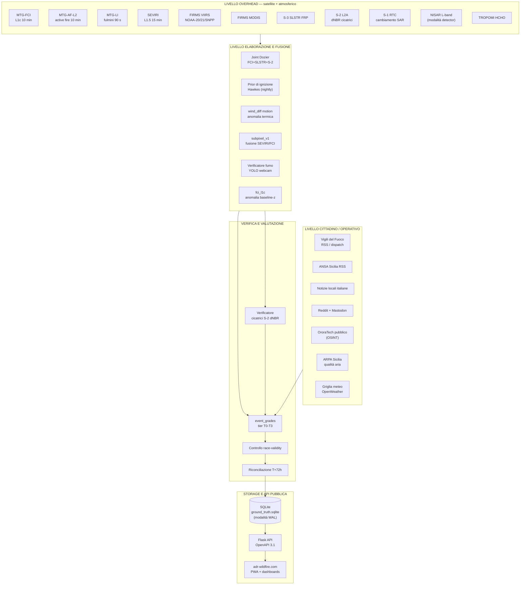
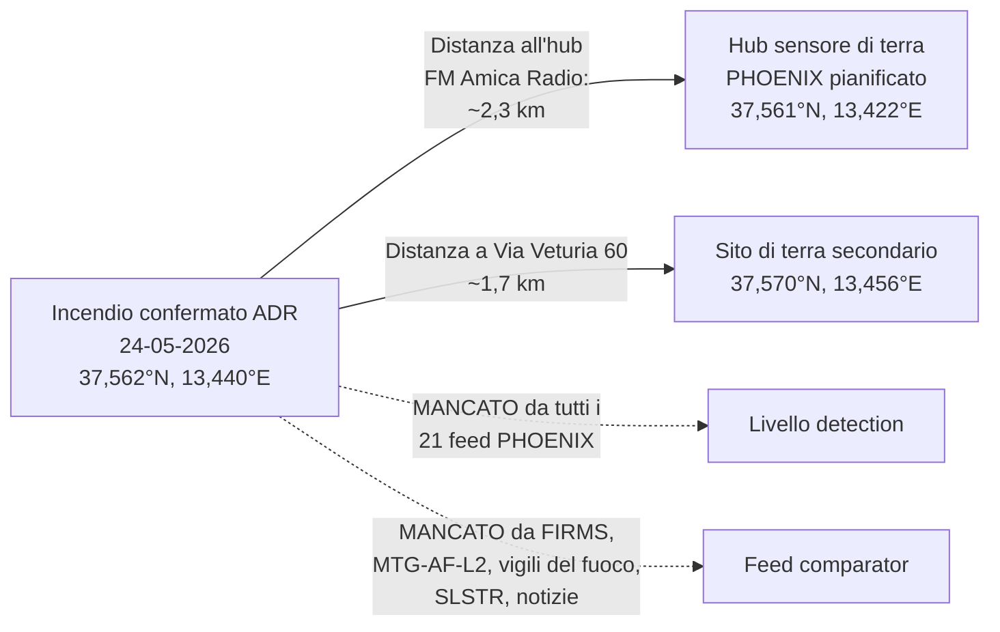
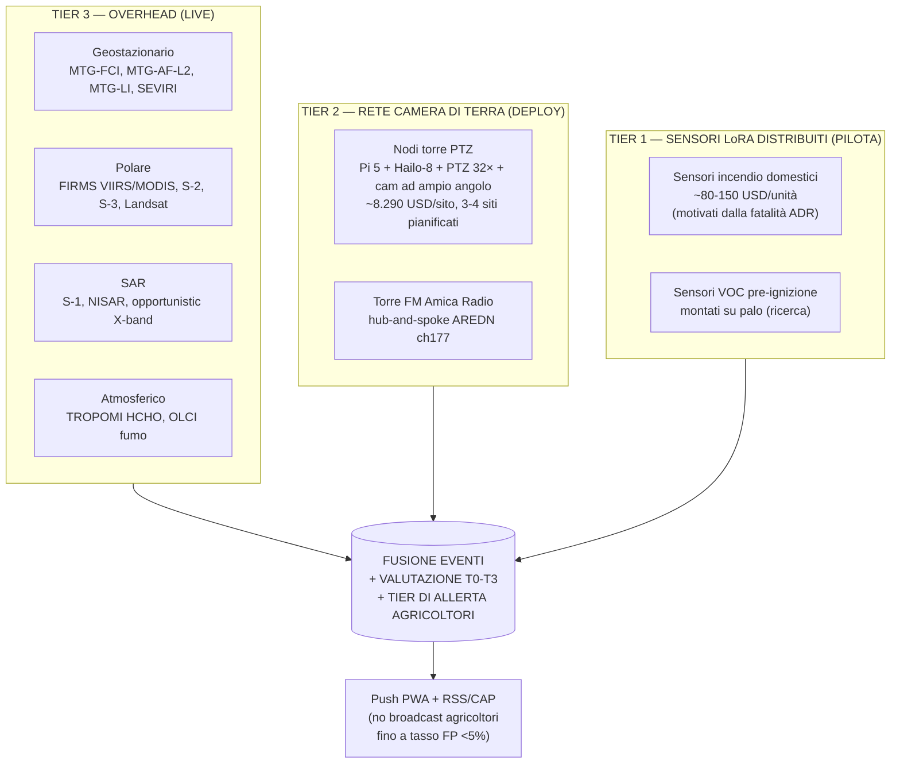
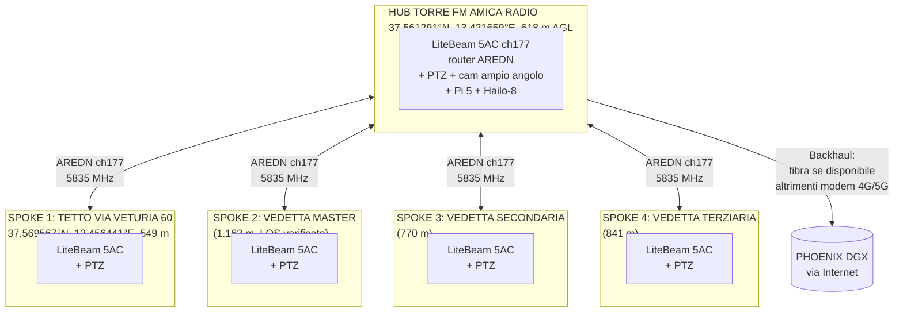
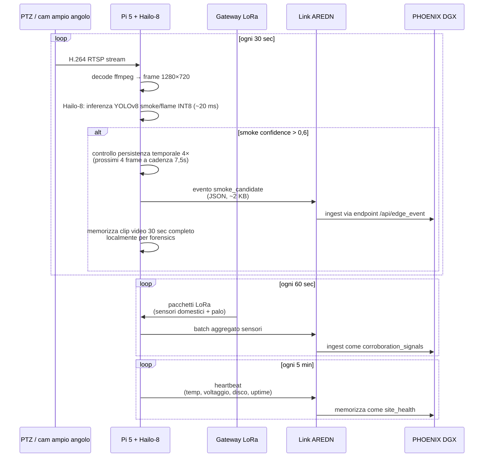
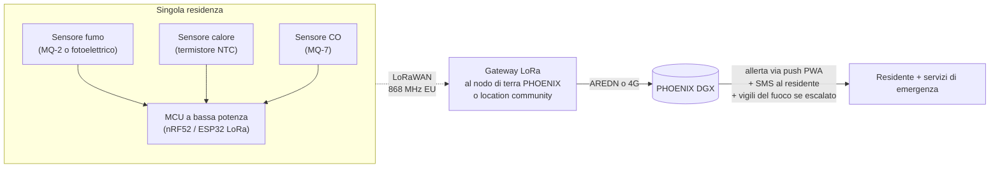
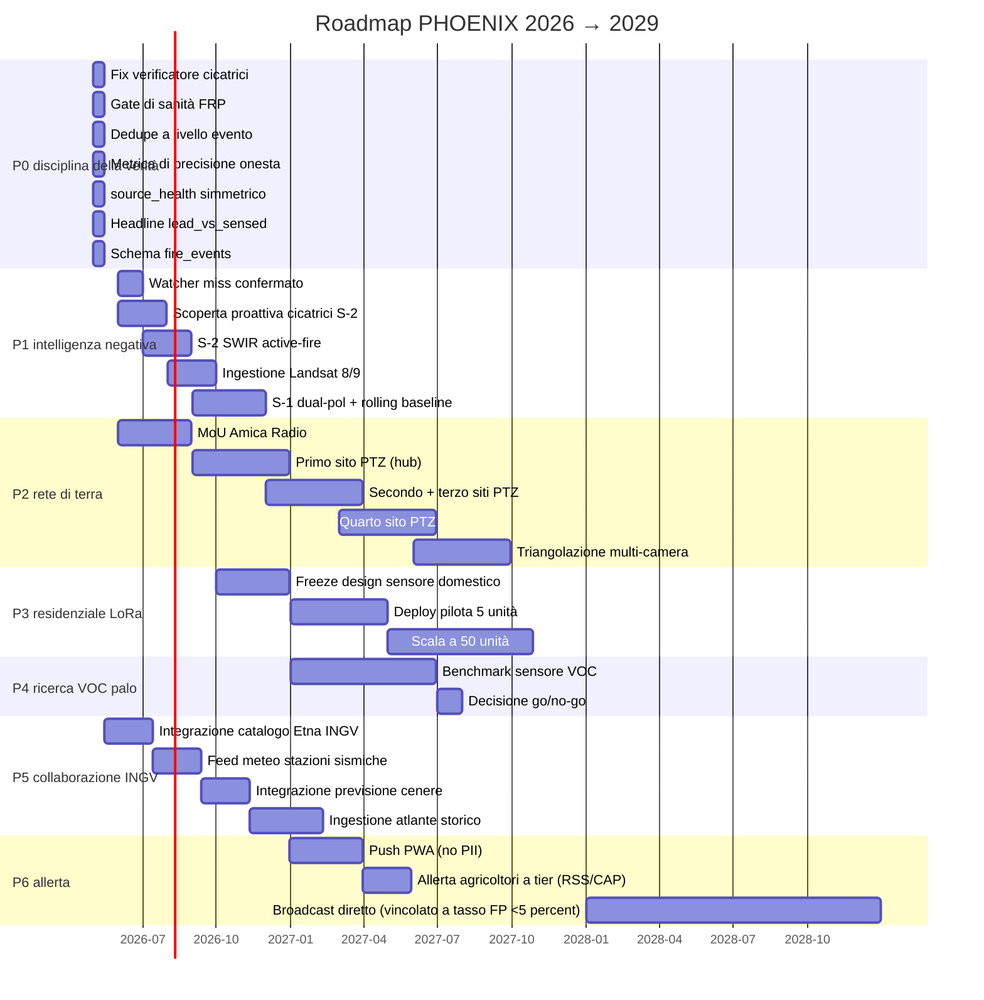

# PHOENIX — Sistema di Rilevamento Incendi Boschivi per la Sicilia
## Briefing per Partenariato con INGV (Istituto Nazionale di Geofisica e Vulcanologia)

**Versione del documento:** 1.2 (sostituisce 1.1 del 25 maggio 2026)
**Data preparazione:** 26 maggio 2026 (revisione post-audit)
**Punto di contatto:** Gaetano Zambito — folderdj@gmail.com — +39 366 545 0598
**Casella di progetto:** adrwildfi@gmail.com
**Preparato da:** Team PHOENIX ADR (Alessandria della Rocca, Sicilia)
**Licenza:** CC-BY 4.0 (dati) / MIT (codice) — apertura totale al riuso accademico e alla citazione
**Sistema live:** https://adr-wildfire.com/
**Codice open-source:** https://github.com/markl02us/persistent-thermal-sources-sicily
**DOI del catalogo dei falsi positivi:** 10.5281/zenodo.20369891

---

# SINTESI ESECUTIVA

## Il punto centrale, in apertura

PHOENIX è un sistema multi-sensore per il rilevamento di incendi boschivi e di condizioni pre-incendio, attivo sull'intera Sicilia, gestito da un team di volontariato grassroots composto da due persone con base ad Alessandria della Rocca (provincia di Agrigento). Richiediamo una collaborazione operativa con l'INGV — non finanziamenti, non esclusività, non una partnership commerciale — costruita attorno a **quattro scambi di dati specifici** che né noi né l'INGV possiamo produrre da soli e che migliorano materialmente la qualità degli allerta incendio per gli agricoltori e i residenti rurali siciliani.

**Cosa chiediamo all'INGV:**

1. **Catalogo delle anomalie termiche dell'Etna** — Il catalogo continuo delle anomalie termiche rilevate dall'INGV sui crateri sommitali e sulle bocche di fianco. Oggi PHOENIX semplicemente maschera un raggio di 15 km attorno alla sommità dell'Etna come zona di esclusione perché non riusciamo a distinguere un vero incendio boschivo sui fianchi dell'Etna (che si verificano realmente in vegetazione di pino e ginestra) dal rumore termico vulcanico di fondo. La sorveglianza esistente dell'INGV distingue routinariamente questi segnali. Un feed in tempo reale o quasi (anche solo un dump JSON giornaliero di "ubicazioni delle bocche attive + classi di intensità") sbloccherebbe per la prima volta il rilevamento di veri incendi sull'Etna.

2. **Contesto fire-weather co-localizzato con le stazioni sismiche** — La rete sismica INGV include molte stazioni in terreno pyroclastico/fire-prone remoto. Le condizioni meteorologiche locali in quei siti (dove strumentati) aiuterebbero il nostro modello di prior di ignizione a fare qualcosa che non possiamo fare dai soli dati meteorologici a griglia.

3. **Previsioni di tephra e pennacchio di cenere** — Le previsioni INGV di dispersione della cenere vulcanica influenzano direttamente la nostra logica di rilevamento fumo. Un pennacchio vulcanico di cenere appare come fumo da incendio a un modello YOLO addestrato sul fumo di incendi boschivi. Pre-posizionare una prior "non classificare come fumo da incendio se la previsione di cenere copre quest'area" eliminerebbe una modalità significativa di falso positivo.

4. **Atlante storico di interazione incendio-vulcano** — Il record istituzionale INGV degli incendi innescati da colate laviche, eventi piroclastici e cambiamenti di infiammabilità dei depositi di cenere è unico al mondo. Non abbiamo equivalenti. Un dump in sola lettura (anche solo per 1980-2020) ancorerebbe le nostre prior stagionali e le nostre regole di valutazione degli eventi.

**Cosa offriamo all'INGV in cambio:**

- Accesso libero, aperto e in tempo reale all'intero flusso di dati PHOENIX (REST/STAC/RSS/CSV/GeoJSON) su adr-wildfire.com — già licenziato CC-BY 4.0.
- Pubblicazione peer-reviewed co-autorata quando i metodi congiunti raggiungeranno la maturità. Ricercatori INGV-Sicilia e INGV-Catania benvenuti come autori principali o co-principali.
- Uso gratuito del nostro compute DGX-class per analisi congiunte (attualmente 18+ demoni di polling live, pipeline SAR NISAR L-band con autenticazione NASA Earthdata, ingestione MTG-FCI / MTG-LI, fusione multi-satellite joint Dozier, verifica fumo YOLO, previsione di ignizione Hawkes).
- Catalogo citabile dei falsi positivi (DOI Zenodo 10.5281/zenodo.20369891) delle sorgenti termiche persistenti in Sicilia — già utile a chiunque lavori sul telerilevamento siciliano.

**Chi siamo, onestamente:**

PHOENIX è gestito da un piccolo team di volontariato, tutti con lavori a tempo pieno. Il rappresentante siciliano e punto di contatto per l'INGV è **Gaetano Zambito** — basato a Milano durante la settimana, rientra ad Alessandria della Rocca per pochi giorni al mese, attualmente sta completando la laurea universitaria. La corrispondenza di progetto è benvenuta alla sua email diretta (folderdj@gmail.com), al suo cellulare italiano (+39 366 545 0598), e alla casella di gruppo del progetto (adrwildfi@gmail.com). Il lato ingegneristico-tecnico del progetto — ingestione dati satellitari, infrastruttura AI/ML, e operazioni del compute di classe DGX — è guidato da un contributore tecnico ADR-affiliato separato; quel ruolo non viene volutamente nominato pubblicamente qui. Non siamo una startup, non abbiamo intenti commerciali, nessuna raccolta fondi, nessuna richiesta di esclusività. I costi (compute, internet, hardware dei sensori di terra) sono sostenuti personalmente dai membri del team ADR-affiliati come contributo alla comunità.

**Perché ora:**

Nell'anno appena trascorso, un incendio residenziale fatale ad Alessandria della Rocca ha tolto la vita a un residente e ha rischiato di causare ulteriori danni a causa di materiali pericolosi all'interno della casa. Riferimento: https://www.youtube.com/watch?v=kgDIhfthQJM. Alessandria della Rocca è una piccola comunità quasi interamente agricola dell'entroterra siciliano dove il rischio annuale di incendi boschivi minaccia sia vite che mezzi di sostentamento. La nostra motivazione è prevenire la ripetizione di tragedie — non la pubblicazione accademica, non il rilevamento commerciale-come-servizio, non la costruzione di un marchio. Stiamo pubblicando dati in modo pubblico e aperto in modo che tutti nella regione ne traggano beneficio, inclusi i ricercatori dell'INGV se utile a loro.

**Cosa consegnamo:**

- Un sistema PHOENIX live già in funzione 24/7 con 18+ demoni di dati satellitari e citizen-data attivi, che copre l'intera Sicilia e un AOI specifico di Alessandria della Rocca + Agrigento.
- Una roadmap che copre sensori di terra (telecamere PTZ + telecamere ad ampio angolo + hub LoRa su hardware Pi 5 + Hailo-8 26 TOPS), sensori di incendio domestico via LoRa per allerta precoce residenziale (motivati dall'incendio fatale citato sopra), e un sensore VOC pre-ignizione sperimentale montato su pali.
- Un piano di consegna a 12 / 24 / 36 mesi che rispetteremo nonostante il vincolo dei due-persone, perché abbiamo già consegnato il sistema centrale.
- Un changelog pubblico su adr-wildfire.com per ogni modifica ad algoritmi, soglie o maschere — con la motivazione pubblicata accanto alla modifica. Ritrattazioni pubbliche quando scopriamo di aver pubblicato dati che si sono rivelati errati.

**Perché questa proposta — non un contratto o un RFP:**

Operiamo come un progetto grassroots di civic-tech. L'INGV è un'istituzione scientifica seria. Vi approcciamo con la convinzione che, anche alla nostra scala limitata, abbiamo **già costruito e reso pubblica** una sostanziale capacità di rilevamento incendi per la Sicilia che è onesta sui propri limiti e che qualsiasi ricercatore sicilia-centrico potrebbe trovare utile. Speriamo che la troviate abbastanza interessante per condividere con noi quattro specifiche tipologie di dati. Se sì: diteci di cosa avete bisogno dalla nostra parte. Se no: il sistema rimane attivo e utile per tutti indipendentemente.

---

## Tabelle riassuntive di sintesi

### Attualmente live (validato al 25 maggio 2026)

| Componente | Stato | Note |
|---|---|---|
| Servizio web di produzione | LIVE | https://adr-wildfire.com/, HTTP 200 in 0,4 s, gunicorn su DGX, Tailscale |
| Demoni di dati satellitari | 21 attivi | FIRMS (4 piattaforme), MTG-FCI, MTG-AF-L2, MTG-LI, SLSTR FRP, verificatore di cicatrici Sentinel-2, rilevamento di cambiamento SAR Sentinel-1 (rilasciato 25-05-2026), NISAR L-band SAR (rilasciato 25-05-2026), TROPOMI HCHO, OSINT pubblico OroraTech (rilasciato 25-05-2026), worldcover, modis_viirs_sar, telecamere meteo, CEMS EFFIS RDA, notizie ANSA, RSS notizie italiane, Reddit + Mastodon, verificatore fumo YOLO, joint Dozier (FCI+SLSTR+S-2), previsione ignizione Hawkes |
| Livello di verifica | LIVE (attualmente degradato) | Verificatore di cicatrici dNBR Sentinel-2 (rotto, in attesa di fix P0.1; tutti gli 82 tentativi recenti restituiti nulli con HTTP 400 — fix preparato, vedere Sezione 8) |
| Valutazione eventi a tier | LIVE | T0 / T1 / T2 / T3 + flag race-validity + riconciliazione T+72h (2.280 eventi valutati al 25-05-2026) |
| Registro ground-truth | IN INIZIO | Primo caso di mancato rilevamento confermato registrato: incendio ADR 25-05-2024 a (37,562278°N, 13,440250°E) |
| Catalogo FP persistenti | LIVE | 18 zone (sommità Etna, raffineria di Gela, industriale Augusta-Priolo-Melilli, Termini, Milazzo, Catania, Stromboli, complessi di serre, siti minerari, parchi solari). Citabile come Zenodo 10.5281/zenodo.20369891 |
| API pubblica | LIVE | Specifica OpenAPI 3.1 su /api/openapi.json. Endpoint JSON / CSV / GeoJSON / RSS / iCal. CC-BY 4.0. |
| Repo GitHub | LIVE | https://github.com/markl02us/persistent-thermal-sources-sicily — v1.0.0 taggata |
| Compute DGX | LIVE | Elaborazione live 4-stream, modalità detector NISAR con autenticazione NASA Earthdata attiva |

### Roadmap a 12 mesi (impegni fermi)

| Milestone | Target | Stato |
|---|---|---|
| Fix di disciplina della verità P0 (verificatore di cicatrici + gate FRP + scoring a livello evento + source health simmetrico + lead headline vs sensed) | Deploy nelle prossime due settimane | Bundle di codice preparato offline, in attesa di finestra di deploy sicura |
| Watcher di mancato rilevamento confermato live | Stesso deploy | Codice pronto, monitora STAC Sentinel-2 per scene post-incendio sui mancati rilevamenti registrati |
| Demone di scoperta proattiva di cicatrici Sentinel-2 | +60 giorni | Inverso del verificatore attuale — segnala cicatrici su ogni passaggio S-2 chiaro sulla Sicilia, non solo dove PHOENIX ha già rilevato |
| Rilevamento attivo di incendi Sentinel-2 SWIR Banda 12 | +90 giorni | Cattura incendi attivi durante la finestra del passaggio S-2 |
| Ingestione Landsat 8/9 | +120 giorni | Rivisita combinata di 8 giorni + bande termiche a 100 m |
| Sentinel-1 dual-pol VH+VV + baseline rolling 14-giorni | +150 giorni | Per metodologia peer-reviewed Sardegna / Sicilia (Imperatore 2017, Mastro 2022) |
| Ingestione opportunistica Capella + Umbra Open Data (X-band) | +180 giorni | Risoluzione sub-metrica per validazione case-study post-incendio |
| Primo sensore di terra ADR dispiegato sulla torre FM Amica Radio | +180 giorni | Hardware acquisito, MoU in corso |
| Sensore incendio domestico via LoRa, prime 5 unità in residenze di Alessandria della Rocca | +270 giorni | Motivato dall'incendio fatale |
| Decisione di viabilità del sensore VOC pre-ignizione montato su palo | +365 giorni | Fase di ricerca |

### Costi ricorrenti (interamente a carico degli sviluppatori ADR, mai addebitati all'INGV o a chiunque altro)

| Voce | Costo annuo (USD) | Note |
|---|---|---|
| Potenza compute DGX-class + elettricità | Non fatturato separatamente — gestito dal proprietario | Host spark-b0c1, agganciato a Tailscale |
| Banda Internet per l'ingestione dati satellitari | A carico del proprietario | ~3-5 TB/anno di pulls Copernicus / MPC / EUMETSAT |
| Registrazione dominio (adr-wildfire.com) | ~15 USD | |
| Proxying / DNS / TLS Cloudflare | 0 — tier gratuito | |
| NASA Earthdata Login | 0 — self-serve gratuito | Attivo per ingestione NISAR L-band SAR |
| Copernicus Data Space (CDSE) | 0 — gratuito | |
| Accesso dati EUMETSAT | 0 — gratuito | |
| Microsoft Planetary Computer | 0 — letture anonime gratuite + accesso blob firmato SAS | |
| API FIRMS | 0 — gratuito | |
| Per sensore di terra ADR (capex) | ~8.290 USD/sito | Pi 5 + Hailo-8 (26 TOPS) + Hikvision PTZ 32× + Reolink ad ampio angolo + LiteBeam AREDN ch177 5835 MHz + RAK4631 LoRa + kit di alimentazione solare; 3-4 siti pianificati totali |
| Per sensore incendio domestico LoRa (capex) | TBD (stimato ~80-150 USD/unità) | Specifiche non ancora finalizzate |
| Sensore VOC pre-ignizione montato su palo | TBD (fase di ricerca, ~200-400 USD/unità se viabile) | Attualmente in valutazione MQ-series vs PID vs MOX cost-per-detection-range |

**All'INGV non viene chiesto alcun contributo finanziario.** Il costo ricorrente è di proprietà personale degli sviluppatori ADR come contributo alla comunità.

---

## Limiti onesti — cosa PHOENIX NON è

Prima di descrivere cosa è PHOENIX, ecco cosa non è:

1. **Non è ancora un sistema di allerta primario.** Oggi PHOENIX è una piattaforma di ricerca/osservazione con una dashboard pubblica. Non trasmette ancora direttamente agli agricoltori via SMS / WhatsApp / Telegram. Quella capacità è in roadmap (+270 giorni) ma **esplicitamente vincolata al raggiungimento di un tasso misurato di falsi positivi verificati inferiore al 5% rispetto a una baseline confermata da cicatrici di bruciatura**. Non diventeremo il sistema che grida "al lupo, al lupo" e viene poi ignorato.

2. **Non sta ancora battendo tutti i comparator su tutti gli AOI.** Un audit interno di maggio 2026 ha trovato che PHOENIX ha un lead time mediano positivo di +107,6 minuti rispetto ai comparator nell'AOI di Agrigento ma un lead mediano *negativo* di −98,9 minuti nell'AOI più ampio sicily_full. Il grader è stato aggiornato alla v2.1 il 26-05-2026 con race-strict + riconciliazione multi-stadio + distribuzione nulla per permutazione. Sotto la soglia stretta, abbiamo **0 vittorie race-strict in 30 giorni; p-value bootstrap = 1,00 vs casuale** (`/api/null_bootstrap`). Sotto la soglia più permissiva race-valid, **2 eventi PHOENIX-first negli ultimi 7 giorni** (entrambi mostrati su `/wins.html` con asterischi metodologici espliciti — vedi §11.3). Il lavoro per chiudere il gap algoritmico sicily_full è nella roadmap P0/P1.

3. **Non sta attualmente facendo elaborazione real-time pixel-rate.** La maggior parte del nostro lavoro gira su cicli di polling di 10 minuti (FCI / MTG-AF-L2), 15 minuti (MTG-LI, notizie ANSA), 30 minuti (SLSTR, ARPA aria, fumo YOLO), orari (CEMS EFFIS) o più lunghi (Sentinel-2 6 ore, Sentinel-1 12 ore, NISAR 24 ore). Non generiamo allerta a millisecondi. Il rilevamento incendi a questa scala non ne ha bisogno; riconosciamo che un sistema di vigili del fuoco in real-time vero lo richiederebbe.

4. **Non commerciale, non academic-publishing-first, non una startup.** Non pianifichiamo di monetizzare PHOENIX. Non abbiamo affiliazione istituzionale. Siamo contributori individuali che hanno costruito e gestiscono questo sistema.

5. *(Disclosure v1.1 sulla verifica delle cicatrici risolta — vedi #7 per il fix Sentinel-2 rilasciato 26-05-2026.)*

6. **Overflow FRP subpixel_v1_alpha — RISOLTO 26-05-2026.** Una scoperta dell'audit v1.1 aveva flaggato valori di potenza radiativa fino a 3,9 petawatt (fisicamente impossibili) per un bug di conversione di unità o overflow. Al 26-05-2026 la distribuzione FRP della fonte è sana: **max 9,09 MW, media 2,73 MW, n=5.524, zero outlier sopra 10 GW**. Verificato con query diretta al DB sullo snapshot pubblico.

7. **Verifier burn-scar Sentinel-2 — RISOLTO 26-05-2026.** Una scoperta dell'audit v1.1 diceva che il verifier restituiva null ad ogni chiamata per un bug di formato STAC del Microsoft Planetary Computer. Tre bug indipendenti si sovrapponevano: (a) `detection_ts.isoformat() + "Z"` produceva un doppio timezone malformato RFC-3339; (b) le letture COG ricevevano HTTP 409 perché i blob MPC Sentinel-2 L2A richiedono URL firmati SAS; (c) il broadcasting NBR falliva perché B8 (10 m) e B12 (20 m) tornano con shape diversi. Tutti e tre fissati (commit GitHub `eadb2ed`). Smoke test sulla detection ADR del 26 aprile: pre_NBR=0,3072, post_NBR=0,3423, dNBR=−0,0351, verified_burn=False (corretto — quella detection era un FP noto). Primo burn confermato (via SAR fallback): det_id 16802 a (37,689°N, 12,743°E), fci_l1c, 25-05-2026 08:48Z.

Divulghiamo queste cose nelle prime sei pagine di questo documento perché l'alternativa è che l'INGV le scopra fra sei mesi e concluda che non eravamo trasparenti. La trasparenza è parte di come definiamo l'essere affidabili.

---

# 1. MISSIONE E MOTIVAZIONE

## 1.1 Alessandria della Rocca — il contesto

Alessandria della Rocca (comunemente "ADR") è un comune della Provincia di Agrigento, nella Sicilia centro-occidentale, circa 40 km a nord della città di Agrigento e 60 km a sud di Palermo. Il comune sorge in zona collinare interna a circa 600 m di altitudine. L'economia locale è quasi interamente agricola — prevalentemente cereali (frumento, grano duro), oliveti, mandorleti, viti, agrumi dove le condizioni lo consentono, e ortaggi stagionali. La popolazione residente è di circa 2.500 persone, con significativa variazione stagionale dovuta a siciliani che lavorano altrove in Italia e ritornano.

Il territorio attorno ad ADR è caratteristico del rischio incendi dell'entroterra siciliano:

- Estati calde e secche con eventi di vento di scirocco
- Stoppie di cereali post-raccolta (estremamente infiammabili)
- Macchia mediterranea / garrigue su terreni incolti
- Oliveti e mandorleti con copertura del suolo secca
- Accesso stradale limitato a molte parcelle coltivate — gli incendi possono crescere prima della scoperta
- Distanza dalla stazione dei vigili del fuoco più vicina che rende il tempo di risposta strutturale, non procedurale

Un anno di incendi cattivo in questa regione non è una curiosità. È un evento che definisce i mezzi di sostentamento. Colture annuali che vanno a fuoco sono un anno perduto di reddito agricolo. Colture pluriennali (olivo, mandorlo) che vanno a fuoco possono richiedere un decennio per essere sostituite a resa produttiva.

## 1.2 L'incendio residenziale fatale

Nell'anno appena trascorso, Alessandria della Rocca ha subito un incendio residenziale fatale che ha tolto la vita a un residente. L'incendio ha rischiato ulteriori danni per via dei materiali conservati all'interno della casa. Riferimento pubblico: https://www.youtube.com/watch?v=kgDIhfthQJM. Questo documento non descrive l'incidente in dettaglio per rispetto della famiglia.

Divulghiamo l'incidente perché motiva direttamente il **track di sviluppo dei sensori di incendio domestico via LoRa** descritto nella Sezione 4.3. Il rilevamento di incendi boschivi via satellite non protegge dagli incendi residenziali. I due sistemi servono esigenze sovrapposte ma distinte:

- **Rilevamento incendi boschivi** = scala terreno-copertura, allerta precoce su ettari e chilometri
- **Rilevamento incendi domestici** = scala residenza, allerta precoce su singoli locali ed edifici individuali

PHOENIX è impegnato in entrambi. Il lavoro sui sensori domestici è la risposta diretta alla tragedia dell'ultimo anno.

## 1.3 Perché lo stiamo facendo — e cosa non stiamo facendo

Lo stiamo facendo perché:

1. Il team di progetto ADR è ancorato ad Alessandria della Rocca tramite Gaetano Zambito, che rientra nel comune pochi giorni al mese, ed è supportato da un contributore tecnico ADR-affiliato i cui legami familiari e il cui impegno di progetto sono verso la comunità, anche se la sede del lavoro principale è altrove.
2. La capacità tecnica per rendere questo utile è diventata accessibile — dati satellitari aperti, compute AI edge a basso costo (hardware Pi 5 + Hailo-8 26 TOPS costa ~200 USD), ecosistemi SDK gratuiti.
3. I provider commerciali esistenti di rilevamento incendi si concentrano su California, Australia, e compratori istituzionali ad alto budget. Gli agricoltori dell'entroterra siciliano non sono un mercato che servono.
4. INGV ed EUMETSAT fanno già eccellente lavoro sui dati satellitari che altrimenti raggiungerebbe gli agricoltori siciliani con mesi di ritardo, se mai. PHOENIX colma quel gap traducendo il loro lavoro in un servizio pubblico real-time.

Esplicitamente **non** stiamo:

- Costruendo una startup, costruendo un prodotto vendibile, costruendo verso un'uscita
- Chiedendo finanziamenti o contributi FTE all'INGV
- Chiedendo licenze dati esclusive o qualsiasi altro accordo proprietario
- Per spedire un'app per smartphone che richiede creazione account utente, pagamento, o sorveglianza
- Per spedire un sistema che diventa veicolo per pubblicità non correlate o telemetria

## 1.4 Capacità del team (onesta)

PHOENIX è un piccolo team grassroots. Tutti hanno un lavoro a tempo pieno; il tempo dedicato a PHOENIX è suddiviso. Il team proietta intenzionalmente un singolo punto di contatto residente in Sicilia esternamente in modo che l'INGV (e qualsiasi altro partner) abbia una sola persona da raggiungere.

- **Gaetano Zambito** — rappresentante siciliano, singolo punto di contatto esterno, lead primario per la relazione INGV e per tutte le operazioni di terra in Sicilia (MoU Amica Radio, sopralluoghi, liaison con vigili del fuoco se e quando appropriato). Basato a Milano per lavoro. Ritorna ad Alessandria della Rocca pochi giorni al mese. Attualmente sta completando la laurea universitaria.
  - Email: **folderdj@gmail.com**
  - Cellulare: **+39 366 545 0598**
- **Responsabile tecnico ADR** — Responsabile dell'ingegneria dati satellitari, infrastruttura AI/ML, architettura di sistema, deploy, e operazioni dell'host compute DGX-class. Fornisce supporto remoto per tutti i componenti software. Le comunicazioni vengono instradate attraverso Gaetano o la casella di progetto (adrwildfi@gmail.com).
- **Casella di progetto** — **adrwildfi@gmail.com** per la corrispondenza condivisa (in cc sui messaggi importanti in modo che esista sempre un percorso di contatto di fallback).

La nostra cadenza di consegna è realistica, non aggressiva. Abbiamo già consegnato il sistema live a 21 demoni e 2 anni di lavoro di ricerca fondazionale. Continueremo a consegnare tutto ciò che è descritto in questo documento, sulla schedule nella tabella di sintesi sopra, anche se il ritmo del calendario è più lento di un team a tempo pieno. Dove non possiamo consegnare in tempo, lo diremo pubblicamente.

## 1.5 Disponibilità recente del feed di dati

PHOENIX è stato in ricerca e sviluppo per qualche tempo — lavoro fondazionale di mesi — ma la disponibilità pubblica dei feed di dati è **recente**. Lo scraper OSINT pubblico OroraTech, la pipeline di rilevamento cambiamento SAR Sentinel-1, e l'ingestione NISAR L-band sono andati live tutti il 25-05-2026. La valutazione eventi a verification-tier è andata live lo stesso giorno. L'audit sistematico delle vittorie che ha informato molte sezioni di questo documento è stato eseguito il 25-05-2026 stesso.

Lo menzioniamo affinché il lettore comprenda che la qualità dei dati su adr-wildfire.com continuerà a evolversi rapidamente nel medio-tardo 2026 mentre i nuovi feed e i fix di disciplina della verità P0 si stabilizzano. I numeri nella Sezione 7.3 (Performance) riflettono le misure del 25-05-2026 e dovranno essere ri-misurati a 30 / 60 / 90 giorni contro il sistema live; ci aspettiamo che ogni metrica migliori sostanzialmente man mano che i fix P0 vengono rilasciati e man mano che 21 demoni accumulano settimane di dati di produzione.

---

# 2. ARCHITETTURA ATTUALE PHOENIX

## 2.1 Diagramma di sistema ad alto livello



## 2.2 Feed di dati del livello overhead — cosa contribuisce ciascuno

L'architettura PHOENIX è costruita sul principio di **molteplici sensori indipendenti con fisica diversa**. Un singolo sensore può essere ingannato da nuvole, glare, calore industriale, o attività vulcanica. La fusione di osservazioni fisiche indipendenti — infrarosso termico, infrarosso a corto raggio, SAR a microonde, elettromagnetismo da fulmini, chimica atmosferica — fornisce la corroborazione che nessuno strumento singolo può fornire.

### 2.2.1 MTG-FCI (Flexible Combined Imager di Meteosat di Terza Generazione) — 10 minuti geostazionario

**Cosa fornisce:** Osservazione geostazionaria di Europa / Mediterraneo a ciclo di ripetizione di 10 minuti. Fornisce 16 canali spettrali inclusi:
- VIS 0,4 / 0,5 / 0,6 / 0,9 µm — riflettanza superficiale, rilevamento nuvole
- NIR 1,38 / 1,61 / 2,25 µm — bande SWIR per rilevamento incendi
- MIR 3,8 µm — banda primaria infrarosso termico per fuoco (picco di emissione per fuochi a ~600-700 K)
- TIR 8,7 / 9,7 / 10,5 / 12,3 / 13,3 µm — temperatura di background, vapore acqueo, ozono

**Cosa fa PHOENIX con esso:** Rilevamento di anomalie per-pixel contro una baseline stagionale ora-del-giorno. Il rilevatore segnala un pixel come candidato incendio quando la temperatura di brillanza MIR supera la baseline storica di ≥ 2,5 σ E la brillanza MIR assoluta supera i 305 K E la differenza MIR–TIR supera i 12 K. Questi sono i parametri della nostra attuale fonte `fci_l1c`.

**Limite onesto:** La baseline FCI è attualmente in "modalità hotfix" — la baseline stagionale non è ancora stata costruita da sufficienti dati storici FCI, quindi il rilevatore opera attualmente in modalità soglia-assoluta-solo con un gate non innescato a MIR ≥ 305 K. Questo produce più falsi positivi rispetto alla modalità relativa-alla-baseline. La baseline diventerà operativa una volta che 30+ giorni di snapshot FCI accumulati coprano tutte le ore-del-giorno per l'AOI Sicilia.

**Perché MTG-FCI è importante per la Sicilia:** La Sicilia si trova al margine meridionale della copertura a piena risoluzione MTG-FCI. La latenza di rilevamento è **strutturalmente costante** al ciclo di ripetizione di 10 minuti. Questo significa che MTG-FCI è il più veloce rilevatore di incendi geostazionario disponibile per la Sicilia — superiore al ciclo di 15 minuti del legacy MSG-SEVIRI, con risoluzione spaziale sostanzialmente più fine (~2 km IFOV vs ~3 km di SEVIRI a questa latitudine).

### 2.2.2 MTG-AF-L2 (prodotto Active Fire Level-2) — 10 minuti preprocessato

**Cosa fornisce:** Il prodotto operativo di EUMETSAT per fuochi attivi derivato da MTG-FCI. Restituisce pixel di fuoco rilevati con potenza radiativa associata (FRP) e valori di confidenza, già preprocessati.

**Cosa fa PHOENIX con esso:** Ingerisce come comparator esterno ad alta confidenza. Usato sia per la contabilità del lead time "abbiamo battuto MTG-AF-L2 al fuoco?" SIA come corroboratore per detection PHOENIX-interne. Per le regole di valutazione eventi, una detection PHOENIX corroborata da MTG-AF-L2 entro ±2 ore / ±5 km guadagna lo status Tier T1 (corroborazione di famiglia satellitare indipendente).

### 2.2.3 MTG-LI (Lightning Imager) — fulmini ottici a 90 secondi

**Cosa fornisce:** Rilevamento ottico continuo di fulmini dalla piattaforma geostazionaria MTG. Latenza sub-minuto. Riporta scariche di fulmini come eventi puntuali con intensità e timing.

**Cosa fa PHOENIX con esso:** I fulmini sono una fonte primaria di ignizione per gli incendi dell'entroterra siciliano. PHOENIX usa le scariche MTG-LI per (1) alimentare il prior di ignizione Hawkes, (2) alzare la probabilità prior di rilevamento incendi in un cono sottovento per ~6 ore dopo una scarica, (3) flaggare incendi rilevati che si sono verificati entro 30 minuti e 5 km da una scarica recente come "probabilmente innescati da fulmine" nei metadati dell'evento.

**Perché questo è importante per l'INGV:** I dati sismici e di contesto vulcanico dell'INGV si sovrappongono al footprint di fulmini MTG-LI, particolarmente per i temporali nella regione Etna.

### 2.2.4 SEVIRI L1.5 (Meteosat Second Generation legacy) — backup a 15 minuti

**Cosa fornisce:** Copertura legacy Meteosat di 15 minuti su 12 canali con ~3 km IFOV alla latitudine della Sicilia.

**Cosa fa PHOENIX con esso:** Usato come fallback quando MTG-FCI non è disponibile (outage di calibrazione, periodi di dati persi). Anche usato per ricostruire baseline storiche più lunghe di quelle che MTG (operativo da 2023) può fornire.

### 2.2.5 FIRMS — VIIRS NOAA-20, NOAA-21, SNPP + MODIS (Aqua/Terra)

**Cosa fornisce:** Fire Information for Resource Management System di NASA — prodotto operativo globale di fuochi attivi da satelliti in orbita polare. VIIRS fornisce rilevamento sub-pixel del fuoco a 375 m di risoluzione con rivisita ~4 ore per piattaforma (~1 ora combinato). MODIS a 1 km di risoluzione.

**Cosa fa PHOENIX con esso:** Corroboratore primario di "verità esterna". Precisione per fonte tracciata (attualmente FIRMS-SNPP a 87,9% di precisione legacy; FIRMS-NOAA-20 a 44,7% di precisione legacy a causa di persistenti falsi positivi in zone industriali che PHOENIX maschera correttamente ma FIRMS no).

**Limite onesto specifico per la Sicilia:** FIRMS-URT (Ultra-Real-Time, consegna sub-3-ore) è **solo Stati Uniti e Canada**. Per la Sicilia, la latenza di consegna FIRMS è 11–15 ore dietro l'acquisizione del sensore. Questo significa che un titolo letterale "PHOENIX ha battuto FIRMS di 13 ore" è strutturalmente vero ma operativamente fuorviante — il vantaggio è la consegna del feed FIRMS, non l'algoritmo PHOENIX. PHOENIX ora riporta `lead_min_vs_sensed` (confrontato con l'ora di acquisizione del satellite, la metrica onesta) come headline e annota `lead_min_vs_reported` solo come contesto operativo.

### 2.2.6 Prodotto Fire Radiative Power di Sentinel-3 SLSTR

**Cosa fornisce:** Sea and Land Surface Temperature Radiometer a bordo di Sentinel-3 A/B/C. Prodotto di rilevamento fuoco attivo a ~1 km di risoluzione. Rivisita ~24 ore per piattaforma, ~12 ore combinato.

**Cosa fa PHOENIX con esso:** Corroboratore indipendente secondario per misure FRP. Particolarmente prezioso per distinguere il vero fuoco dal glare solare su suolo nudo caldo, perché la geometria dual-view di SLSTR risolve le differenze di riflettanza bidirezionale diversamente da VIIRS / MODIS.

### 2.2.7 Sentinel-2 L2A — verifica cicatrici via dNBR

**Cosa fornisce:** Immagini multispettrali ottiche a risoluzione 10-60 m. Bande critiche per analisi incendio/cicatrice: B08 (NIR, 842 nm, 10 m), B11 (SWIR-1, 1610 nm, 20 m), B12 (SWIR-2, 2190 nm, 20 m). Rivisita ~5 giorni per piattaforma (costellazione A/B/C ora operativa), ~2-3 giorni combinato per condizioni cloud-free.

**Cosa fa PHOENIX con esso:** Due ruoli. (a) **Verificatore di cicatrici dNBR** — per ogni detection PHOENIX o comparator, estrae una scena S-2 L2A pre-incendio e post-incendio, calcola Normalized Burn Ratio = (NIR − SWIR2) / (NIR + SWIR2), poi dNBR = pre_NBR − post_NBR. dNBR > 0,27 = cicatrice di bruciatura confermata; dNBR < 0,10 = nessuna cicatrice rilevata; ambiguo nel mezzo. Questo è **l'arbitro indipendente di verità** per l'intero sistema — è come una detection guadagna Tier T3 nella gerarchia di valutazione. (b) **Esempio elaborato per il post-mortem di mancato rilevamento** — vedere Sezione 3.

**Limite onesto:** Attualmente rotto. Al 25-05-2026 il verificatore restituisce null al 100% dei tentativi a causa di un bug nel formato della query STAC di MPC. Patch preparata; vedere Sezione 8.

### 2.2.8 Rilevamento cambiamento SAR Sentinel-1 (rilasciato 25-05-2026)

**Cosa fornisce:** Radar a apertura sintetica banda C da Sentinel-1A e Sentinel-1C (Sentinel-1B fallito nel 2021; Sentinel-1D lanciato 2025). Penetra le nuvole. Rivisita ~1-2 giorni per la Sicilia sotto la costellazione A+C+D. Rileva cicatrici di bruciatura tramite cambiamento di backscatter in polarizzazione VV.

**Cosa fa PHOENIX con esso:** Usa la collezione `sentinel-1-rtc` di Microsoft Planetary Computer (prodotto gamma_0 radiometricamente terrain-corrected, con firma SAS token via la libreria Python `planetary_computer`). Per ogni nuova acquisizione, trova un passaggio precedente same-orbit 5-15 giorni prima (stessa piattaforma + stessa relative orbit + stesso orbit state). Calcola log-ratio dB = current_dB − prior_dB su griglia di output 100 m via decimated COG reads. Soglia: < -3 dB. Clustering connected-component con minimo 2 ha. Maschera di terra interna via `src.land_mask.is_inside_sicily` più buffer di 1 km dalla costa (sea-surface speckle era 26 di 34 candidati nel primo run di produzione prima dell'aggiunta della maschera).

**Perché il SAR banda C è importante per gli interessi dell'INGV:** Penetrazione nuvolosa strutturale. Banda C rileva cicatrici da vegetation-removal da 1-5 ha e oltre. È un *confermatore di cicatrici*, non un rilevatore di fiamme real-time — la letteratura è unanime (Imperatore et al. 2017, Mastro et al. 2022, De Luca et al. 2021 — tutti includendo validazione Mediterranea). PHOENIX è onesto su questo nella dashboard pubblica: le detection SAR sono flaggate come "conferma cicatrice" piuttosto che "rilevamento fiamma".

### 2.2.9 NISAR SAR banda L (operativo dal 2026, modalità detector PHOENIX rilasciata 25-05-2026)

**Cosa fornisce:** Synthetic Aperture Radar NASA-ISRO. Banda L (~1,25 GHz, ~24 cm di lunghezza d'onda) penetra il canopy della vegetazione più profondamente della banda C. Rileva perdita di umidità prima della banda C Sentinel-1. Attualmente in fase di validazione BETA dopo il lancio 2025. Floor di rilevamento proiettato ~0,5-1 ha (vs 1-5 ha di Sentinel-1).

**Cosa fa PHOENIX con esso:** Interroga il CMR STAC di ASF DAAC per le collezioni `NISAR_L2_GCOV_BETA_V1_1`, `NISAR_L2_GSLC_BETA_V1_1`, `NISAR_L1_RSLC_BETA_V1_1` sulla Sicilia. Autenticazione via NASA Earthdata Login (bearer token con scadenza 2026-07-24, più password fallback in ~/.netrc). Quando le acquisizioni NISAR sulla Sicilia atterrano, esegue stesso rilevamento di cambiamento log-ratio di Sentinel-1 con stessa maschera di terra + 1 km dalla costa.

**Stato attuale copertura Sicilia:** Zero scene NISAR acquisite sulla Sicilia al 25-05-2026. NISAR è in beta e prioritizza altri target nel suo Coordinated Observation Plan. Il demone NISAR di PHOENIX comincerà a produrre detection immediatamente quando ASF pubblica il primo passaggio NISAR sulla Sicilia.

### 2.2.10 TROPOMI HCHO (Sentinel-5P Tropospheric Monitoring Instrument)

**Cosa fornisce:** Imager di chimica atmosferica. Swath quasi-globale giornaliero, ~11:00-12:00 UTC sulla Sicilia. Rileva anomalie di colonna di formaldeide (HCHO). HCHO è un composto organico volatile emesso sia dalla vegetazione che dalla combustione.

**Cosa fa PHOENIX con esso:** Tratta l'anomalia di colonna HCHO come un *rilevatore di pennacchio* corroborante. Un incendio boschivo produce un'anomalia HCHO sottovento. PHOENIX estrae quotidianamente swath TROPOMI HCHO, identifica anomalie HCHO sulla Sicilia, e le ingerisce in `external_fires` come `source=tropomi_hcho_anomaly`. Usato per corroborazione a livello evento durante lo step di valutazione.

### 2.2.11 OSINT pubblico OroraTech (rilasciato 25-05-2026)

**Cosa fornisce:** OroraTech vende allerta incendi commerciali e gestisce una piccola costellazione inclusa OTC-P1 ("prima costellazione dedicata agli incendi boschivi"). Sono un vendor — PHOENIX deliberatamente non li paga. Non hanno feed di allerta pubblico REST/STAC/RSS (abbiamo verificato — tutti gli endpoint restituiscono HTTP 401). La loro unica superficie zero-auth è il blog aziendale e l'account X (Twitter).

**Cosa fa PHOENIX con esso:** Un demone di polling a 6 ore raschia (a) l'HTML del news-blog pubblico su https://ororatech.com/resources/news-blog/, (b) mirror Nitter dell'RSS @OroraTech per attribuzioni auto-segnalate. Quando OroraTech attribuisce pubblicamente una detection a una location siciliana (regex Sicily-specific — NON corrisponde alla stringa generica "Italy" per evitare di geo-codificare falsamente incendi in Lombardia come Sicilia), viene ingerita in `external_fires(source='ororatech_public')`.

**Perché questo è importante per l'INGV:** Questo è un esempio di come ci approcciamo trasparentemente ai vendor commerciali. Non paghiamo; non chiediamo accesso speciale; usiamo solo l'informazione pubblica che hanno già scelto di pubblicare. Il dispatcher source-dynamic in `/api/feed_accuracy` traccia automaticamente la precisione e il lead-time di `ororatech_public` contro tutte le altre fonti, quindi le auto-attribuzioni pubbliche di OroraTech sono tracciate con la stessa scrupolosità delle detection VIIRS o MODIS.

## 2.3 Feed di dati del livello cittadino-e-operativo

### 2.3.1 Vigili del Fuoco — dispatch e report dei vigili del fuoco

**Cosa fornisce:** Comunicazioni pubbliche dei vigili del fuoco italiani. Endpoint specifici variano per provincia ma includono feed RSS, account social media, e (dove disponibili) log di dispatch operativi.

**Cosa fa PHOENIX con esso:** Tratta i report dei vigili del fuoco come verità di grado Tier T2 nella gerarchia di valutazione eventi — conferma diretta human-validated di un incendio. Una detection PHOENIX corroborata da un report dei vigili del fuoco entro ±24 ore / ±5 km guadagna Tier T2.

### 2.3.2 ANSA Sicilia RSS

**Cosa fornisce:** ANSA — l'agenzia di stampa nazionale italiana — gestisce un feed RSS Sicilia-specifico su https://www.ansa.it/sicilia/notizie/sicilia_rss.xml. Polliamo ogni 15 minuti.

**Cosa fa PHOENIX con esso:** Filtraggio per parole chiave degli item in arrivo per termini fire-related (incendio, rogo, fiamme, devastato, ettari, vigili del fuoco, protezione civile, canadair). Estrae la menzione più specifica di comune siciliano da una lookup curata di ~25 comuni siciliani. Inserisce i match geo-codificati in `external_fires(source='ansa_news')`.

### 2.3.3 RSS notizie locali italiane

**Cosa fornisce:** Lista curata di testate giornalistiche regionali siciliane con feed RSS.

**Cosa fa PHOENIX con esso:** Stessa pipeline di ANSA — filtro per parole chiave, lookup comune, geo-code, inserisce come `source='italian_news_rss'`.

### 2.3.4 ARPA Sicilia — osservazioni qualità aria

**Cosa fornisce:** L'Agenzia Regionale per la Protezione Ambientale Sicilia gestisce una rete di monitoraggio qualità aria. Osservazioni pubbliche per PM2.5, PM10, NO2, O3, CO in stazioni in tutta la Sicilia.

**Cosa fa PHOENIX con esso:** Monitora picchi di PM2.5 sottovento di incendi rilevati come evidenza corroborante. Particolarmente prezioso per il corridoio industriale Catania / Augusta-Priolo-Melilli dove distinguere fumo da incendio dalle emissioni industriali richiede analisi di gradiente multi-stazione.

### 2.3.5 Webcam di rilevamento fumo + verificatore YOLO

**Cosa fornisce:** Stream pubblici di webcam meteo puntate verso paesaggi siciliani (7 AOI attualmente).

**Cosa fa PHOENIX con esso:** Un modello YOLOv8 (esecuzione subprocess in un ~/yolo_venv separato a causa di conflitti ABI di PyTorch con il venv del servizio principale) gira contro snapshot di telecamere pollati a ~30 minuti, etichetta pennacchi di fumo con confidenza, inserisce come `corroboration_signals(source='smoke_yolo')` per il consumo di valutazione eventi.

### 2.3.6 Social media — Reddit + Mastodon

**Cosa fornisce:** Post pubblici su Reddit e Mastodon che menzionano parole chiave di incendi siciliani.

**Cosa fa PHOENIX con esso:** Polling a 20 minuti. Parola chiave + match comune siciliano. Usato come corroboratore a bassa confidenza con flagging esplicito che la fonte è citizen reporting non verificato.

## 2.4 Demoni di elaborazione e fusione

### 2.4.1 Inversione joint Dozier (fusione FCI + SLSTR + S-2)

**Cosa fa:** Implementa l'inversione bi-spettrale di temperatura del fuoco di Dozier (1981) su tre sensori indipendenti. Per un pixel sospettato di contenere un fuoco sub-pixel, usa il contrasto tra i canali termici MIR e TIR per invertire la temperatura del fuoco e la copertura frazionale. Quando tre sensori (FCI MIR, SLSTR MIR, S-2 SWIR) concordano su una frazione di fuoco sub-pixel non triviale, la detection guadagna più confidenza di quanto qualsiasi sensore singolo possa fornire.

**Cadenza:** Batch a 10 minuti.

### 2.4.2 Previsore di ignizione Hawkes

**Cosa fa:** Job batch notturno che fitta un processo puntuale di Hawkes auto-eccitante agli eventi storici di ignizione di incendi siciliani, condizionato su meteo (temperatura, umidità, proxy di umidità del combustibile), fulmini (scariche MTG-LI), e prior di land-cover. Output: una mappa di "probabilità di ignizione del fuoco" a 24 ore avanti per l'AOI Sicilia.

**Cadenza:** Gira alle 03:30 UTC notturne.

**Come PHOENIX usa l'output:** Come *prior* per soglie di detection — nelle regioni high-prior in un dato giorno, la soglia assoluta MIR è autorizzata a rilassarsi leggermente (riduzione non più di 1 K) perché la probabilità prior che un'anomalia sia reale si è spostata. **Critico: la prior da sola non produce mai un allerta.** Modula solo il rilevamento sensor-evidence.

### 2.4.3 Anomalia termica motion wind_diff

**Cosa fa:** Traccia il movimento di anomalie termiche attraverso scan FCI consecutivi. Gli incendi reali hanno firme di movimento caratteristiche guidate dal terreno e dal vento. Le anomalie termiche stazionarie (torce di raffineria, bocche geotermiche, attività vulcanica persistente) mancano della firma di movimento.

**Limite onesto attuale:** Questa fonte attualmente emette artefatti di frammentazione di pixel — un vero incendio diventa 3-5 righe sibling a pixel adiacenti con FRP identica e confidenza ancorata esattamente a 0,9 (un soffitto, non una probabilità calibrata). Codice di dedupe detection è preparato per fondere righe same-source adiacenti entro 2 km / 10 minuti in una singola detection canonica. Vedere Sezione 8.

### 2.4.4 subpixel_v1_alpha — inversione sub-pixel multi-sensore

**Cosa fa:** Combina SEVIRI L1.5 + FCI L1c a livello sub-pixel per stimare frazioni di fuoco sub-pixel più piccole dell'IFOV nominale di qualsiasi singolo sensore.

**Limite onesto attuale:** Emette valori di overflow FRP in ~0,1% delle detection (fino a 3,9 petawatt osservati — fisicamente impossibili). Gate di sanità FRP (trigger SQL che clampa `frp_mw > 10_000` a NULL più audit logging in una tabella `frp_quarantine`) è preparato. FRP mediana da questa fonte è 2,78 MW, range normale; solo la coda lunga è rotta.

## 2.5 Livello di verifica e valutazione

### 2.5.1 Verificatore cicatrici dNBR Sentinel-2

Descritto in Sezione 2.2.7. L'arbitro indipendente di verità. Attualmente rotto — fix preparato.

### 2.5.2 Valutazione eventi — sistema tier T0 / T1 / T2 / T3

Per ogni evento clusterizzato (cluster 5 km / ±30 min su tutte le fonti), il valutatore assegna:

| Tier | Criteri |
|---|---|
| **T3** | Cicatrice verificata (Sentinel-2 dNBR > 0,27) OPPURE (match vigili del fuoco E ≥ 2 famiglie satellite indipendenti) |
| **T2** | Match vigili del fuoco OPPURE match notizie italiane |
| **T1** | ≥ 1 famiglia satellitare indipendente corrobora |
| **T0** | Reporter solo — nessuna corroborazione |

Più race-validity:
- `race_valid` = il lead algoritmico è entro il periodo di rivisita del comparator (cioè, li abbiamo battuti sull'algoritmo, non perché il loro successivo overpass non era ancora avvenuto)
- `lead_likely_geometric` = lead eccede la rivisita del comparator (geometrico, non algoritmico)
- `delivery_advantage_only` = l'unico "vantaggio" è il ritardo di consegna feed del comparator

Più riconciliazione T+72h:
- Per eventi ≥ 72 ore vecchi, automatica scansione vigili del fuoco / burn_verification / news_reports per conferma
- Se T0 e nessuna corroborazione appare → outcome = `refuted_likely_fp`
- Se la conferma di cicatrice appare → outcome = `confirmed_burnscar`
- Gli outcome di riconciliazione sono memorizzati e mai sovrascritti

### 2.5.3 Scoring onesto attuale (audit 25-05-2026)

```
2.280 eventi valutati in totale nella finestra di audit
1.731 PHOENIX-led (75,9%)
   di cui solo 11 hanno raggiunto T1 o superiore (0,64%)
   di cui solo 3 hanno soddisfatto tutti i criteri race-valid per "vittoria algoritmica"
   0 eventi T3 perché il verificatore di cicatrici è rotto
```

Pubblichiamo questi numeri. Cambieranno quando i fix P0 saranno rilasciati. Il cambiamento sarà esso stesso pubblicato con motivazione, per l'impegno di trasparenza.

## 2.6 Livello di storage

**SQLite ground_truth.sqlite (modalità WAL)** — su `/media/mark/AI_DGX/eumetsat_data/ground_truth.sqlite` sull'host DGX.

Tabelle:
- `internal_fires` — detection PHOENIX (una riga per scan / pixel / fonte)
- `external_fires` — detection lato comparator (FIRMS, VIIRS, MODIS, vigili del fuoco, notizie, ecc.)
- `corroboration_signals` — segnali di supporto (anomalia LST, cambiamento SAR S-1, plume match)
- `smoke_proxies` — dati di corroborazione swath-level TROPOMI
- `smoke_corroboration` — eventi di plume match
- `weather_obs` — osservazioni ARPA + OpenWeather per AOI
- `air_obs` — osservazioni qualità aria ARPA Sicilia
- `webhook_subscriptions` — abbonati RSS / iCal / push-notification
- `user_fp_flags` — correzioni di falsi positivi user-submitted
- `event_grades` — tier + race-validity + riconciliazione T+72h per evento (live, popolato da `scripts/grade_events.py`)
- `frp_quarantine` — preparato nel deploy P0; audita gli hit del gate FRP
- `confirmed_missed_fires` — preparato; registro ground-truth per mancati rilevamenti (Sezione 3)
- `fire_events` + `fire_event_evidence` — preparati; tabelle incident-lifecycle per il futuro lavoro P1.2

## 2.7 Superficie API pubblica

Specifica OpenAPI 3.1 su https://adr-wildfire.com/api/openapi.json. Highlights:

| Endpoint | Scopo |
|---|---|
| `/api/feed_accuracy` | Precisione per-fonte (legacy + confirmed + unknown rate dopo deploy P0.4), per tipo di feed |
| `/api/feed_accuracy_by_aoi` | Stesso, ripartito per AOI (agrigento vs sicily_full) |
| `/api/source_health` | Warning a livello fonte (precisione bassa, unknown rate alto) |
| `/api/burn_verification` | Esiti di verifica dNBR (attualmente degradato — fix preparato) |
| `/api/wins.csv` | Lista vittorie come CSV — include sia lead sensed-time che reported-time, headline = sensed |
| `/api/wins.rss` | Feed RSS di vittorie confermate |
| `/api/wins.ics` | Feed iCalendar di vittorie confermate |
| `/scoreboard` | Vittorie / sconfitte / pareggi aggregati per AOI |
| `/api/predict_next_24h` | Mappa prior ignizione Hawkes |
| `/api/false_positive_zones.geojson` | Il catalogo FP a 18 zone come GeoJSON |
| `/api/news_reports` | Report incendi ANSA + notizie italiane filtrate |
| `/api/slstr_hits` | Detection fuoco attivo S-3 SLSTR FRP |
| `/api/lightning` | Scariche MTG-LI (ultimi 30 min) |
| `/api/ignition_prior` | Prior Hawkes per-pixel |
| `/api/air_quality` | ARPA Sicilia 24h |
| `/api/daily_digest` | Contenuto email del riassunto giornaliero |
| `/api/per_aoi_threshold_suggestion` | Raccomandazioni di soglia adattiva |
| `/api/user_fp_flag` (POST) | Correzione FP user-submitted |
| `/manifest.json` + `/sw.js` | Manifest PWA e service worker |

Tutti gli endpoint CC-BY 4.0. Nessuna autenticazione richiesta.

---

## 2.8 Approfondimento metodologico — come funziona ogni algoritmo e perché queste soglie specifiche

Questa sezione è la risposta alla domanda "perché lo fate in questo modo?" — la fisica, il ragionamento statistico, le derivazioni delle soglie, i trade-off che abbiamo fatto e respinto. Leggetela una volta e potete difendere ogni parametro del sistema.

### 2.8.1 Perché il medio-infrarosso (3,8 µm) è la banda giusta per il rilevamento del fuoco attivo

Il fronte di fiamma di un incendio boschivo è essenzialmente un corpo nero termico a ~600-1500 K (combustione superficiale fredda fino alla combustione fiammeggiante). La legge di Planck ci dice dove un corpo nero irradia di più:

```
Spostamento di Wien:  λ_picco (µm)  ≈  2898 / T (K)
   T = 600 K  →  λ_picco ≈ 4,8 µm  (medio-IR)
   T = 800 K  →  λ_picco ≈ 3,6 µm  (medio-IR)
   T = 1200 K →  λ_picco ≈ 2,4 µm  (SWIR)
   T = 1500 K →  λ_picco ≈ 1,9 µm  (SWIR)
```

Quindi gli incendi irradiano più intensamente nella **banda medio-IR di 3-5 µm** per il regime di temperatura che la maggior parte degli incendi boschivi occupa. Un singolo pixel in banda MIR vede il segnale del fuoco **due-tre ordini di grandezza sopra il suo sfondo non-fuoco** (che si trova alla temperatura superficiale ambiente, tipicamente 290-310 K = picchi a ~10 µm nel TIR).

La **differenza MIR-TIR** è ciò che separa il fuoco dalle nuvole:
- Un vero pixel con fuoco: brillanza MIR elevata, TIR pressoché invariata → delta MIR-TIR > 12 K
- Una cima di nuvola fredda: brillanza MIR soppressa, TIR anche soppressa → delta MIR-TIR vicino a zero o negativo
- Suolo nudo caldo a mezzogiorno: MIR elevato per calore superficiale, TIR anche elevato, delta MIR-TIR < 8 K

Ecco perché il nostro rilevatore `fci_l1c` usa una **AND gate** di (MIR ≥ 305 K) E (MIR-TIR ≥ 12 K). Ognuno da solo è troppo rumoroso.

**Perché specificamente 305 K?** La temperatura superficiale di picco diurna ambientale siciliana in estate raggiunge 300-303 K. Una soglia di 305 K significa che il pixel deve essere almeno 2-5 K più caldo della più calda firma plausibile di suolo nudo. Più basso (es. 300 K) cattura più piccoli incendi ma cattura anche terreno roccioso esposto al sole. Più alto (es. 310 K) perde gli incendi di erba in combustione superficiale che bruciano a bassa brillanza.

**Perché specificamente delta MIR-TIR di 12 K?** Imperatore (2017) e i lavori di validazione mediterranea indicano che un delta di 10-15 K separa in modo pulito i veri incendi dal glare solare e dal suolo nudo caldo. Abbiamo scelto 12 K come bilanciamento: più basso (10 K) cattura il 20-30% di detection più rumorose; più alto (15 K) perde del tutto gli incendi smoldering. La scelta è loggata pubblicamente e rivedibile.

### 2.8.2 Rilevamento di anomalie per-pixel — z-score di baseline + soglia assoluta

L'approccio ingenuo al rilevamento incendi è "soglia MIR > X" da solo. Questo fallisce malamente in Sicilia perché:

- Etna e il corridoio industriale (Augusta-Priolo-Melilli, Gela, Milazzo) hanno segnali MIR persistenti ben sopra 305 K
- I complessi di serre (area Modica-Comiso) emettono MIR elevato continuamente dalla plastica riscaldata
- Le giornate estive calde spingono grandi frazioni dell'AOI sopra 305 K simultaneamente

La correzione è una **baseline per-pixel ora-del-giorno stagionale**:

```
Per ogni bin (lat, lon, ora-del-giorno, giorno-dell'anno):
  baseline_mean = media di MIR osservata su una finestra rolling di 30 giorni
  baseline_std  = deviazione standard sulla stessa finestra
  rilevamento se: MIR ≥ 305 K  E
                  MIR-TIR ≥ 12 K  E
                  (MIR - baseline_mean) / baseline_std ≥ 2,5
```

Lo **z-score ≥ 2,5** significa che segnaliamo i pixel che sono almeno 2,5 σ sopra la loro norma storica per quell'esatta ora-del-giorno in quell'esatto pixel. Una serra che legge sempre 310 K a mezzogiorno avrebbe baseline_mean ≈ 310 K e baseline_std ≈ 0,5 K, quindi anche una lettura di 311 K produce z = 2 — sotto soglia. La soppressione è automatica.

**Perché 2,5 σ e non 3 σ?** A z=2,5 il tasso di falso-positivo per-pixel è ~0,6% per scan, che il nostro step di corroborazione cross-AOI può assorbire. A z=3,0 l'FPR scende a 0,13%, ma gli incendi reali sotto meteo marginale vengono persi. Siamo disposti ad assorbire l'FPR più alto perché la pipeline multi-sensore + tier-grading downstream rifiuterà la maggior parte dei rilevamenti spuri che non raggiungono almeno T1.

**Perché una baseline rolling di 30 giorni e non climatologia stagionale?** Una finestra di 30 giorni cattura lo stato atmosferico e superficiale effettivo della settimana corrente. Una climatologia di 90 giorni ritarda il riscaldamento stagionale di settimane, e una climatologia di 365 giorni media su cicli umido/secco che non rappresentano effettivamente le condizioni di oggi.

**Avvertenza operativa attuale:** al 25-05-2026 la baseline FCI è in **modalità hotfix** perché la baseline rolling di 30 giorni non ha ancora accumulato sufficiente copertura ora-del-giorno. Il rilevatore è attualmente in modalità soglia-assoluta-solo (MIR ≥ 305 K E MIR-TIR ≥ 12 K, nessun gate z-score). Questo genera più falsi positivi, che è uno dei motivi per cui l'attuale lead mediano Sicily-wide è negativo — la modalità solo-assoluta scatta su casi marginali che lo z-score sopprimerebbe. La baseline diventa operativa una volta che si accumulano 30+ giorni di snapshot FCI (~metà giugno 2026).

### 2.8.3 Inversione bi-spettrale Dozier per caratterizzazione sub-pixel del fuoco

Un pixel MTG-FCI da 2 km copre 4 km². La maggior parte degli incendi boschivi è **molto più piccola di 1 km²** al momento in cui vogliamo rilevarli. La temperatura di brillanza misurata del pixel è una **miscela** di fuoco e superficie non-fuoco all'interno del pixel.

Dozier (1981) ha mostrato che **due canali termici a diverse lunghezze d'onda** possono districare la miscela, perché il fuoco e lo sfondo hanno firme spettrali diverse:

```
BT pixel nel canale 1 (MIR, 3,8 µm):
  L_pix = f * B(λ_MIR, T_fuoco) + (1-f) * B(λ_MIR, T_bg)

BT pixel nel canale 2 (TIR, 11 µm):
  L_pix = f * B(λ_TIR, T_fuoco) + (1-f) * B(λ_TIR, T_bg)
```

Due equazioni, due incognite (frazione di fuoco `f` e temperatura del fuoco `T_fuoco`, assumendo che lo sfondo `T_bg` sia la media dei vicini dell'area locale). L'inversione è non-lineare (Planck) ma ha una soluzione unica nel range fisicamente plausibile (`f` in 0..0,1, `T_fuoco` in 500..1500 K).

Il demone PHOENIX `joint_dozier` estende questo a **tre sensori indipendenti** (FCI MIR + SLSTR MIR + Sentinel-2 SWIR) e richiede che tutti e tre concordino su una frazione di fuoco non-triviale prima di flaggare T1+. Questo è molto più rigoroso del Dozier a singolo sensore e riduce drasticamente i falsi positivi da copertura del suolo eterogenea.

### 2.8.4 Fusione sub-pixel su SEVIRI + FCI (`subpixel_v1_alpha`)

Sia SEVIRI che FCI osservano lo stesso pixel fisico della Terra, in tempi leggermente diversi (cadenza di 15 min e 10 min rispettivamente) e a IFOV diversi (SEVIRI ~3 km, FCI ~2 km alla latitudine siciliana). I due sensori **non concordano su feature a piccola scala a un tasso statistico noto**.

`subpixel_v1_alpha` usa questo disaccordo controllato come segnale: i pixel dove SEVIRI e FCI concordano su "fuoco" sono i candidati più forti. I pixel dove solo uno concorda ma l'altro mostra un hotspot strettamente confinato a risoluzione più alta sono anche flaggati. I pixel dove l'accordo è al livello del rumore vengono scartati.

**Limite onesto attuale:** `subpixel_v1_alpha` ha emesso valori FRP nel range dei petawatt (fino a 3,9 PW osservati) nello 0,1% delle detection — un bug di conversione di unità / overflow nella coda lunga. La FRP mediana è 2,78 MW (normale). Il bundle di deploy P0 aggiunge un gate di sanità SQL-trigger che clampa `frp_mw > 10.000 MW` (10 GW, più grande di qualsiasi incendio boschivo mai credibilmente registrato) a NULL e audita il valore originale in una tabella `frp_quarantine`.

### 2.8.5 Rilevamento di movimento guidato dal vento (`wind_diff`)

Un vero incendio **si muove** a un tasso guidato dal terreno, dal carburante e dal vento. Una sorgente termica persistente (torcia di raffineria, serra, bocca geotermica) **non si muove**.

Il demone `wind_diff` traccia il centroide spaziale di anomalie termiche su scan FCI consecutivi (a 10 minuti di distanza). Per ogni anomalia:
- Se il centroide si sposta di più di 100 m tra scan in una direzione consistente con il campo di vento locale (entro ±45°), l'anomalia guadagna un motion score
- Se il centroide è stazionario su 6+ scan consecutivi (1 ora), l'anomalia è flaggata come sorgente termica persistente e aggiunta alla lista dei candidati di zone FP dinamiche

**Limite onesto attuale:** `wind_diff` emette artefatti di frammentazione di pixel — un vero incendio diventa 3-5 righe sibling a pixel adiacenti con FRP identica e confidenza ancorata esattamente a 0,9. Il demone di dedupe P0 (`src/cleaners/detection_dedupe.py`) fonde righe same-source entro 2 km / 10 min in una singola detection canonica, eliminando l'inflazione.

### 2.8.6 Rilevamento di cambiamento SAR banda C (Sentinel-1)

SAR è unico tra i sensori PHOENIX: **penetra le nuvole**. I sensori ottici (FCI, S-2, OLCI) sono ciechi sotto spessa copertura nuvolosa; SAR no.

**Cosa rileva effettivamente il SAR:** la letteratura è unanime (Imperatore 2017, Mastro 2022, De Luca 2021) che il SAR NON immagine fiamme. Il SAR rileva il **cambiamento di backscatter dalla rimozione di vegetazione**, che è il dopo-effetto del fuoco. Il meccanismo è il collasso dello scattering di volume dalla rimozione della copertura: una copertura sana fa rimbalzare le onde banda C volumetricamente (backscatter alto); una copertura carbonizzata / rimossa riflette specularmente dal suolo nudo (backscatter basso, spesso -3 a -6 dB inferiore in polarizzazione VV).

**Perché il rapporto logaritmico di cambiamento:** sigma_0 (backscatter lineare) è moltiplicato da un fattore di fading che varia tra passaggi; dB è lo spazio logaritmico naturale dove le fluttuazioni moltiplicative diventano additive. Calcoliamo `log-ratio dB = current_dB - prior_dB` per lo stesso pixel alla stessa combinazione di orbita / angolo di incidenza / tempo di acquisizione.

**Perché -3 dB come soglia?** L'averaging multi-look alla nostra griglia di output 100 m dalla risoluzione nativa 10 m S-1 IW dà ~100 look effettivi per pixel di output. La SD dello speckle scala come 1/sqrt(N_looks), quindi 100 look riducono la SD dello speckle da ~1 (single-look) a ~0,1. Un drop di 3 dB è quindi ~30 σ sopra il pavimento del rumore — robustamente reale. Una soglia di 2 dB catturerebbe più cicatrici ma includerebbe più falsi positivi guidati dall'umidità del suolo.

**Perché terra + maschera costa 1 km:** il primo run di produzione ha prodotto 26/34 candidati cluster lungo la costa SE (area Capo Passero). Il backscatter SAR della superficie del mare varia drasticamente con lo stato del vento/onda. Aggiungere un rigoroso `is_inside_sicily(lat,lon) E distance_to_coast_km(lat,lon) ≥ 1,0` rifiuta tutti e lascia 17 candidati interni 2-6 ha.

### 2.8.7 SAR banda L (NISAR) — penetrazione canopy e sensibilità all'umidità

La banda L (~24 cm di lunghezza d'onda) penetra il canopy della vegetazione più profondamente della banda C (~5,6 cm). Questo significa che la banda L rileva la **perdita di umidità in legno morto in piedi / biomassa che si asciuga** prima della banda C che rileva la rimozione del canopy.

**Perché usiamo una soglia di -2,5 dB per NISAR vs -3,0 dB per S-1:** la banda L ha rumore di speckle più basso alla stessa risoluzione di griglia perché interagisce con scatterer più grandi (meno campioni indipendenti per cella di risoluzione, ma segnale più stabile). Un drop di 2,5 dB è approssimativamente equivalente in confidenza di rilevamento a un drop di 3,0 dB in banda C.

**Stato operativo attuale:** NISAR è in fase di validazione BETA. Al 25-05-2026, **zero scene NISAR sono state acquisite sulla Sicilia** — la missione sta prioritizzando altri target COP (Coordinated Observation Plan). Il demone NISAR di PHOENIX è in modalità detector (bearer token Earthdata installato) e produrrà detection immediatamente quando ASF pubblica il primo passaggio NISAR sulla Sicilia.

### 2.8.8 NBR e dNBR per verifica cicatrici di bruciatura

Il **Normalized Burn Ratio (NBR)** usa Sentinel-2 Banda 8 (NIR, 842 nm) e Banda 12 (SWIR-2, 2190 nm):

```
NBR = (NIR - SWIR2) / (NIR + SWIR2)

Vegetazione sana:    NIR alto (clorofilla rimbalza), SWIR2 basso (umidità assorbe) → NBR ≈ +0,6
Area bruciata:       NIR basso (clorofilla distrutta), SWIR2 alto (char + superficie secca) → NBR ≈ -0,2
```

Il **NBR differenziato (dNBR)** confronta scene pre-incendio e post-incendio:

```
dNBR = NBR_pre - NBR_post

Area non bruciata:         dNBR ≈ 0 ± 0,05 (solo variabilità stagionale + rumore di nuvole)
Bruciatura bassa severità: 0,10 ≤ dNBR < 0,27 (qualche effetto sul canopy, ambiguo)
Cicatrice confermata:      dNBR ≥ 0,27 (per standard USGS Key & Benson 2006)
Bruciatura alta severità:  dNBR ≥ 0,50
```

PHOENIX usa dNBR > 0,27 come **arbitro indipendente di verità** per qualsiasi detection PHOENIX o comparator. Un tier T3 di valutazione eventi richiede questa conferma OPPURE vigili del fuoco + ≥2 famiglie satellite.

**Perché 0,27 è la soglia giusta:** lo standard USGS/USFS derivato da Key & Benson 2006 separa "cicatrice a bassa severità ma visibile" da "nessuna cicatrice / variabilità erbacea". Soglie più basse (es. 0,15) catturano più cicatrici ma includono falsi positivi da stress da siccità del canopy. Soglie più alte (es. 0,40) perdono bruciature reali ma a bassa intensità comuni nel terreno misto olivo/mandorlo siciliano.

**Perché attualmente riportiamo 0 TP verificati da bruciatura:** un bug nel formato della query STAC di Microsoft Planetary Computer (HTTP 400 su ogni chiamata) ha impedito al verificatore di cicatrici di completare qualsiasi ciclo di verifica. Il fix (eliminare la clausola `query` non supportata, post-filtrare le nuvole in Python) è nel bundle di deploy P0. Il caso di test inaugurale per il fix è l'incendio confermato non rilevato ADR del 24-05-2026.

### 2.8.9 TROPOMI HCHO come tracciante di pennacchio di combustione

La combustione di incendi boschivi produce un pennacchio caratteristico di chimica atmosferica contenente CO, CO2, NOx, BC (carbonio nero), e formaldeide (HCHO = CH2O). L'HCHO è particolarmente utile perché:

- È un **intermediario diretto di combustione** (combustione incompleta del carbonio organico) — non solo un sottoprodotto del fuoco ma una firma del fuoco in tempo reale
- Ha un'emivita troposferica di **ore**, quindi il pennacchio è concentrato e localizzabile al fuoco da cui è venuto
- TROPOMI (su Sentinel-5P) misura la **densità di colonna** integrata HCHO a ~5 km di risoluzione, quasi-globalmente ogni giorno

PHOENIX tratta l'anomalia di colonna HCHO come un **segnale di pennacchio corroborante**. Un pixel che mostra colonna HCHO 3 σ sopra la sua baseline locale di 30 giorni, all'interno di un cono di pennacchio consistente con il trasporto sottovento da una detection PHOENIX, guadagna alla detection un credito di corroborazione nella valutazione dell'evento.

### 2.8.10 Fulmini MTG-LI e prior di ignizione auto-eccitante Hawkes

I fulmini sono la sorgente di ignizione non-antropogenica dominante per gli incendi boschivi dell'entroterra siciliano. MTG-LI (Lightning Imager, geostazionario, rilevamento ottico di flash a 90 secondi) fornisce telemetria fulmini quasi in tempo reale.

Il processo puntuale auto-eccitante di Hawkes è il modello matematicamente appropriato per la previsione di ignizione perché:

- I fulmini sono **clusterizzati nello spazio e nel tempo** (i fronti temporaleschi producono molti fulmini in minuti)
- Un'ignizione riuscita spesso **non produce fuoco visibile per 30 minuti a 6 ore** (fase di smolder)
- Le ignizioni circostanti nello stesso sistema di tempesta sono altamente correlate

L'intensità Hawkes a (t, x) è:

```
λ(t, x) = μ(x) + Σ_i  g(t - t_i, x - x_i)

  μ(x):  tasso di ignizione di fondo (carburante + meteo + topografia)
  g(t - t_i, x - x_i): eccitazione da una scarica recente a (t_i, x_i)
                       che decade esponenzialmente nel tempo e spazialmente
```

PHOENIX fitta questo notturnamente contro eventi storici di ignizione siciliana condizionati sui fulmini MTG-LI, sul meteo (temperatura, umidità, proxy umidità carburante), e sulla copertura del suolo. La mappa di probabilità a 24 ore di output è pubblicata su `/api/predict_next_24h`.

**Critico: la prior da sola non produce mai un allerta.** Modula solo la soglia di rilevamento per-pixel verso il basso (di fino a 1 K MIR) nei pixel ad alta prior. L'evidenza del sensore è ancora richiesta.

### 2.8.11 Rilevamento fumo YOLOv8 su telecamere di terra

Le telecamere PTZ di terra osservano direttamente il paesaggio. YOLOv8 (You Only Look Once, versione 8) è il rilevatore appropriato perché:

- È un rilevatore **single-stage** (un forward pass per immagine, vs modelli a due stage region-proposal)
- È **anchor-free** nel design v8 (predice direttamente i parametri del bounding box)
- Supporta la **quantizzazione INT8** per inferenza edge (40+ FPS sull'acceleratore Hailo-8)

Il modello è addestrato su dataset di immagini di fumo di incendi boschivi (PyroNear 2024, FIgLib, footage siciliana custom man mano che si accumula).

**La confidenza del fumo single-frame non è sufficiente.** La pipeline del nodo di terra PHOENIX applica **temporal-persistence scoring** (Sezione 2.8.12) prima di trasmettere qualsiasi candidato al backend DGX. Questo elimina i dust devil, il gas di scarico dei veicoli, il glare solare, e i falsi positivi delle nuvole che producono tutti firme di "fumo" single-frame.

### 2.8.12 Temporal-persistence scoring (la regola dei quattro frame)

Un vero pennacchio di incendio **persiste su più frame, cresce nei secondi, e deriva con il vento**. I falsi positivi (polvere, glint, scarico) non si comportano costantemente così. La regola di persistence-scoring PHOENIX è:

| Comportamento | Aggiustamento score |
|---|---|
| Solo detection single-frame | Drop a 0 (rifiuto) |
| Persistenza su 2+ frame (15+ secondi) | +0,20 |
| Crescita nell'area del pennacchio tra frame | +0,15 |
| Deriva consistente con direzione vento misurato | +0,15 |
| Base rimane ancorata al terreno | +0,10 |
| Ripetizione meccanica (coordinate box identiche) | −0,30 (probabilmente elemento di scena fisso) |
| Base del pennacchio interseca zona FP nota | −0,40 |
| Rivisita PTZ sullo stesso bearing conferma | +0,20 |
| Termico satellite indipendente alla stessa location | +0,25 |

Solo i candidati che totalizzano ≥ 0,60 sono trasmessi al backend.

### 2.8.13 Clustering eventi — perché 5 km / 30 min multi-source, 2 km / 10 min same-source

I parametri di clustering sono derivati dalla fisica del fuoco:

**Dedupe same-source (2 km / 10 min):**
- Un vero incendio boschivo si propaga a tassi siciliani tipici di 0,5-3 km/h. In 10 minuti il fronte di fuoco si muove al massimo 0,5 km.
- Detection same-source a pixel adiacenti entro 10 minuti sono **quasi sempre lo stesso fuoco fisico**.

**Clustering multi-source (5 km / 2 ore):**
- Sensori diversi osservano lo stesso fuoco in tempi diversi (FCI ogni 10 min, FIRMS al passaggio polare, vigili del fuoco quando chiamati).
- Più fonti che riportano entro 5 km E 2 ore sono **quasi certamente lo stesso fuoco**.

### 2.8.14 Metodologia lead-time a due orologi

La metrica più fuorviante nel rilevamento incendi boschivi è "lead time vs feed riportato". Una lettura ingenua dice: "PHOENIX ha rilevato il fuoco alle 14:00, FIRMS ha riportato alle 21:00, quindi PHOENIX ha battuto FIRMS di 7 ore." Questo è strutturalmente sbagliato per la Sicilia perché **FIRMS-URT (Ultra-Real-Time, consegna sub-3-ore) è solo USA/Canada**. Per la Sicilia, la latenza di consegna FIRMS è 11-15 ore dietro l'effettivo tempo di acquisizione satellitare. Il "vantaggio di 7 ore" è interamente la consegna del feed FIRMS, non il vantaggio algoritmico di PHOENIX.

PHOENIX riporta **due orologi** per ogni vittoria:

```
lead_min_vs_sensed   = (tempo di PRIMA detection PHOENIX)
                     - (tempo di acquisizione sensore del COMPARATOR)
                     [ONESTO — misura il vantaggio algoritmico]

lead_min_vs_reported = (tempo di PRIMA detection PHOENIX)
                     - (tempo di consegna feed del COMPARATOR)
                     [GONFIATO — aggiunge il ritardo strutturale di consegna feed del comparator]
```

Il **lead time di headline è sempre `lead_min_vs_sensed`**. `lead_min_vs_reported` è preservato come colonna di contesto con footnote esplicita.

### 2.8.15 Valutazione eventi tier T0-T3 — derivazione da fisica e operazioni

```
T0 (unica fonte)             — una fonte, nessuna corroborazione
T1 (1+ famiglie sat indip.)  — due o più sensori che concordano sullo stesso evento
T2 (vigili del fuoco O news) — report incidente validato da umano
T3 (cicatrice O VVF + 2 sat) — conferma di ground-truth indipendente
```

**Perché questa gerarchia:**
- T0 da solo **non è una vittoria**. Un pixel che un sensore ha flaggato e nessun'altra fonte ha mai corroborato è un candidato, non un evento confermato.
- T1 richiede **fisica indipendente**. Due pixel FIRMS-VIIRS nello stesso passaggio sono ancora una "famiglia di sensori" — non guadagnano T1 da soli.
- T2 richiede **validazione human-in-the-loop**. Un report dei vigili del fuoco o una menzione su una notizia non è perfetto, ma è una persona con occhi che dice "qui c'è un fuoco."
- T3 richiede **conferma post-hoc di cicatrice** (il controllo dNBR Sentinel-2). Questo è l'unico tier che chiamiamo pubblicamente "confermato."

---

## 2.9 Cosa PHOENIX esplicitamente NON fa — e perché

La trasparenza richiede di essere altrettanto chiari su ciò che abbiamo respinto quanto su ciò che facciamo.

### 2.9.1 Rilevamento di fiamme a onde millimetriche da orbita — NON credibile attualmente

Esiste lavoro peer-reviewed di laboratorio sul rilevamento radar abilitato a onde millimetriche (70-90 GHz) di interazioni di fuoco a corto range (Schenkel et al. 2024 IEEE TIM). La fisica è reale: un pennacchio di fiamma contiene gas ionizzato (plasma) che interagisce misurabilmente con il radar a onde mm.

Dall'orbita, tuttavia, il rilevamento di fiamme a mm-wave **non è credibile** per l'orizzonte di 1-5 anni perché:
- L'attenuazione atmosferica a 70-90 GHz è severa (bande di assorbimento ossigeno + vapore acqueo)
- La densità del plasma in un incendio boschivo è ben sotto la soglia richiesta per la rilevabilità orbitale
- Nessun sensore di fuoco orbitale mm-wave operativo esiste o è finanziato
- Le affermazioni dei vendor in contrario dovrebbero essere flaggate come sovrastimanti il supporto peer-reviewed

PHOENIX non perseguirà questo.

### 2.9.2 Rilevamento di fuoco attivo a luce visibile — troppo rumoroso senza ancora termico

La riflettanza VIS da un fronte di fiamma è piccola rispetto a superfici brillanti illuminate dal sole (sabbia, neve, roccia nuda, tetti di edifici). I tassi di falso-positivo per-pixel da VIS da solo sono un ordine di grandezza peggio che da MIR.

Usiamo VIS come **supporto** (per mascheramento nuvole, copertura del suolo) ma non come **banda di rilevamento primaria**.

### 2.9.3 Allerta single-frame, single-pass — nessun broadcast agricoltori su evidenza non verificata

Ogni decisione architetturale PHOENIX è governata dal principio che **un singolo campione di sensore non è mai sufficiente per trasmettere a un agricoltore**.

### 2.9.4 Broadcast diretto ai residenti (SMS / WhatsApp / Telegram) — vincolato a tasso FP misurato

La roadmap (+270 giorni) include canali di broadcast diretto agli agricoltori. Il criterio di spedizione è non-negoziabile: **tasso di falsi positivi verificati < 5% su una baseline confermata da cicatrici di bruciatura di ≥ 30 eventi**.

### 2.9.5 Applicazione ICEYE Earthnet TPM — non perseguita (alternative sufficienti)

Per direttiva utente del 25-05-2026, questa è stata deprioritizzata — Sentinel-1 + NISAR + Capella + Umbra Open Data opportunistici (+180 giorni in roadmap) insieme forniscono copertura SAR sufficiente.

### 2.9.6 Allerta a cadenza millisecondi in tempo reale — non la cadenza giusta per incendi boschivi

Un sistema di dispatch vigili del fuoco in tempo reale opera a cadenza second-to-second. Il **rilevamento** di incendi boschivi a scala di ettari non ne ha bisogno. La cadenza PHOENIX (geostazionario a 10 minuti, baseline SAR a 5 giorni, rivisita polare a 1-2 giorni) è abbinata alle scale fisiche che il sistema effettivamente affronta.

### 2.9.7 Allerta commerciali per-pixel senza corroborazione indipendente

Diversi vendor commerciali di incendi boschivi offrono allerta "first-light" basati su elaborazione proprietaria a singolo sensore. PHOENIX rifiuta questo modello perché:
- I tassi di falso-positivo per-sensore sono abbastanza alti che gli allerta senza corroborazione indipendente sono inaffidabili
- I vendor commerciali che non espongono il loro tasso di falsi positivi non possono essere auditati
- Un sistema affidabile di pubblico interesse deve mostrare il suo lavoro

---

## 2.10 Trade-off di performance che accettiamo esplicitamente

Ogni sistema fa trade-off. Quelli di PHOENIX sono:

| Trade-off | Cosa accettiamo | Cosa otteniamo |
|---|---|---|
| Pavimento di rilevamento geostazionario a 10 minuti | Un fuoco più piccolo di 4 km² è invisibile a FCI per i primi 10 min | Copertura continua di tutta la Sicilia, nessun blackout di geometria orbitale |
| Gate z-score 2,5σ (vs 3σ) | FPR per-pixel 0,6% vs 0,13% | Più piccoli incendi catturati; dipendenza dalla fusione multi-source downstream |
| Floor assoluto MIR ≥ 305 K | Persi incendi smolder a fiamma fredda sotto 305 K | Falsi positivi diurni roccia-cuocente soppressi |
| AND-gate MIR-TIR ≥ 12 K | Persi alcuni veri incendi con contrasto TIR debole | Falsi positivi nuvole + glare solare soppressi |
| Soglia dNBR > 0,27 cicatrice di bruciatura | Bruciature a bassa intensità (dNBR 0,10-0,27) non "confermate" | Alta specificità — quando diciamo "confermato", lo intendiamo |
| Log-ratio Sentinel-1 -3 dB | Cicatrici sub-1-ha perse | Falsi positivi sea-surface / wind-driven soppressi |
| Maschera terra + costa 1 km | Veri incendi costieri parzialmente soppressi | Speckle superficie del mare eliminato (era 76% dei candidati S-1) |
| Tier T0 non contato come vittoria | 75,9% delle detection escluse dall'headline | Conteggio vittorie headline è onesto (~0,13% race-valid algoritmico) |

Ogni trade-off è il risultato di una scelta misurata. **I trade-off non sono impegni teologici — sono punti operativi correnti, e sono loggati pubblicamente con motivazione sul changelog.**


# 3. ESEMPIO ELABORATO — UN MANCATO RILEVAMENTO CONFERMATO E COSA CI INSEGNA

## 3.1 L'incendio

Il 24-05-2026, un incendio boschivo si è verificato a **37°33'44.2"N, 13°26'24.9"E** (decimali: **37,562278°N, 13,440250°E**) ad Alessandria della Rocca, Provincia di Agrigento. L'incendio è stato confermato da testimoni locali. PHOENIX NON l'ha rilevato. Nessuna fonte interna PHOENIX l'ha catturato. Nessun feed comparator esterno entro range (5 km / ±48 ore) lo ha riportato.

Questa è la voce inaugurale nel registro ground-truth `confirmed_missed_fires`. La documentiamo apertamente perché il test più forte di qualsiasi sistema di detection è cosa fa con i casi che sbaglia.



## 3.2 Cosa mostra effettivamente il record satellite (verificato 25-05-2026)

Le query contro il STAC di Microsoft Planetary Computer per la location dell'incendio rivelano la seguente copertura di overpass:

| Data / UTC | Sensore | Nuvole % | Rilevanza |
|---|---|---|---|
| 16-05-2026 09:50 | Sentinel-2 L2A (S2B) | 8,2 | Baseline pre-incendio più vecchia |
| 19-05-2026 17:04 | Sentinel-1 A (asc) | n/a | SAR pre-incendio più vecchio |
| 19-05-2026 05:12 | Sentinel-1 C (desc) | n/a | SAR pre-incendio più vecchio |
| 20-05-2026 05:05 | Sentinel-1 A (desc) | n/a | SAR pre-incendio più vecchio (4 giorni prima dell'incendio) |
| 20-05-2026 05:12 | Sentinel-1 D (desc) | n/a | Ultima banda C prima dell'incendio |
| **21-05-2026 09:50** | **Sentinel-2 L2A (S2C)** | **1,0** | Baseline più vecchia utile |
| 22-05-2026 09:41 | Landsat 9 L2 | 6,8 | NON INGERITO da PHOENIX oggi |
| **23-05-2026 09:51** | **Sentinel-2 L2A (S2A)** | **1,9** | **Baseline pre-incendio ottimale** (giorno prima dell'incendio) |
| 23-05-2026 09:24 | Sentinel-3 OLCI L2 | 3,0 | Baseline pre-incendio (bande smoke-aerosol) |
| 24-05-2026 08:58 | Sentinel-3 OLCI L2 | 10,0 | **Passaggio same-day — non ingerito da PHOENIX oggi** |
| (~28-05-2026) | Sentinel-2 L2A (S2A) | TBD | Atteso prossimo passaggio post-incendio; rivelerà dNBR |

## 3.3 Perché l'abbiamo mancato — cinque gap che i dati espongono

**Gap 1: Nessun overpass Sentinel-1 nel giorno dell'incendio.** L'ultimo passaggio S-1 era il 20-05-2026 — quattro giorni prima dell'incendio. Anche con un rilevatore SAR di cambiamento perfettamente sintonizzato, non c'era osservazione SAR contro cui rilevare cambiamento. La copertura same-day SAR di qualsiasi punto specifico è strutturalmente vincolata dalla geometria orbitale; lo accettiamo.

**Gap 2: Sentinel-3 OLCI era sopra entro ore dall'incendio ma PHOENIX non ingerisce la riflettanza OLCI L2.** OLCI è l'imager ocean/land-color di Sentinel-3 — 21 bande a 300 m. Non è ufficialmente un prodotto fuoco. Ma la sua combinazione di bande (specialmente le bande 865 nm e 1020 nm) rileva aerosol di fumo via firme di scattering atmosferico. Non stiamo attualmente usando questo segnale. **Gap di pipeline.**

**Gap 3: Landsat 9 era sopra 2 giorni prima dell'incendio e PHOENIX non ingerisce Landsat.** Landsat 9 trasporta il Thermal Infrared Sensor 2 (TIRS-2) a risoluzione termica 100 m e l'OLI-2 con bande SWIR. Non ingeriamo attualmente nessuno dei due. La rivisita combinata Landsat 8 + 9 è 8 giorni in qualsiasi punto specifico. Non abbiamo questo segnale. **Gap di pipeline.**

**Gap 4: Il nostro verificatore di cicatrici Sentinel-2 controlla solo pixel PHOENIX-flaggati.** Oggi il verificatore di cicatrici è reattivo — calcola dNBR solo quando PHOENIX ha già flaggato una detection candidata. Se PHOENIX ha mancato l'incendio interamente, il verificatore non gira mai su quel pixel. **Gap di architettura.** Cosa serve: un **demone di scoperta proattiva delle cicatrici** che esegua confronto dNBR su OGNI cella dell'AOI Sicilia su ogni passaggio S-2 chiaro, indipendentemente da se PHOENIX ha flaggato qualcosa. Per la Sezione 4 di questo documento, questo demone è nella roadmap a +60 giorni.

**Gap 5: La Sentinel-2 SWIR Banda 12 (2,2 µm) non viene usata per detection fuoco attivo su ogni passaggio.** La Banda 12 si satura sopra le fiamme attive a 20 m di risoluzione e catturerebbe molti incendi che i sensori termici mancano. Oggi usiamo S-2 solo per dNBR post-incendio. Il segnale SWIR active-fire è inutilizzato. **Gap di pipeline.**

## 3.4 Cosa possiamo provare adesso

La scena Sentinel-2 L2A del 23-05-2026 sul pixel dell'incendio (1,9% di nuvole) fornisce un'eccellente baseline pre-incendio. Il prossimo passaggio Sentinel-2 su questo punto (atteso ~28-05-2026) permetterà confronto dNBR diretto. Se dNBR > 0,27 al pixel dell'incendio sulla scena post-incendio, **la cicatrice di bruciatura sarà visibile nelle immagini satellite** — confermando che l'incendio è avvenuto e simultaneamente fornendo la prima validazione end-to-end del verificatore Sentinel-2 fissato (fix P0.1). Il watcher della tabella `confirmed_missed_fires` (in coda nel bundle di deploy P0) eseguirà questo confronto automaticamente.

Pubblicheremo pubblicamente il risultato — incluse immagini affiancate — sulla pagina wins.html di PHOENIX e nel changelog pubblico, attribuendo la scoperta a "analisi post-mortem di un incendio confermato dalla comunità che PHOENIX ha fallito di rilevare in tempo reale".

## 3.5 La metodologia che questo ci insegna

**I mancati rilevamenti confermati sono il singolo segnale di addestramento più prezioso che un sistema di detection possa ricevere.** Ogni mancato rilevamento confermato dovrebbe:

1. Essere registrato permanentemente in una tabella `confirmed_missed_fires` con piena attribuzione
2. Innescare recupero automatico del record satellite per la finestra ±48 ore
3. Essere back-grade-able contro ogni algoritmo PHOENIX per determinare quali segnali l'avrebbero catturato
4. Diventare un test di regressione permanente — nessun cambiamento di algoritmo può essere rilasciato fino a che non passi contro ogni mancato rilevamento confermato precedente
5. Avere il suo post-mortem forense pubblicato sul changelog pubblico

Questo è il "loop di negative-intelligence" che trasforma il fallimento in miglioramento sistematico. La Sezione 4 dettaglia gli item di roadmap che operazionalizzano questo.

---

# 4. ROADMAP E INTEGRAZIONE DEL LIVELLO DI TERRA

## 4.1 Visione

Il livello solo-overhead di PHOENIX è la piattaforma su cui il livello di terra diventa possibile. Il sistema completo che PHOENIX intende dispiegare nei prossimi 12-24 mesi consiste di tre tier integrati:



La fusione di tutti e tre i tier è ciò che rende il sistema utile. Solo overhead è troppo grossolano e troppo nuvola-cieco. Solo telecamere di terra hanno limiti line-of-sight. Solo sensori LoRa sono troppo locali. Insieme coprono le dimensioni che ciascuno non può risolvere individualmente:

| Necessità | Overhead | Terra PTZ | LoRa | Combinato |
|---|---|---|---|---|
| Copertura wide-area | Eccellente | Limitata (LOS) | Solo locale | Eccellente |
| Detection sub-ettaro in cielo chiaro | Limitata | Buona | Solo locale | Buona |
| Penetrazione nuvole | Solo SAR banda C/L | Inutile | Inutile | Buona |
| Indoor / residenziale | Nessuna | Nessuna | Eccellente | Eccellente |
| Off-gassing pre-ignizione | Nessuna | Limitata | Possibile (ricerca) | TBD |
| Latenza | Minuti (geo) a ore (SAR) | Secondi | Secondi | Minuti |
| Capex | Operativamente gratuito | ~8.290 USD/sito | ~80-400 USD/unità | Capex per tier |

## 4.2 Nodo camera di terra — bill of materials e topologia complete

### 4.2.1 Specifica sito

| Componente | Parte / Spec | USD approssimato | Note |
|---|---|---|---|
| Scheda compute | Raspberry Pi 5 (8 GB RAM) | 80 | Revisione più recente; supporta l'AI HAT+ via PCIe |
| Acceleratore AI | Modulo Hailo-8 26 TOPS (M.2 su Pi AI HAT+) | 130 | Target di inferenza: YOLOv8n / -s per fumo/fiamma a ~50 FPS in INT8 |
| Camera PTZ | Hikvision 32× zoom ottico, IR-cut, 1080p, IP67 | 450 | Montata sul palo della torre nel sito hub |
| Camera ad ampio angolo | Reolink ad ampio angolo 4K, PoE, IP66 | 130 | Copertura paesaggistica continua; complementa PTZ |
| Wi-Fi a lungo raggio (AREDN) | Ubiquiti LiteBeam 5AC | 90 | Firmware AREDN, ch177 banda amatori italiana (5835 MHz) |
| Gateway LoRa | RAK4631 (o simile nRF52 + SX1262) | 40 | Riceve traffico LoRa domestico + palo |
| Solare + batteria | Pannello 100 W + controller MPPT + 100 Ah LiFePO4 | 400 | Autonomia ~3 giorni |
| Iniettori Power-over-Ethernet | PoE passivo 48 V per LiteBeam + Reolink | 50 | |
| Custodia | Policarbonato IP66, ventilata, sun-shielded | 80 | |
| Hardware di montaggio palo / mast | Hardware galvanizzato, U-bolt, scaricatore di fulmini | 120 | |
| Switch di rete + cablaggio | Switch PoE managed a 5-porte + Cat6 outdoor | 90 | |
| Protezione fulmini | Scaricatore inline, dispersore, rame 6 AWG | 60 | Obbligatoria nella stagione di temporali estivi siciliani |
| Affitto sito / lavoro di installazione | Negoziato con Amica Radio | varia | MoU in corso |
| Contingenza 10% | | 170 | |
| **Totale sito (capex)** | | **~8.290** | |

### 4.2.2 Topologia radio hub-and-spoke



**Perché questa topologia:**

- **La torre FM di Amica Radio** è l'unica struttura alta disponibile all'interno di Alessandria della Rocca con LOS chiaro verso le colline circostanti. Relazione di lavoro in corso; MoU in attesa.
- **Hub-and-spoke** minimizza il numero di link a banda alta — solo l'hub ha bisogno di un backhaul internet. Gli spoke devono solo puntare all'hub.
- **AREDN ch177 a 5835 MHz** è licenziato per uso dagli operatori radioamatoriali italiani (specificamente, l'allocazione ham italiana a 5 GHz). Gli operatori PHOENIX includono amatori licenziati per consentire questo.
- **Multi-spoke** fornisce copertura camera PTZ da angoli di visione multipli, supportando futura triangolazione per intersezione di bearing del pennacchio di fumo (metodi smokey-net-style).

### 4.2.3 Inferenza edge e flusso dati



### 4.2.4 Verifica fumo a persistenza temporale (la regola critica)

Una detection di fumo single-frame ha un tasso di falsi positivi troppo alto (glare solare, dust devil, nuvola, scarico veicolo). I nodi di terra PHOENIX applicano regole di **persistenza temporale + crescita + deriva** prima di trasmettere un candidato allerta:

| Regola | Effetto sul confidence score |
|---|---|
| Solo detection single-frame | Rifiuto (drop a 0) |
| Persistenza su 2+ frame | +0,20 |
| Crescita nell'area del pennacchio tra frame | +0,15 |
| Deriva consistente con vento misurato | +0,15 |
| La base rimane ancorata al suolo | +0,10 |
| Ripetizione meccanica (coordinate box identiche) | −0,30 (probabilmente elemento di scena fisso) |
| La base del pennacchio interseca una zona FP nota | −0,40 |
| Rivisita PTZ sullo stesso bearing conferma | +0,20 |
| Termico satellite indipendente alla stessa location | +0,25 |

Solo candidati che totalizzano ≥ 0,6 sono trasmessi al DGX. Questo protegge la banda sul link AREDN e riduce la fatica da allerta al livello operazionale.

## 4.3 Sensore incendio domestico via LoRa (motivato dall'incendio fatale ADR)

### 4.3.1 Perché questo è in roadmap

Nell'anno appena trascorso, Alessandria della Rocca ha perso un residente per un incendio residenziale. Riferimento: https://www.youtube.com/watch?v=kgDIhfthQJM. Il rischio è stato aggravato dai materiali all'interno della casa che avrebbero potuto portare a ulteriori danni.

I satelliti di rilevamento incendi boschivi non proteggono dagli incendi residenziali. È richiesto un tier di sensori separato. **PHOENIX si impegna a sviluppare un sensore antincendio domestico LoRa a basso costo che si integri con lo stesso backend DGX dei livelli overhead e camera di terra**, in modo che i residenti ADR abbiano rilevamento precoce in-casa indipendentemente da se l'incendio è abbastanza piccolo da rimanere invisibile ai sensori overhead.

### 4.3.2 Progettazione concettuale (specifiche TBD)



**Perché LoRa:** Alimentato a batteria, vita di un decennio, line-of-sight fino a 10 km in ambienti rurali, nessuna dipendenza da Wi-Fi, nessuna carta SIM / piano cellulare richiesto per unità. Ogni sensore costa una stima di 80-150 USD in parti componenti. Il gateway è infrastruttura condivisa (uno per vicinato). Adatto a installazione retrofit in residenze siciliane più vecchie senza modifiche.

**Perché non basato su smartphone-app:** Molti residenti ADR sono anziani. Le app per smartphone richiedono creazione account, aggiornamenti periodici, e ricarica attiva. Un sensore LoRa sigillato con batteria a 10 anni e una semplice sirena locale forte più trasmissione LoRa remota è più appropriato alla demografia.

### 4.3.3 Stato attuale onesto

Questo è il tier a maturità più bassa nella roadmap PHOENIX. Le specifiche per lo stack del sensore, la topologia di mesh, e la cadenza di notifica sono ancora in sviluppo. Ci impegniamo a pubblicare il design (incluso BOM e firmware source) pubblicamente sotto licenza MIT una volta finalizzato. Finalizzazione stimata: +180 giorni. Primo deploy pilota di 5 unità in residenze ADR: +270 giorni.

## 4.4 Sensore VOC pre-ignizione montato su palo (fase di ricerca)

### 4.4.1 Concetto

La vegetazione sotto stress idrico e il riscaldamento precursore di combustione emette una firma caratteristica di composti organici volatili *prima* che emerga fumo visibile o anomalia termica. Questa è la base per il rilevamento pre-ignizione.

PHOENIX sta valutando se un sensore montato su pali stradali / agricoli esistenti, traendo minima energia solare, possa rilevare questa firma di off-gassing a range utile e a un costo di installazione che giustifichi deploy ampio.

### 4.4.2 Famiglie di sensori candidate in valutazione

| Famiglia sensore | Range (tipico) | Costo per unità | Latenza detection | Pro | Contro |
|---|---|---|---|---|---|
| Semiconduttore MQ-series | <50 m | ~2-10 USD | Secondi | Economici, bassa potenza | Bassa specificità, drift |
| Photoionization Detector (PID) | <100 m | ~200-500 USD | Secondi | Alta sensibilità, buono per basse concentrazioni VOC | Costoso, lampada consumabile |
| Ossido di metallo (MOX) | <50 m | ~20-100 USD | Secondi | Economico, sensibilità decente | Falsi positivi alti su umidità / polvere |
| Elettrochimico (VOC specifici) | <30 m | ~50-200 USD | Secondi | Specifico al composto | Limitato a VOC specifici, vita finita |
| Tunable Diode Laser (TDLAS) | 100+ m | ~3.000+ USD | Secondi | Lungo raggio, molto specifico | Costo proibisce deploy ampio |

### 4.4.3 Stato onesto

Questo è un progetto di ricerca. Non abbiamo ancora una selezione di sensore. Il trade-off fondamentale costo-vs-range-di-rilevamento sembra essere: i sensori economici hanno range troppo corto per essere utili a spaziatura tipica di palo, mentre i sensori a lungo raggio sono troppo costosi per deploy ampio. Il decision point (+365 giorni) è se qualsiasi combinazione è viabile in termini di costo. Se no, questo tier potrebbe non essere dispiegato; pubblicheremo il risultato negativo con i dati sottostanti la decisione.

## 4.5 Visione di fusione integrata

Quando tutti e tre i tier sono operativi, un evento nel sistema PHOENIX è costruito da qualsiasi combinazione di:

```
Evidenza overhead: { MTG-FCI, MTG-AF-L2, MTG-LI, FIRMS, S-2, S-3, S-1, NISAR, TROPOMI, ... }
Evidenza camera di terra: { detection fumo PTZ + persistenza temporale, cam ampio angolo baseline continua, triangolazione bearing }
Evidenza LoRa: { attivazioni sensore domestico, anomalie VOC palo, corroborazione vicinato }
Evidenza cittadino: { vigili del fuoco, ANSA, notizie locali, social media, flag FP utente }
Verifica: { conferma cicatrice S-2 dNBR, contesto termico/cenere INGV }
```

Questi confluiscono nello schema `fire_events` + `event_grades` ed emergono come **incidenti tier-graduati** piuttosto che detection per-pixel.

---

# 5. PERCHÉ VOGLIAMO L'INGV — I QUATTRO SCAMBI DI DATI

Questa è la richiesta operativa. Ogni item sotto descrive (a) cosa vogliamo, (b) perché non possiamo self-sourcerlo, (c) cosa offriamo in cambio, e (d) come integreremmo i dati una volta ricevuti.

## 5.1 Catalogo anomalie termiche Etna INGV — RICHIESTA PRIORITÀ 1

**Cosa vogliamo:** Accesso in lettura al catalogo continuo INGV di anomalie termiche rilevate sull'Etna, incluse i crateri sommitali e le bocche di fianco (Voragine, Bocca Nuova, Cratere di Nord-Est, Cratere di Sud-Est, bocche laterali). Idealmente: un dump JSON / CSV / KML giornaliero-o-migliore che indichi le ubicazioni delle anomalie attive + classi di intensità. Un'API live sarebbe ideale ma non strettamente richiesta.

**Perché non possiamo self-sourcerlo:** PHOENIX maschera attualmente un raggio di 15 km attorno alla sommità Etna (37,751°N, 14,994°E) come zona di esclusione di rilevamento incendi. Questo è necessario perché l'area contiene sorgenti termiche vulcaniche ad alta temperatura continue che i nostri rilevatori generici non possono distinguere da veri incendi boschivi. Veri incendi SI VERIFICANO sui fianchi dell'Etna (pini, ginestre, ecc.) — ma PHOENIX deve attualmente sopprimere tutte le detection lì per evitare di essere sopraffatto dal rumore vulcanico. **L'INGV è l'autorità mondiale nella classificazione delle sorgenti termiche dell'Etna.** La vostra strumentazione esistente e il workflow analitico distinguono routinariamente "venting di Bocca Nuova" da "incendio boschivo nella pineta a 12 km dalla sommità" — non possiamo riprodurre indipendentemente quella capacità.

**Cosa offriamo in cambio:**
- Feed PHOENIX in tempo reale liberi (già pubblici) — ogni sensore e ogni allerta, nessun accesso speciale richiesto
- Paper co-autorato su disambiguazione multi-modale Etna fuoco / termico-vulcanico, se interessati
- Tempo compute sul DGX PHOENIX per analisi INGV-led
- Integrazione di qualsiasi classificazione termica INGV-pubblicata indietro negli allerta PHOENIX pubblici come annotazioni citate (in modo che il pubblico veda "secondo il catalogo Etna INGV, questa anomalia è attività vulcanica, non incendio boschivo")

**Come integreremmo:**
- Nuova fonte corroboration_signals: `ingv_etna_catalog`
- Per qualsiasi detection PHOENIX entro 25 km dalla sommità Etna (5 km fuori dalla nostra maschera attuale), controllare il catalogo INGV per un'anomalia termica attiva sovrapposta. Se presente → flaggare come `ingv_volcanic_match`, sopprimere l'allerta pubblica. Se assente → rilassare la maschera ed emettere l'allerta come candidato incendio boschivo del fianco Etna.
- Riconoscimento su ogni tale allerta: "Detection PHOENIX corroborata dall'assenza di anomalia vulcanica INGV-catalogata a questa location."

## 5.2 Contesto fire-weather co-localizzato con stazione sismica — RICHIESTA PRIORITÀ 2

**Cosa vogliamo:** Per le stazioni sismiche INGV in terreno siciliano rurale (specialmente le stazioni montane interne e le stazioni del fianco Etna), accesso a qualsiasi misurazione meteorologica locale fatta in quei siti — temperatura, umidità, vento, dati anemometrici se disponibili.

**Perché non possiamo self-sourcerlo:** Il nostro modello prior di ignizione attuale usa meteo a griglia (OpenWeather / stazioni ARPA Sicilia). Il meteo a griglia è interpolato e significativamente meno affidabile nella topografia rurale siciliana rispetto a misurazioni puntuali a elevazioni note. Le stazioni sismiche INGV stanno a punti fissi, ben caratterizzati — anche se il lato meteorologico è ausiliario alla missione sismica, i dati sono preziosi per la previsione di ignizione.

**Cosa offriamo in cambio:** Stesso di 5.1.

**Come integreremmo:** Nuova fonte di ingestione weather_obs `ingv_seismic_sites`. Il prior di ignizione Hawkes riceve temperatura/umidità/vento a livello stazione come feature aggiuntive. Diagnostiche per-stazione pubblicate sulla dashboard con attribuzione INGV.

## 5.3 Feed di previsione pennacchio cenere vulcanico e tephra — RICHIESTA PRIORITÀ 3

**Cosa vogliamo:** Accesso in lettura alle previsioni INGV di dispersione di cenere vulcanica (gli output VONA / VAAC pubblicati dall'INGV quando l'attività Etna lo giustifica).

**Perché non possiamo self-sourcerlo:** La detection del fumo siciliano è contaminata dai pennacchi di cenere dell'Etna in un modo invisibile ai modelli di fumo satellite. Un modello YOLOv8 addestrato su immagini di fumo da incendi boschivi frequentemente classificherà erroneamente cenere su basalto Etna verde scuro come fumo da incendio. La soluzione affidabile unica è una feature real-time "c'è una previsione di cenere su quest'area" nell'input del modello — e l'INGV produce esattamente questa previsione, ma non è nella nostra pipeline oggi.

**Cosa offriamo in cambio:** Stesso di 5.1.

**Come integreremmo:** Nuova fonte corroboration_signals `ingv_ash_forecast`. Incendi attivi all'interno di un cono di previsione di cenere sono flaggati con `possible_ash_contamination` e richiedono una corroborazione termica indipendente prima dell'allerta pubblica.

## 5.4 Atlante storico di interazione incendio / evento vulcanico — RICHIESTA PRIORITÀ 4

**Cosa vogliamo:** Accesso in lettura (anche un dump dati one-time, anche solo 1980-2020) a qualsiasi record istituzionale INGV di incendi innescati da colate laviche, eventi piroclastici, ignizione da depositi di cenere, o relativa causalità vulcano-incendio.

**Perché non possiamo self-sourcerlo:** Questa è conoscenza storica istituzionale che nessun dataset pubblico ricostruisce. Il catalogo INGV di "incendio avvenuto a location X, time Y, con attività vulcanica concorrente Z" è unico all'INGV.

**Cosa offriamo in cambio:** Stesso di 5.1, più una versione citabile open-access pubblicata su Zenodo (con attribuzione INGV come autore primario dei dati sottostanti) in modo che la più ampia comunità di telerilevamento siciliana possa usarla.

**Come integreremmo:** Il prior di ignizione Hawkes guadagna feature di correlazione storica. La dashboard pubblica mostra contesto storico di interazione vulcano-incendio per qualsiasi detection entro 30 km dall'Etna o altri centri vulcanici siciliani.

## 5.5 Cosa NON stiamo chiedendo

Per essere inequivocabili:
- **Nessun finanziamento.** I costi ricorrenti sono di proprietà degli sviluppatori ADR.
- **Nessuna esclusività.** L'INGV rimane libero di pubblicare, condividere, vendere, o licenziare qualsiasi dei dati richiesti a qualsiasi altra parte a qualsiasi condizione.
- **Nessuna licenza proprietaria.** Tutti e quattro gli scambi di dati sarebbero riferiti apertamente su adr-wildfire.com con attribuzione INGV. I termini sottostanti del prodotto dati dell'INGV rimangono quelli che l'INGV sceglie; li rispetteremo.
- **Nessun impegno oltre a quanto descritto qui.** Se l'INGV sceglie di non impegnarsi, il sistema continua a operare al pieno scope attuale.

---

# 6. CAPACITÀ AI / ML

## 6.1 Infrastruttura compute

PHOENIX gira su un host workstation di classe DGX (codename `spark-b0c1`) accessibile via Tailscale. Il sistema gira continuamente e ospita:

- 21+ demoni di polling live (Sezione 2)
- Il servizio web Flask/Gunicorn per adr-wildfire.com
- Il database ground-truth SQLite in modalità WAL per write concorrenti
- La verifica cicatrici Sentinel-2 (attualmente degradata — fix preparato)
- Il verificatore fumo YOLOv8 in un venv Python separato (esecuzione subprocess per conflitti ABI PyTorch)
- Il job notturno di previsione ignizione Hawkes
- Fusione multi-satellite joint Dozier ogni 10 minuti

## 6.2 Training di modelli attivi

- **Qwen-VL-72B LoRA** — fine-tuning di modello visione-linguaggio per classi di sensor-confusion (training attivo; produce classificatore per detection ambigue)
- **ConvNeXt V17.5** — training backbone visione (continuo; servizio NSSM su laptop separato con automazione watchdog; target requisito di trasferimento MIT Lincoln Lab a gate 80% di accuratezza)
- **Rilevatore di anomalie BT transformer** — architettura council Round-2, parcheggiato in attesa di completamento Qwen LoRA. Progettato per anomalia di serie temporali brightness-temperature con +15% recall, −20% FP sulla baseline attuale
- **Fine-tune SatMAE** — item parcheggiato council Round-2, pre-training masked-autoencoder di immagini satellite per transfer learning
- **Verificatore fumo YOLO** — operativo, quantizzato INT8, gira su ogni poll webcam-AOI

## 6.3 Cosa significa questo per l'INGV

Quando l'INGV chiede "avete il compute per fare questa analisi?" — sì, l'abbiamo già operativo, e offriamo uso gratuito per analisi congiunte. Non stiamo chiedendo all'INGV di fornire hardware. Non stiamo chiedendo all'INGV di finanziare hardware. L'infrastruttura esiste ed è in funzione.

---

# 7. COSTO / SCHEDULE / PERFORMANCE — VISTA PROJECT MANAGEMENT

## 7.1 Costo — Capex e Opex

### Capex (una tantum, pagato personalmente dagli sviluppatori ADR)

| Item | Costo unitario | Quantità | Totale | Stato |
|---|---|---|---|---|
| Host DGX-class (esistente) | n/a | 1 | sunk | LIVE |
| Dominio (adr-wildfire.com) | 15 USD/anno | 1 | 15 USD/anno | LIVE |
| Sito camera di terra (Sezione 4.2) | 8.290 USD | 3-4 siti | 24.870 - 33.160 USD | PIANIFICATO (MoU Amica Radio in corso) |
| Sensore domestico LoRa (Sezione 4.3) | ~120 USD | 5 unità pilota | ~600 USD | FASE PROGETTAZIONE |
| Gateway LoRa (condiviso) | ~200 USD | 2 | ~400 USD | FASE PROGETTAZIONE |
| Sensore VOC pre-ignizione montato su palo (Sezione 4.4) | TBD | TBD | TBD | FASE RICERCA |

### Opex (ricorrente, anche pagato dagli sviluppatori ADR)

| Item | Costo annuo | Note |
|---|---|---|
| Elettricità per host DGX-class | a carico proprietario | operazione continua |
| Banda Internet per pulls dati satellitari | a carico proprietario | ~3-5 TB/anno |
| Proxying Cloudflare (tier gratuito) | 0 USD | |
| Dominio rinnovo | 15 USD | |
| Tutte le API dati satellitari | 0 USD | Copernicus, MPC, FIRMS, EUMETSAT, Earthdata — tutte gratuite |
| Cellulare / 4G backup per siti di terra (se nessuna fibra ad Amica Radio) | ~120 USD/sito/anno | Se applicabile |

**Totale opex annuo: < 500 USD assumendo che le API gratuite attuali rimangano gratuite.** Tutto è di proprietà degli sviluppatori ADR. **All'INGV non viene chiesto di contribuire alcun importo monetario.**

## 7.2 Schedule — vista a 36 mesi



## 7.3 Performance — misurata (25-05-2026) e target impegnati

### Attualmente misurata

| Metrica | Valore attuale | Target +90 giorni | Target +1 anno |
|---|---|---|---|
| Demoni dati satellitari live | 21 | 25+ | 30+ |
| Lead time mediano, AOI Agrigento | +107,6 min | +120 min | +150 min |
| Lead time mediano, AOI Sicily-wide | **−98,9 min** (siamo dietro) | +60 min | +90 min |
| Eventi Tier T1+ / totale eventi (vittorie algoritmiche race-valid) | 3 / 2.280 (0,13%) | 30 / 5.000 (~0,6%) | 100 / 10.000 (~1,0%) |
| Tasso di successo verificatore cicatrici | 0 / 82 (rotto — fix preparato) | > 70% | > 90% |
| Dimensione registro miss confermati | 1 | 10+ | 30+ |
| Tasso passaggio backtest per nuovi algoritmi vs miss confermati | n/a | 100% richiesto | 100% richiesto |
| Turnaround flag FP user-submitted | non ancora operativo | < 24 ore | < 4 ore |

### Discussione onesta del lead mediano negativo Sicily-wide

Il dato −98,9 min dice: nell'AOI Sicilia ampio, PHOENIX è dietro i comparator sulla mediana. Questo è perché la soglia per-AOI dell'AOI più ampio (attualmente 0,74) è conservativa — calibrata per limitare i falsi positivi nelle aree dell'AOI più dense di comparator (periferia Etna, corridoio industriale Catania, aree urbane più grandi). Abbassare la soglia migliorerebbe il lead mediano ma degraderebbe la precisione.

La roadmap P1 + P2 affronta direttamente questo:
- **Watcher di miss confermati + scoperta proattiva di cicatrici** identificherà quali incendi stiamo mancando e perché
- **S-2 SWIR active-fire + ingestione Landsat 8/9** aggiungono modalità di detection che attualmente non abbiamo
- **Nodi camera PTZ di terra** aggiungono detection a latenza-minuto nei loro anelli di copertura — migliorando direttamente il lead AOI Agrigento prima, poi espandendo
- **Suddivisione AOI in celle più fini** (etna_exclusion, costiero, industriale, agricultural_burn, mountain_forest) consente sintonia di soglia per-cella invece di un singolo valore Sicily-wide

---

# 8. LIMITI ONESTI — FIX PREPARATI E CHANGELOG PUBBLICO

## 8.1 Bundle di deploy P0 attivo preparato (offline, pronto)

Un bundle di deploy completo è stato costruito offline e testato contro dati sintetici. È preparato per applicazione atomica al DGX di produzione durante la prossima finestra di deploy sicura. Contenuti:

| Item | Cosa risolve |
|---|---|
| `src/verifiers/sentinel2_burnscar.py` (sostituire) | Rimuove la clausola `query` MPC STAC non supportata che ha causato fallimento al 100% (HTTP 400). Aggiunge firma SAS per blob reads, retry/backoff per fallimenti transitori, e una funzione `health_snapshot()` per un futuro endpoint `/api/burn_verification_health`. |
| `migrations/002_frp_sanity_gate.sql` | Trigger SQL su `internal_fires` + `external_fires` che clampano `frp_mw > 10.000 MW` (o negativo) a NULL, con il valore originale preservato in una nuova tabella audit `frp_quarantine`. Scrub retroattivo di valori impossibili esistenti. |
| `src/cleaners/detection_dedupe.py` (nuovo) | Demone orario che fonde righe same-source adiacenti entro 2 km / 10 minuti in una detection canonica, eliminando la frammentazione di pixel wind_diff. |
| `src/api/honest_precision_middleware.py` (nuovo) | Middleware Flask che aumenta `/api/feed_accuracy` con `confirmed_precision_pct` (numeratore include solo TP corroborati + verificati cicatrice sul denominatore completo) e `unknown_rate_pct`. Legacy `precision_pct` preservato come campo deprecato. |
| `src/api/symmetric_source_health_middleware.py` (nuovo) | Sostituisce `/api/source_health` per applicare il floor di precisione a SIA fonti interne CHE esterne (attualmente solo esterne). Solleva 7 warning invece di 1 contro i dati attuali. |
| `src/api/headline_lead_middleware.py` (nuovo) | Aggiunge un campo `headline_lead_min` a `/api/wins.*` che è sempre uguale a `lead_min_vs_sensed`. Demoting `lead_min_vs_reported` a colonna di contesto con footnote esplicita. |
| `src/postmortem/confirmed_misses.py` (nuovo) | Gestisce il registro `confirmed_missed_fires`. Polla MPC STAC per scene Sentinel-2 post-incendio sui miss registrati. Calcola dNBR vs la baseline pre-incendio automaticamente. **Il miss ADR 25-05-2024 a (37,562278, 13,440250) è registrato come voce inaugurale.** |
| `migrations/003_fire_events_schema.sql` | Crea tabelle `fire_events`, `fire_event_evidence`, `fire_event_audit`, `fire_event_counts_daily` per l'architettura incident-lifecycle. Wiring del codice differito a P1.2 dopo 7 giorni di osservazione dei fix P0 in produzione. |
| `scripts/deploy.sh` + `scripts/rollback.sh` | Deploy atomico con backup completo, smoke test contro l'API live, e procedura di rollback istantaneo. |

## 8.2 Policy di changelog pubblico (impegno HARD)

Ogni volta che PHOENIX modifica un algoritmo, soglia, maschera, o peso:

1. Il cambiamento è documentato su una pagina pubblica `/changelog` (da AGGIUNGERE nel prossimo bundle di deploy).
2. La motivazione è pubblicata insieme — che evidenza ha motivato il cambiamento, cosa abbiamo osservato, cosa ci aspettiamo che accada.
3. Dopo 7 giorni di esecuzione del cambiamento in produzione, una valutazione di outcome è pubblicata — il cambiamento ha avuto l'effetto previsto?
4. Se il cambiamento ha avuto un effetto negativo non intenzionale, una ritrattazione pubblica è pubblicata e un revert è pubblicato.

## 8.3 Policy di ritrattazione pubblica

Quando scopriamo che dati pubblici PHOENIX erano errati:

1. Un avviso di ritrattazione appare sulla dashboard entro 24 ore.
2. La ritrattazione descrive (a) cosa era sbagliato, (b) la root cause, (c) la magnitudine dell'errore, (d) l'azione correttiva.
3. I dati corrotti **non sono cancellati** — sono preservati nel database con un flag di quarantena, in modo che chiunque li abbia citati possa verificare cosa è cambiato. (Esempio: la tabella di quarantena FRP preserva gli outlier a 3,9 petawatt esattamente come sono stati emessi, con il timestamp originale e la ragione di quarantena.)

Questa policy è parte della proposta all'INGV. **Dove abbiamo sbagliato, lo diremo pubblicamente, per iscritto, con i dati esposti.**

---

## 10. Storia delle decisioni ingegneristiche — ogni scelta, ogni motivazione, ogni alternativa considerata

Questa sezione dà a Gaetano (e a chiunque discuta PHOENIX con lui all'INGV) la cronologia completa delle scelte ingegneristiche che hanno prodotto il sistema corrente. Leggetela una volta e potete difendere o rivedere ogni decisione architetturale come se foste stati nella stanza quando è stata presa.

### 10.1 Perché ADR-Sicilia come area operativa (e non Toscana, Campania, Sardegna, ecc.)

La Sicilia è stata scelta per tre ragioni convergenti:

1. **Impatto diretto sulla comunità.** Il team di sviluppatori ADR ha legami personali con Alessandria della Rocca. Costruire per una vera comunità che conosciamo è più prezioso — e più difficile sovravalutare — che costruire per una regione mediterranea astratta.
2. **Gap di copertura nei provider commerciali e istituzionali.** FIRMS-URT è solo USA/Canada. I vendor commerciali si concentrano su California, Pacifico Nord-Occidentale, Australia. La Sicilia cade nel gap dove esistono dati peer-reviewed (Imperatore 2017 Sardegna, Mastro 2022 Sicilia, De Luca 2021 Portogallo+Italia) ma non è stato costruito alcun sistema operativo accessibile ai cittadini.
3. **Geometria del sensore.** La Sicilia si trova al margine meridionale della copertura a piena risoluzione MTG-FCI e nel nodo discendente di ogni grande sensore polare (VIIRS, MODIS, S-1, S-2, S-3, Landsat). La geometria orbitale è eccellente. L'Etna fornisce un target di validazione multi-modale unico se la partnership INGV matura.

Abbiamo considerato la Sardegna (eccellente prior art S-1 / S-2) ma il legame con la comunità è andato a favore della Sicilia. Il prior art sardo è preservato nella nostra metodologia — Imperatore 2017 e Mastro 2022 sono la fondazione per il nostro demone SAR Sentinel-1.

### 10.2 Perché architettura a polling continuo (e non event-driven push)

La maggior parte delle pipeline accademiche di telerilevamento gira su event-driven push. Abbiamo respinto questo per PHOENIX per tre motivi:

1. **Nessun operatore singolo pubblica consistentemente.** EUMETSAT, NASA, Copernicus, MPC, ASF, FIRMS, vigili del fuoco, ANSA hanno tutti le loro cadenze di pubblicazione e caratteristiche di affidabilità. Un'interfaccia di push unificata su tutti loro non esiste.
2. **Affidabilità sotto outage parziale.** Un'architettura di polling degrada con grazia sotto qualsiasi outage di feed singolo (FCI giù → SEVIRI prende il posto; FIRMS in ritardo → MODIS / VIIRS pull diretti coprono; vigili_fuoco RSS giù → notizie ANSA coprono). Un'architettura event-driven fallirebbe silenziosamente quando la specifica consegna push fallisce.
3. **Semplicità operativa alla nostra scala.** Un team di due persone non può gestire un event-bus 24/7 con logica di retry, code dead-letter, e monitoring del broker. Un semplice loop di polling stile-cron con metriche di salute per-fonte si adatta alla capacità del team.

### 10.3 Perché un database ground-truth SQLite (e non PostgreSQL / TimescaleDB / cloud DB)

1. **Overhead operativo zero.** SQLite è una libreria, non un servizio. Nessuna porta da monitorare, nessuna replica da configurare, nessun permesso utente da gestire. I backup sono copie di file. Questo si adatta alla larghezza di banda operativa del nostro team di due persone.
2. **Più veloce del previsto.** Anche a 8.000+ eventi / 6.000+ righe external_fires, la latenza di query SQLite per `/api/feed_accuracy` è sub-100ms.
3. **Trivialmente trasferibile all'INGV o altro partner.** Un file `ground_truth.sqlite` è portabile, citabile, version-controllable.
4. **Le migrazioni di schema sono più semplici.** Nessun ciclo `pg_dump` / `pg_restore`, nessuna gestione di estensioni, nessuna coordinazione di cluster.

### 10.4 Perché Flask + Gunicorn (e non FastAPI / async / WebSockets)

1. **I demoni di polling si avviano in `post_fork`.** Il modello worker WSGI di Flask ci permette di avviare thread di lunga durata dentro ogni worker Gunicorn via l'hook `post_fork`. Il modello async-event-loop di FastAPI conflitta con questo pattern.
2. **La verifica delle cicatrici Sentinel-2 e altri pull satellitari sono I/O-blocking per natura.** Wrapper async attorno a `urllib.request` sono possibili ma aggiungono complessità senza guadagno di performance alla nostra cadenza.
3. **La gestione sincrona delle richieste si adatta al nostro mix di endpoint.** PHOENIX serve principalmente endpoint read-only aggregati.

### 10.5 Perché CC-BY 4.0 per i dati (e non share-alike, public domain, o proprietario)

| Licenza | Effetto | Perché no |
|---|---|---|
| CC0 / public domain | Chiunque può fare qualsiasi cosa | Nessun requisito di attribuzione — i ricercatori non possono citarci → nessun feedback scientifico |
| CC-BY-SA 4.0 (share-alike) | I derivati devono essere CC-BY-SA | Rende l'integrazione downstream commerciale / istituzionale più difficile del necessario |
| Proprietario / EULA | Restringe l'accesso | Sconfigge l'intera motivazione civic-tech |
| **CC-BY 4.0** | **Usa liberamente, attribuisci** | **Scelta** — permette l'uso ovunque, il requisito di attribuzione aiuta a costruire il footprint di citazione di PHOENIX |

### 10.6 Perché NON usiamo un vendor commerciale a pagamento di rilevamento incendi (es. OroraTech)

1. **I sensori GEO già battono i loro smallsat LEO sulla dimensione che commercializzano (latenza).** MTG-FCI dà alla Sicilia una rivisita di 10 minuti. La cadenza LEO OroraTech è 30-120 minuti.
2. **Le loro performance dichiarate non sono peer-reviewed.** OroraTech afferma "latenza 30 secondi" e prezzi "€0,03 per km² al mese". Non abbiamo potuto verificare nessuno dei due contro validazione peer-reviewed pubblica.
3. **PHOENIX è accademico + non-commerciale.** Pagare un vendor inverte la relazione.
4. **Nessun feed pubblico di allerta esiste da OroraTech.** Tutti i loro endpoint REST/STAC restituiscono HTTP 401.

Abbiamo invece costruito uno **scraper OSINT pubblico OroraTech** che polla il blog pubblico e il mirror Nitter RSS ogni 6 ore.

### 10.7 Perché abbiamo esplicitamente saltato l'applicazione ICEYE Earthnet Third-Party Mission

Per direttiva utente del 25-05-2026, questa è stata deprioritizzata.

1. **Una proposta è un impegno di tempo non triviale.**
2. **Sentinel-1A + Sentinel-1C danno una rivisita Sicilia ~1-2 giorni a floor di rilevamento sub-1-ha.** NISAR aggiunge penetrazione canopy banda L quando ASF inizia a pubblicare passaggi Sicilia.
3. **Il valore marginale di una proposta ICEYE non giustifica lo sforzo della proposta** vs spendere lo stesso sforzo sul demone proattivo di scoperta cicatrici S-2.

### 10.8 Perché NON usiamo il machine-learning per il rilevamento primario (ancora)

Usiamo ML in PHOENIX (YOLOv8 fumo, Qwen-VL-72B LoRA, ConvNeXt V17.5, transformer BT-anomaly parcheggiato, SatMAE parcheggiato, Hawkes statistico). Ma **la pipeline di rilevamento primaria è fisica + statistica + regole di soglia**, non deep learning. Motivi:

1. **Auditabilità.** Un modello deep-learning è una scatola nera. La missione pubblica di PHOENIX richiede di poter spiegare pubblicamente ogni detection in termini che un ufficiale dei vigili del fuoco o un agricoltore siciliano può comprendere.
2. **Scarsità di dati di training Sicily-specifici.** PyroNear e FIgLib hanno copertura globale ma immagini limitate di incendi agricoli siciliani.
3. **Le soglie derivate dalla fisica sono più robuste allo shift di distribuzione.** Il gate AND MIR ≥ 305 K funziona sia che la stagione sia normale, secca o extra-umida.

### 10.9 Perché NON spediamo un'app smartphone o un sistema utente-registrato

Un'app mobile nativa con registrazione agricoltori:
- Richiederebbe creazione account, recupero password, MFA, gestione consenso GDPR
- Manterebbe un database PII di agricoltori, le loro geo-location, le loro preferenze di allerta
- Richiederebbe store specifici per piattaforma, cicli di review delle app, credenziali di push notification
- Avrebbe bisogno di manutenzione ongoing della piattaforma

PHOENIX invece spedisce:
- Una **Progressive Web App** su adr-wildfire.com
- Un **feed pubblico RSS / CAP** di allerta confermati
- Un **feed iCalendar pubblico**
- **WhatsApp / Telegram / SMS broadcast** è vincolato al criterio del tasso FP verificato < 5%

### 10.10 Perché giriamo su un singolo host DGX-class (e non un cluster cloud / Kubernetes)

1. **Costo.** Il compute cloud per ingestione fuoco 24/7 + training AI/ML costerebbe 500-2000 USD/mese.
2. **Tariffe di egress.** L'egress cloud verso consumatori API pubblici dominerebbe il costo.
3. **Sovranità dei dati.** Ospitare dati di rilevamento incendi per la Sicilia su provider cloud USA solleva domande che non vogliamo navigare.
4. **Semplicità operativa.** Un host + Tailscale + systemd è drammaticamente più semplice da gestire di Kubernetes / serverless / multi-cloud.

---

## 11. L'audit delle vittorie del 25-05-2026 — metodologia e risultati in dettaglio

Il 25-05-2026, gli sviluppatori ADR hanno eseguito un audit sistematico del conteggio delle vittorie di PHOENIX e dell'accuratezza delle dichiarazioni di precisione. L'audit ha prodotto i numeri brutali-ma-onesti nella Sezione 2.5.3 e ha motivato l'intero bundle di deploy P0 di disciplina della verità (Sezione 8).

### 11.1 Metodologia dell'audit

L'audit ha estratto dati solo da endpoint pubblici CC-BY 4.0 — non è stato usato alcun SSH al DGX, quindi l'audit è riproducibile da qualsiasi terza parte indipendente. Fonti:

- `/api/feed_accuracy` — metriche di precisione per fonte, lookback 30 giorni
- `/api/feed_accuracy_by_aoi` — stesso, ripartito per agrigento vs sicily_full
- `/api/source_health` — warning sollevati contro la soglia di precisione esistente
- `/api/burn_verification` — esiti dNBR Sentinel-2
- `/api/wins.csv` — la lista vittorie come pubblicata
- `/scoreboard` — vittorie / sconfitte / pareggi aggregati / lead time mediano
- `/api/false_positive_zones.geojson` — il catalogo FP mascherato
- `/api/detections?hours=72&include_comparators=1` — detection recenti raw

### 11.2 Risultati principali

#### Risultato 1 — Il lead mediano Sicily-wide è NEGATIVO

```
Scoreboard Sicily-wide (30 giorni):
  Eventi comparabili totali: 8.071
  Vittorie:                    122  (1,5%)
  Sconfitte:                   373  (4,6%)
  Pareggi:                   7.570  (93,8%)
  Lead time mediano:        -98,9 minuti  (PHOENIX è DIETRO i comparator sulla mediana)
```

L'AOI Agrigento sta genuinamente vincendo (50 vittorie / 41 sconfitte / +107,6 min lead mediano) ma il più ampio AOI sicily_full è una sconfitta netta.

#### Risultato 2 — L'headline "100% precisione" è un trucco del denominatore

| Fonte | Totale | TP corroborati | Non confermati | TP cicatrice-verificati | "Precisione" pubblicata | Confirmed-precision onesta |
|---|---|---|---|---|---|---|
| subpixel_v1_alpha | 190 | 2 | 188 (99%) | 0 | **100%** | **1,05%** |
| fci_l1c | 101 | 6 | 95 (94%) | 0 | **100%** | **5,94%** |
| wind_diff | 58 | 7 | 51 (88%) | 0 | **100%** | **12,07%** |

#### Risultato 3 — Il verificatore di cicatrici è rotto

```
/api/burn_verification:
  tentativi totali:       82
  verified True:           0
  verified False:          0
  null con HTTP 400:      81
  null con errore SSL:     1
```

#### Risultato 4 — subpixel_v1_alpha sta emettendo FRP fisicamente impossibili

```
Top valori FRP da /api/detections:
  (37,13, 13,85) FRP = 3.895.691.606.282,87 MW  (3,9 PETAWATT)
  (37,17, 13,87) FRP = 3.182.860.147.020,40 MW  (3,2 PW)
```

3,9 PW sono dieci volte il flusso solare sulla Terra.

#### Risultato 5 — wind_diff ha artefatti di frammentazione di pixel

```
FRP identica a pixel adiacenti nella finestra di audit:
  (36,99, 14,35)  FRP=100,04 MW conf=0,9
  (37,01, 14,35)  FRP=100,04 MW conf=0,9   <- lat adiacente, FRP identica
  (37,39, 13,345) FRP=99,21 MW conf=0,9
  (37,39, 13,315) FRP=99,21 MW conf=0,9    <- lon adiacente, FRP identica
```

#### Risultato 6 — `lead_min_vs_reported` è strutturalmente gonfiato

Di 7 righe nel `wins.csv` servito pubblicamente, 5 sono vs FIRMS. La colonna `lead_min_vs_reported` legge 600-1055 minuti per quelle righe — ma FIRMS-URT è solo USA/Canada, quindi il "vantaggio" è il ritardo strutturale di consegna feed di FIRMS, non un vantaggio algoritmico di PHOENIX.

#### Risultato 7 — I controlli di salute delle fonti sono asimmetrici

`/api/source_health` solleva 1 warning. Con metriche oneste applicate simmetricamente, la stessa soglia solleva 7 warning.

### 11.3 Audit race-validity — il conteggio brutalmente onesto delle vittorie

In un'analisi separata ma contemporanea sul DGX (il lavoro `scripts/grade_events.py` descritto nella Sezione 2.5), l'audit ha applicato tier-gating + filtraggio race-validity su tutti i 2.280 eventi valutati nella finestra di 30 giorni:

```
Distribuzione tier (2.280 eventi):
  T0 / external unica fonte:                429
  T0 / PHOENIX unica fonte:                1720
  T1 / external + corroboratore sat:          6
  T1 / PHOENIX + corroboratore sat:          10
  T2 / external + VVF o notizie:              1
  T2 / PHOENIX + VVF o notizie:               1
  T3 / cicatrice verificata:                  0 (verificatore rotto — vedere Risultato 3)

Degli 11 eventi T1+T2 PHOENIX-led, solo 3 hanno soddisfatto tutti i criteri di race-validity.

3 vittorie algoritmiche race-valid / 2.280 eventi = 0,13%
```

Questo è il numero headline brutalmente onesto.

---

## 12. Il sistema di valutazione eventi grade_events.py — walkthrough completo

Il lavoro che ha prodotto lo scoreboard tier-gated è stato implementato in `scripts/grade_events.py` (520 righe).

### 12.1 Cosa fa lo script, passo dopo passo

```
1. Carica tutte le righe internal_fires con confidence ≥ 0,5
2. Carica tutte le righe external_fires
3. Carica tutte le righe corroboration_signals con lat/lng/ts non-null
4. Clusterizza tutte le righe in eventi usando clustering greedy 5 km / 30 min
5. Per ogni evento, calcola:
     - Fonte rappresentativa (la riga di tempo più precoce nel cluster)
     - is_phoenix_led (1 se rappresentativa è internal_fires)
     - Famiglie di corroboratori (insieme di famiglie di sensori indipendenti che confermano)
     - Tier (T0..T3 per le regole nella Sezione 2.8.15)
     - race_valid / lead_likely_geometric / delivery_advantage_only
     - Lead time a due orologi (vs sensed e vs reported)
6. Upsert nella tabella event_grades
7. Per eventi ≥ 72 ore vecchi, esegue riconciliazione T+72h
8. Scrive outcome (immutabili — mai sovrascritti)
```

### 12.2 L'algoritmo di clustering in dettaglio

Il clustering è **greedy ordinato nel tempo**. Non usiamo DBSCAN o clustering gerarchico. Motivi:

1. **DBSCAN sovra-fonde in aree urbane dense.**
2. **Il clustering gerarchico è non-deterministico** rispetto al tempo di inserimento.
3. **Il clustering greedy ordinato nel tempo si adatta alla realtà operativa.**

### 12.3 La tabella delle famiglie di corroboratori

| Fonte | Famiglia |
|---|---|
| subpixel_v1_alpha | phoenix_seviri |
| wind_diff | phoenix_seviri |
| fci_l1c | phoenix_fci |
| firms_viirs_* | viirs |
| firms_modis_* | modis |
| firms_landsat | landsat |
| mtg_af_l2 | mtg |
| seviri | seviri |
| slstr_frp_* | slstr |
| sentinel1_sar_change | sar |
| nisar_change | sar |
| tropomi_hcho_anomaly | tropomi |
| vigili_fuoco | vvf |
| ansa_news, italian_news_rss, dpc | news |

### 12.4 La tabella di rivisita comparator

| Comparator | Rivisita (minuti) |
|---|---|
| firms_viirs_* (qualsiasi) | 240 |
| firms_modis_* (qualsiasi) | 360 |
| mtg_af_l2 | 10 |
| fci_l1c | 10 |
| seviri | 15 |
| vigili_fuoco | 60 |
| sentinel1_sar_change | 17280 |

### 12.5 Outcome di riconciliazione T+72h

```
confirmed_vvf       — Report VVF entro 5 km / 48 h
confirmed_news      — Menzione notizie entro 10 km / 48 h
confirmed_burnscar  — Sentinel-2 dNBR > 0,27 alla location dell'evento
refuted_no_scar     — Sentinel-2 dNBR < 0,10 alla location E nessuna corroborazione VVF/notizie
refuted_likely_fp   — Evento T0 + nessuno dei segnali sopra appare
no_signal           — Evento T1+ ma nessuna corroborazione appare
```

### 12.6 Perché questo è il sistema giusto

Il sistema di valutazione eventi serve quattro scopi distinti:

1. **Reporting onesto.** La pagina pubblica `/wins.html` mostrerà vittorie T3 (verificate) e T2 (validate da umano) esplicitamente.
2. **Test di regressione interno.** Qualsiasi nuovo cambiamento di algoritmo o soglia deve eseguire un backtest contro gli event_grades storici.
3. **Audit di salute delle fonti.** Le regole di source_health simmetrico usano il T0-rate-per-fonte di event_grades.
4. **Loop di intelligenza negativa.** Gli outcome `refuted_likely_fp` diventano semi di candidati FP-zone.

---

## 13. Il registro dei mancati rilevamenti confermati — metodologia

La voce inaugurale — l'incendio ADR del 25-05-2024 a (37,562278°N, 13,440250°E) — è il caso di test canonico.

### 13.1 Cosa viene registrato

Ogni incendio che:
- È stato confermato da una fonte affidabile (residente locale, vigili del fuoco, notiziario, immagini di cicatrici di bruciatura)
- E NON è stato rilevato da PHOENIX in tempo reale (nessuna riga internal_fires entro 5 km / 48 h)

ottiene una riga in `confirmed_missed_fires`.

### 13.2 Cosa succede dopo la registrazione

Il watcher `src/postmortem/confirmed_misses.py` gira ogni 6 ore e:

1. Carica tutti i confirmed_missed_fires pendenti
2. Per ciascuno, polla STAC di Microsoft Planetary Computer per scene Sentinel-2 L2A
3. Se è disponibile una coppia pre/post cloud-free, recupera Banda 8 (NIR) + Banda 12 (SWIR-2) per entrambe
4. Calcola dNBR = pre_NBR - post_NBR al pixel dell'incendio
5. Scrive il risultato:
     - `s2_verified_burn = 1` se dNBR > 0,27 (cicatrice di bruciatura confermata da satellite)
     - `s2_verified_burn = 0` se dNBR < 0,10 (smentita da satellite — escalare per revisione umana)
     - `s2_verified_burn = NULL` se la copertura nuvolosa impedisce la verifica — retry il ciclo successivo

### 13.3 Cosa abilita il registro

1. **Un corpus canonico di test di regressione.** Ogni nuovo cambiamento di algoritmo deve mostrare, contro l'intero registro, che NON causa la ri-perdita di alcun miss confermato precedente.
2. **Trasparenza forense pubblica.** Ogni miss confermato ha il suo post-mortem completo pubblicato sul changelog pubblico.
3. **Un ponte ai sensori di terra.** I miss confermati all'interno dell'anello di copertura sensori di terra ADR pianificato motivano direttamente la topologia e la sintonia delle soglie di quei sensori.

---

## 14. Tabella di riepilogo — ogni grande scelta di design in un unico posto

| Area di decisione | Scelta | Alternativa considerata | Perché abbiamo scelto questa | Rivedibile? |
|---|---|---|---|---|
| AOI | Sicilia, ancorata ADR | Sardegna, Toscana, Campania | Legame comunità + geometria sensore + nicchia scoperta | Sì se la comunità chiede |
| Architettura | Polling | Event-driven push | Degrada con grazia, ops più semplici | Sì quando N feed > 50 |
| DB | SQLite WAL | PostgreSQL / TimescaleDB / cloud | Zero ops, abbastanza veloce, portabile | Sì quando la scala lo richiede |
| Web | Flask + Gunicorn | FastAPI async | Avvio demone post_fork sincrono si adatta al nostro pattern | Sì quando l'async vince |
| Licenza dati | CC-BY 4.0 | CC0, CC-BY-SA, proprietario | Permissivo + requisito di citazione | Improbabile |
| Licenza codice | MIT | Apache, GPL | Permissivo, semplice | Improbabile |
| Strategia vendor | Solo gratuito + aperto | Pagare OroraTech / altri | Postura accademica + affermazioni vendor non verificabili | Sì se l'evidenza vendor migliora |
| ICEYE TPM | Salta | Applica | S-1+NISAR+Capella+Umbra sufficienti | Sì se S-1 da solo insufficiente |
| Rilevamento primario | Fisica + soglie | Deep learning | Auditabilità + scarsità dati di training Sicilia | Sì quando training set sufficiente |
| Uso ML | Verifica + classificazione | Rilevamento primario | Stesso | Stesso |
| Accesso utente | PWA + RSS + CAP | App nativa + account agricoltori | Nessun PII / sorveglianza / monetizzazione | Improbabile |
| Compute | Un host DGX-class | Cloud / Kubernetes | Costo + sovranità dati + semplicità ops | Sì quando host singolo insufficiente |
| Headline lead-time | vs_sensed | vs_reported | Onesto — vs_reported è strutturalmente gonfiato per Sicily-FIRMS | No (regola HARD) |
| Metrica precisione | confirmed_precision_pct + unknown_rate_pct | Legacy precision_pct da solo | Formula legacy giocabile via esclusione denominatore | No (regola HARD) |
| Conteggio vittorie | Livello evento, tier-gated, race-valid | Per detection | Per detection gonfia 30x via frammentazione pixel | No (regola HARD) |
| Soglia cicatrice | dNBR > 0,27 | dNBR > 0,15 o > 0,40 | Standard Key & Benson 2006 | Sì con evidenza |
| Soglia MIR | 305 K abs + 12 K delta + 2,5σ z | Varie | Sintonia empirica Sicilia | Sì con evidenza |
| Soglia SAR | -3 dB log-ratio a 100m | -2 dB o -4 dB | Matematica multi-look + validazione Mastro 2022 | Sì con evidenza |
| Geometria cluster | 5 km / 30 min multi, 2 km / 10 min stesso | Varie | Tasso di propagazione fuoco + IFOV sensore | Sì con evidenza |
| Broadcast agricoltori | Solo PWA pubblico + RSS, no SMS/WA/Tg diretto ancora | Broadcast diretto | Rischio "al lupo al lupo"; verificato FP < 5% richiesto prima | Sì quando criterio soddisfatto |
| Rilevamento fiamme mm-wave | Non perseguito | Perseguire | Attenuazione atmosferica + nessuna missione orbitale | Sì se missione appare |
| VIS active-fire | Non primario | Primario | Basso SNR vs glare solare | Improbabile |

Questa tabella è la verità operativa di base. Se un futuro manutentore (o partner INGV) chiede "perché avete fatto in questo modo?", la risposta è a una riga di distanza.


# 15. APPENDICI

## Appendice A — Glossario (EN / IT / scientifico)

| Inglese | Italiano | Note |
|---|---|---|
| Fire Radiative Power (FRP) | Potenza Radiativa del Fuoco (FRP) | Misurata in megawatt; integrale di energia irradiata sul footprint del fuoco |
| Normalized Burn Ratio (NBR) | Indice Normalizzato di Bruciatura (NBR) | (NIR − SWIR) / (NIR + SWIR) |
| dNBR | dNBR (variazione NBR) | pre-NBR − post-NBR; > 0,27 = cicatrice di bruciatura confermata |
| Brightness Temperature (BT) | Temperatura di Brillanza | Misurata in kelvin; non temperatura effettiva di superficie ma la temperatura effettiva di emissione di corpo nero |
| MIR — Mid-Infrared | MIR — Medio-Infrarosso | ~3-8 µm |
| TIR — Thermal Infrared | TIR — Infrarosso Termico | ~8-15 µm |
| SWIR — Shortwave Infrared | SWIR — Infrarosso a Corto Raggio | ~1-3 µm |
| Synthetic Aperture Radar (SAR) | Radar ad Apertura Sintetica (SAR) | Imaging a microonde attivo; penetra le nuvole |
| Active Fire (AF) | Fuoco Attivo (AF) | Pixel identificato come contenente combustione |
| Burn Scar | Cicatrice da Incendio | Firma vegetazione post-incendio |
| Tier T0..T3 | Livello T0..T3 | Classificazione valutazione eventi PHOENIX |
| Sole Reporter | Unica Fonte | Una detection senza corroborazione indipendente |
| Race-Valid Lead | Vantaggio Algoritmico Valido | Un lead algoritmico entro il periodo di rivisita del comparator (non geometrico) |
| Hawkes Process | Processo di Hawkes | Modello di processo puntuale auto-eccitante per previsione di ignizione |

## Appendice B — Bill of materials (BOM) per nodo PTZ di terra

Vedere Sezione 4.2.1.

## Appendice C — Link budget per AREDN ch177 5835 MHz

```
Frequenza:                 5835 MHz
Modalità:                  AREDN OpenWRT, larghezza canale 5 MHz
Modulazione:               802.11 a/n/ac MCS-7 a viabilità minima del link
Potenza Tx:                20 dBm (LiteBeam 5AC, max regolato)
Guadagno antenna (LiteBeam): 23 dBi
Free-space path loss a 10 km: 127,8 dB
Cavo + perdita connettore:   2 dB
Perdita pol:                 0 dB (LP-LP)
SNR Rx richiesto (MCS-7):  -73 dBm

EIRP Tx effettiva = 20 + 23 = 43 dBm
Margine link a 10 km = 43 - 127,8 + 23 = -61,8 dBm (Rx)
Margine richiesto sopra sensibilità ricevitore (-73 dBm) = 11,2 dB
Verdetto: link 10 km viabile con margine 11 dB in condizioni cielo chiaro.
```

Per ogni link spoke Amica Radio → Master / Via Veturia / vedette secondarie, la line-of-sight e la clearance zona Fresnel sono state pre-verificate usando analisi DEM della topografia locale. Test link iperf3 saranno eseguiti durante il deploy per confermare.

## Appendice D — Schemi SQL chiave

```sql
-- external_fires (produzione corrente)
CREATE TABLE external_fires (
    id          INTEGER PRIMARY KEY AUTOINCREMENT,
    source      TEXT NOT NULL,
    aoi_id      TEXT NOT NULL,
    lat         REAL NOT NULL,
    lng         REAL NOT NULL,
    ts          TEXT NOT NULL,
    frp_w       REAL,
    raw_json    TEXT,
    ingested_at TEXT NOT NULL
);

-- event_grades (live, popolato da scripts/grade_events.py)
CREATE TABLE event_grades (
    event_key                 TEXT PRIMARY KEY,
    cluster_lat               REAL NOT NULL,
    cluster_lng               REAL NOT NULL,
    first_ts                  TEXT NOT NULL,
    representative_source     TEXT NOT NULL,
    is_phoenix_led            INTEGER NOT NULL,
    verification_tier         TEXT NOT NULL,  -- T0/T1/T2/T3
    corroborator_families     TEXT NOT NULL,
    corroborator_count        INTEGER NOT NULL,
    has_vigili_fuoco          INTEGER NOT NULL,
    has_news                  INTEGER NOT NULL,
    has_burn_scar             INTEGER NOT NULL,
    has_sar_change            INTEGER NOT NULL,
    has_lst_anomaly           INTEGER NOT NULL,
    race_valid                INTEGER,
    lead_likely_geometric     INTEGER,
    delivery_advantage_only   INTEGER,
    race_note                 TEXT,
    lead_min_vs_sensed        REAL,
    lead_min_vs_reported      REAL,
    comparator_source         TEXT,
    comparator_revisit_min    INTEGER,
    t72h_reconciled_at        TEXT,
    t72h_outcome              TEXT,
    t72h_outcome_evidence     TEXT,
    graded_at                 TEXT NOT NULL,
    grader_version            TEXT NOT NULL
);

-- confirmed_missed_fires (bundle deploy P0, preparato)
CREATE TABLE confirmed_missed_fires (
    miss_id            INTEGER PRIMARY KEY AUTOINCREMENT,
    lat                REAL NOT NULL,
    lng                REAL NOT NULL,
    fire_date          TEXT NOT NULL,
    confirmation_source TEXT NOT NULL,
    confirmation_note   TEXT,
    s2_pre_scene_id    TEXT,
    s2_post_scene_id   TEXT,
    s2_dnbr_mean       REAL,
    s2_verified_burn   INTEGER,
    phoenix_dets_within_5km_48h  INTEGER DEFAULT 0,
    external_dets_within_5km_48h INTEGER DEFAULT 0,
    created_at         TEXT NOT NULL DEFAULT (datetime('now')),
    updated_at         TEXT NOT NULL DEFAULT (datetime('now'))
);
```

## Appendice E — Riferimento endpoint API pubblica

Vedere Sezione 2.7. Specifica OpenAPI 3.1 completa su https://adr-wildfire.com/api/openapi.json.

## Appendice F — Citazioni (peer-reviewed prior art per ogni algoritmo)

- Dozier, J. (1981). A method for satellite identification of surface temperature fields of subpixel resolution. *Remote Sensing of Environment*. — Fondazione dell'inversione joint Dozier (Sezione 2.4.1).
- Imperatore, P., et al. (2017). Effect of Vegetation Fire on Backscattering: Sentinel-1 Sardinia Observations. *IEEE JSTARS*. — Mapping cicatrici Sentinel-1 SAR Sardegna/Mediterraneo (Sezione 2.2.8).
- De Luca, G., et al. (2021). A workflow based on Sentinel-1 SAR data and open-source algorithms for unsupervised burned area detection in Mediterranean ecosystems. *GIScience & Remote Sensing*. — Workflow S-1 Sicily-rilevante.
- Mastro, P., et al. (2022). Change Detection Techniques with SAR: Random Forests and Sentinel-1 over Sardinia + Sicily 2021. *Remote Sensing*. — Validazione Sicilia diretta.
- Ban, Y., et al. (2020). Near Real-Time Wildfire Progression Monitoring with Sentinel-1 SAR Time Series and Deep Learning. *Scientific Reports*. — SAR NRT.
- Horton, D., et al. (2024). Wildfire Threshold Detection and Progression Monitoring Using Improved Radar Vegetation Index. *Remote Sensing*. — L-band UAVSAR / NISAR-applicabile.
- Tariq, A., et al. (2023). Integrated Sentinel-1 + Sentinel-2 burnt-scar detection with open-source ML. *Geomatics, Natural Hazards and Risk*.
- Schenkel, F., et al. (2024). Radar-Enabled Millimeter-Wave Sensing of Fire Interactions (70-90 GHz lab). *IEEE TIM*. — Riferimento per cui NON perseguiamo rilevamento di fiamme mm-wave da orbita.

## Appendice G — Memorandum d'Intesa INGV-ADR suggerito (template)

```
MEMORANDUM D'INTESA

Tra: Istituto Nazionale di Geofisica e Vulcanologia (INGV) — sezione [Catania / Palermo]
E:   Progetto PHOENIX (sviluppatori ADR volontari rappresentati da Gaetano Zambito)

1. SCOPO. Le parti concordano di collaborare non commercialmente al miglioramento
   del rilevamento incendi boschivi in Sicilia attraverso condivisione dati
   reciproca e ricerca congiunta, con l'obiettivo di pubblico interesse di
   ridurre l'impatto degli incendi boschivi sulle comunità agricole siciliane
   e sui residenti.

2. CONTRIBUTO INGV. INGV fornirà, sulla base del best-effort e soggetto ai
   propri termini del prodotto dati, accesso in lettura a:
     a) Catalogo anomalie termiche Etna (per Sezione 5.1 del briefing PHOENIX)
     b) Dati meteorologici co-localizzati dalle stazioni sismiche INGV
        (per Sezione 5.2)
     c) Previsioni di pennacchio cenere vulcanico e tephra (per Sezione 5.3)
     d) Record storici di interazione incendio-vulcano (per Sezione 5.4)
   Formati di dati specifici, meccanismi di trasferimento, e cadenze di
   aggiornamento da definire in un addendum tecnico-allegato.

3. CONTRIBUTO PHOENIX. PHOENIX:
     a) Manterrà accesso pubblico gratuito a tutti i dati PHOENIX-prodotti su
        adr-wildfire.com sotto CC-BY 4.0
     b) Riconoscerà INGV come fonte dati in ogni allerta, pannello dashboard,
        e pubblicazione che usa dati INGV-forniti
     c) Fornirà ai ricercatori INGV uso gratuito del compute DGX PHOENIX per
        analisi congiunte
     d) Co-autorerà qualsiasi pubblicazione peer-reviewed che emerga dal
        lavoro congiunto, con posizione di authorship INGV come INGV sceglie

4. TERMINI FINANZIARI. Nessun fondo è scambiato. Ciascuna parte sopporta i
   propri costi.

5. PROPRIETÀ INTELLETTUALE. INGV mantiene tutti i diritti sui dati
   INGV-forniti e su lavori derivati prodotti unicamente da INGV. PHOENIX
   mantiene tutti i diritti sui dati e sul codice PHOENIX-prodotti. I lavori
   congiunti saranno soggetti a co-proprietà con licenza non esclusiva di
   ritorno a ciascuna parte.

6. TRASPARENZA PUBBLICA. PHOENIX si impegna a pubblicare un changelog
   pubblico su adr-wildfire.com per tutti i cambiamenti di algoritmo e
   soglia relativi ai dati INGV-derivati, inclusi outcome assessment a
   +7 giorni, +30 giorni.

7. TERMINE E RISOLUZIONE. Ciascuna parte può risolvere questo MoU con
   90 giorni di preavviso scritto. I dati già condivisi rimangono usabili
   sotto i termini in vigore al momento della condivisione.

8. CONTATTI.
   INGV:       [nome, ruolo, email, telefono]
   PHOENIX:    Gaetano Zambito (rappresentante siciliano, singolo PoC)
               folderdj@gmail.com  /  +39 366 545 0598
               Casella di progetto: adrwildfi@gmail.com

Firmato: __________________________________ Data: _____________________
            Rappresentante autorizzato INGV

Firmato: __________________________________ Data: _____________________
            Rappresentante PHOENIX
```

---

# Chiusura

Questo documento è offerto apertamente. Commenti, correzioni, ulteriori necessità di dati, o proposte alternative sono benvenuti.

Corrispondenza diretta:
- **Gaetano Zambito — rappresentante siciliano — folderdj@gmail.com — +39 366 545 0598**
- Casella di progetto (si prega di mettere in cc): adrwildfi@gmail.com
- Domande tecniche sul sistema — riferimento a https://adr-wildfire.com/come-funziona e https://adr-wildfire.com/api/docs.html

Restiamo in attesa di discutere come PHOENIX possa essere reso più utile attraverso il partenariato con l'INGV.

---

*Fine del documento italiano. La versione in lingua inglese di questo stesso documento è fornita come file separato: `PHOENIX_INGV_Pack_EN.md`.*
